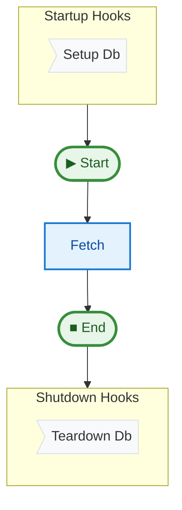

# 10 Lifecycle Hooks

This example demonstrates how to use lifecycle hooks (`on_startup` and `on_shutdown`) to manage resources like database connections.

## Key Concepts

1.  **Context**: The `Context` object is designed to hold persistent resources that are not part of the pipeline's functional state (e.g., DB connections, loggers, API clients).
2.  **`on_startup`**: This hook runs before any steps are executed. It's the ideal place to initialize resources.
3.  **`on_shutdown`**: This hook runs after the pipeline finishes (even if it failed with an error). It's the ideal place to clean up resources.
4.  **Resource Injection**: Steps can access the `Context` to use the initialized resources.

## How to Run

```bash
uv run python examples/10_lifecycle_hooks/main.py
```

## Expected Output

```text
Connecting to mock database...
Fetching data from DB...
Data fetched from DB: some_value
Disconnecting from mock database...
Pipeline finished.
```

## Pipeline Graph


