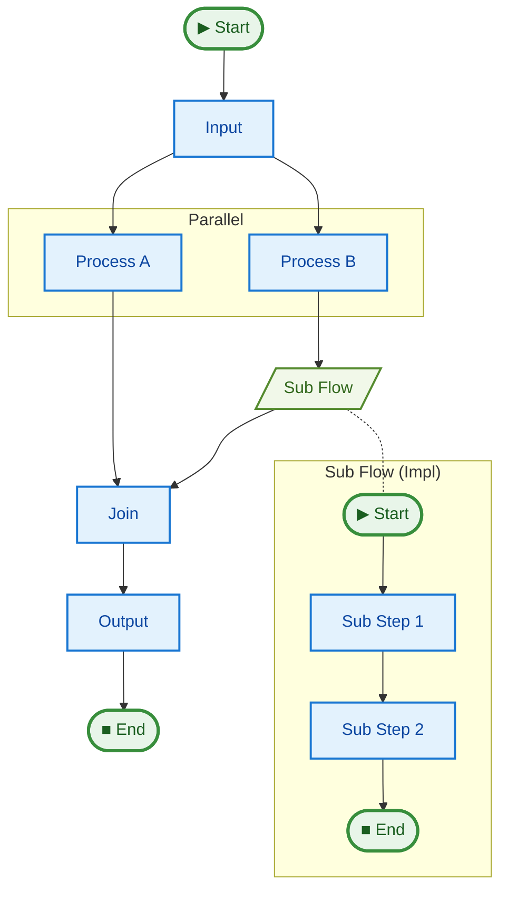

# 11 Visualization

This example demonstrates how `justpipe` can automatically generate Mermaid diagrams of your pipelines.

## Key Concepts

1.  **Automatic Discovery**: `justpipe` tracks the `to` targets of every step to build a directed graph.
2.  **`pipe.graph()`**: This method returns a string containing the Mermaid.js code for the pipeline.
3.  **No Execution Required**: You can generate the graph immediately after defining the pipe, without needing to run it.
4.  **Complex Topologies**: The visualization handles parallel branches, joins, and even mentions of sub-pipelines (though sub-pipelines are currently visualized as single nodes in the parent graph).

## How to Run

```bash
uv run python examples/11_visualization/main.py
```

## How to View

You can copy the generated Mermaid code into the [Mermaid Live Editor](https://mermaid.live/) or use a VS Code extension that supports Mermaid.

## Pipeline Graph


