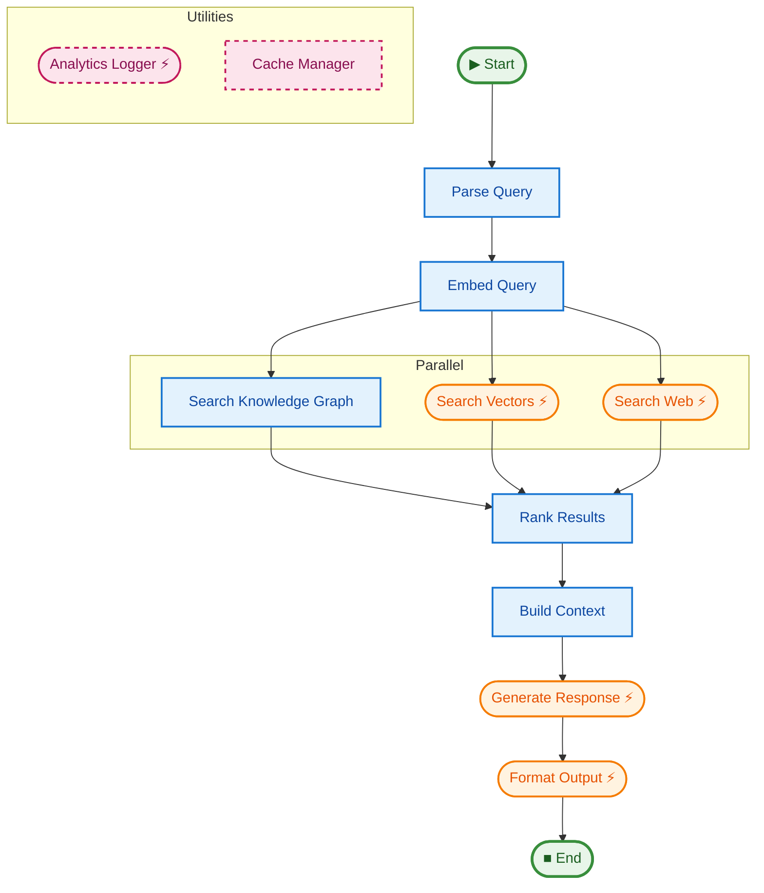

# justpipe

[](https://github.com/plar/justpipe/actions/workflows/ci.yml)
[](https://github.com/plar/justpipe/actions)
[](https://pypi.org/project/justpipe/)

Your code is the graph. Async, streaming pipelines for AI.

## Installation

```bash
pip install justpipe

# With retry support (tenacity)
pip install "justpipe[retry]"
```

## Quick Start

[View Example Code](examples/01_quick_start)

```python
import asyncio
from dataclasses import dataclass
from justpipe import Pipe, EventType

@dataclass
class State:
    message: str = ""

# Type-safe pipeline definition
pipe = Pipe[State, None]()

@pipe.step()
async def respond(state: State):
    yield f"{state.message}, World!"

@pipe.step(to=respond)
async def greet(state: State):
    state.message = "Hello"

async def main():
    state = State()
    async for event in pipe.run(state):
        if event.type == EventType.TOKEN:
            print(event.data)  # "Hello, World!"

asyncio.run(main())
```

## Features

- **Code-as-Graph** - Define complex workflows using simple decorators (`@step`, `@map`, `@switch`).
- **Type-Safe** - Full generic type support `Pipe[StateT, ContextT]` with static analysis.
- **Visualization** - Generate beautiful Mermaid diagrams with `pipe.graph()`.
- **Resilience** - Built-in backpressure, retries, and timeouts.
- **Async & Streaming** - Native `asyncio` support with generator streaming.
- **Zero dependencies** - Core library is lightweight (dependencies only for extras).
- **Parallel execution** - Fan-out with implicit barrier synchronization.
- **Validated** - Graph integrity checks (cycles, broken references) with `pipe.validate()`.



## Parallel Execution (DAG)

[View Example Code](examples/02_parallel_dag)

Static parallelism is defined by linking one step to multiple targets. Use `barrier_timeout` to prevent the pipeline from hanging if a parallel branch fails silently.

```python
@pipe.step(barrier_timeout=5.0)
async def combine(state):
    # Implicit Barrier: Runs only after BOTH fetch_a and fetch_b complete
    state.result = state.a + state.b

@pipe.step(to=combine)
async def fetch_a(state):
    state.a = await fetch_from_api_a()

@pipe.step(to=combine)
async def fetch_b(state):
    state.b = await fetch_from_api_b()

@pipe.step(to=[fetch_a, fetch_b])
async def start(state):
    pass
```

## Dynamic Parallelism (Map)

[View Example Code](examples/03_dynamic_map)

Use `@pipe.map` to process a list of items in parallel. The decorated function must return an iterable.

```python
@pipe.step("worker")
async def worker(item: int, state):
    # 'item' is injected automatically because it's not a state/context arg
    print(f"Processing {item}")

@pipe.map(using=worker)
async def process_batch(state):
    # Spawns 'worker' step for each item in the returned list
    return [1, 2, 3]
```

## Dynamic Routing (Switch)

[View Example Code](examples/04_dynamic_routing)

Use `@pipe.switch` to route execution based on the return value.

```python
@pipe.step("positive_handler")
async def handle_pos(state): ...

@pipe.step("negative_handler")
async def handle_neg(state): ...

@pipe.switch(routes={
    "pos": "positive_handler", 
    "neg": "negative_handler"
})
async def decide(state) -> str:
    return "pos" if state.value > 0 else "neg"
```

Alternatively, any step can simply return the name of the next step (as a string) to jump dynamically.

## Suspension

[View Example Code](examples/05_suspension_resume)

Use `Suspend` to pause execution. The event stream will yield a `SUSPEND` event and then stop.

```python
from justpipe import Suspend

@pipe.step("validate")
async def validate(state):
    if not state.is_ready:
        return Suspend(reason="wait_for_human")
```

## Sub-pipelines (Composition)

[View Example Code](examples/06_subpipelines)

Compose complex workflows by running other pipelines as steps.

```python
sub_pipe = Pipe()
# ... define sub_pipe steps ...

@pipe.sub("execute_sub", using=sub_pipe)
async def delegate(state):
    # Pass the state (or a transformation of it) to the sub-pipeline
    return state
```

## Streaming Tokens

[View Example Code](examples/07_streaming)

```python
@pipe.step("stream")
async def stream(state):
    for chunk in generate_response():
        yield chunk  # Yields TOKEN events
```

## Reliability & Retries

[View Example Code](examples/08_reliability_retry)

justpipe has built-in support for `tenacity` if installed.

```bash
pip install "justpipe[retry]"
```

```python
@pipe.step("flaky_api", retries=3, retry_wait_min=0.1)
async def flaky_api(state):
    # Will automatically retry on exception
    response = await unreliable_api_call()
```

## Backpressure

Protect your application from memory exhaustion by limiting the event queue size. When the queue is full, producer steps will automatically block.

```python
# Set a global limit for the pipe
pipe = Pipe(queue_size=100)

# Or override it at runtime
async for event in pipe.run(state, queue_size=10):
    ...
```

## Middleware

[View Example Code](examples/09_middleware)

Middleware wraps every step execution. Useful for logging, tracing, or error handling.

```python
from justpipe import simple_logging_middleware, StepContext

pipe.add_middleware(simple_logging_middleware)

def custom_middleware(func, ctx: StepContext):
    async def wrapped(**kwargs):
        print(f"Entering {ctx.name}")
        return await func(**kwargs)
    return wrapped
```

## Lifecycle Hooks

[View Example Code](examples/10_lifecycle_hooks)

Hooks are useful for managing external resources like database connections or API clients.
Hooks use the same dependency-injection rules as steps, so you can type or name parameters for state/context.

```python
@pipe.on_startup
async def setup(context):
    context.db = await connect_to_database()

@pipe.on_shutdown
async def cleanup(context):
    await context.db.close()
```

## Visualization & Introspection

[View Example Code](examples/11_visualization)

Inspect registered steps or generate Mermaid diagrams.

```python
# Generate Mermaid graph
print(pipe.graph())

# Programmatic introspection
for step in pipe.steps():
    print(f"{step.name} -> {step.targets}")
```

## Error Handling

Define how to recover from failures at the step or pipeline level.

```python
from justpipe import Retry, Skip

# 1. Step-level handler
async def handle_api_error(error, state):
    return Retry() if isinstance(error, TransientError) else Skip()

@pipe.step(on_error=handle_api_error)
async def call_api(state):
    ...

# 2. Global handler
@pipe.on_error
async def global_handler(error, state, step_name):
    print(f"Global catch: {step_name} failed with {error}")
```

## Development

**justpipe** uses `uv` for dependency management.

```bash
# Install development dependencies
uv sync --all-extras --dev

# Run tests
uv run pytest

# Run linting
uv run ruff check .

# Run type checks
uv run mypy justpipe
```

## License

MIT
