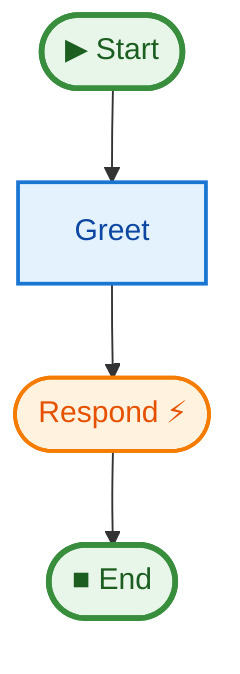

# 01 Quick Start

This example demonstrates the most basic usage of `justpipe`.

## Key Concepts

1.  **State Definition**: Using a dataclass to hold the pipeline state.
2.  **Pipe Initialization**: Creating a `Pipe[StateT, ContextT]` instance.
3.  **Step Registration**: Using `@pipe.step` to define the execution flow.
4.  **Async Execution**: Running the pipeline with `pipe.run()`.
5.  **Event Handling**: Listening for `TOKEN` events from streaming steps.
6.  **Visualization**: Generating a Mermaid diagram of the graph.

## How to Run

From the project root:

```bash
uv run python examples/01_quick_start/main.py
```

## Expected Output

```text
Starting pipeline...
Received token: Hello, World!
Graph saved to .../pipeline.mmd
```

## Pipeline Graph


