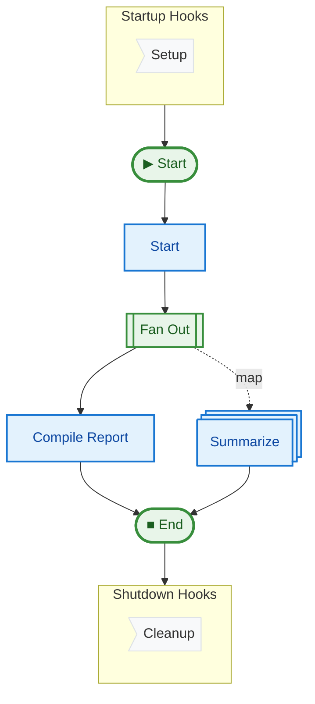

# 03 Dynamic Map (News Summarizer)

This example demonstrates the `Map` feature, which allows you to spawn dynamic parallel tasks based on a list of items at runtime. It simulates (or performs) parallel summarization of news articles using the Google Gemini API.

## Key Concepts

1.  **`Map(items=[...], target="step_name")`**: Returning this object triggers the runner to execute "step_name" for each item in the list concurrently.
2.  **Item Injection**: The target step receives the item as an argument (based on payload mapping).
3.  **Barrier Synchronization**: Steps that follow the map target (like `compile_report`) will wait for ALL mapped tasks to complete.
4.  **Integration**: Uses `google-generativeai` if available and configured.

## How to Run

1.  (Optional) Set your Gemini API key:
    ```bash
    export GEMINI_API_KEY="your-key-here"
    ```
    *If not set, the example runs in "Mock Mode".*

2.  Run the example:
    ```bash
    uv run python examples/03_dynamic_map/main.py
    ```

## Expected Output (Mock Mode)

```text
Found 3 articles to process.
Processing: Python 3.13 released...
Processing: AI models are gettin...
Processing: The weather tomorrow...

--- Report ---
Summarized 3 articles:

- Mock summary for: Python 3.13 released with new features...
- Mock summary for: AI models are getting smaller and faster...
- Mock summary for: The weather tomorrow will be sunny with a chance of rain...
Graph saved to ...
```

## Pipeline Graph


