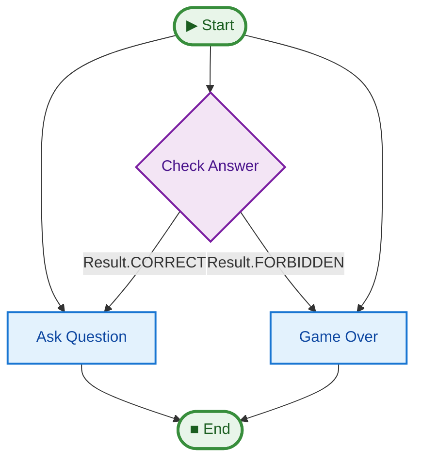

# 05 Suspension & Resume (Human-in-the-Loop)

This example demonstrates how to use the `Suspend` object to pause pipeline execution, wait for external input, and then resume the flow. It implements the classic game "Yes, No, Black, White".

## Key Concepts

1.  **`Suspend`**: Returning `Suspend(reason="...")` causes the pipeline to stop immediately and yield a `SUSPEND` event.
2.  **State Persistence**: The `state` object preserves all changes made before the suspension.
3.  **Resumption**: You can resume execution by calling `pipe.run()` again with the SAME `state` object and specifying the `start` step where the logic should continue.
4.  **Interactive Loops**: Combining `Suspend` with external loops allows for complex "Human-in-the-Loop" workflows.

## How to Run

```bash
uv run python examples/05_suspension_resume/main.py
```

## Game Rules

You will be asked a series of questions. You must answer them, but you are **FORBIDDEN** from using the words:
*   Yes
*   No
*   Black
*   White

If you use any of these words, the game is over!

## Pipeline Graph

