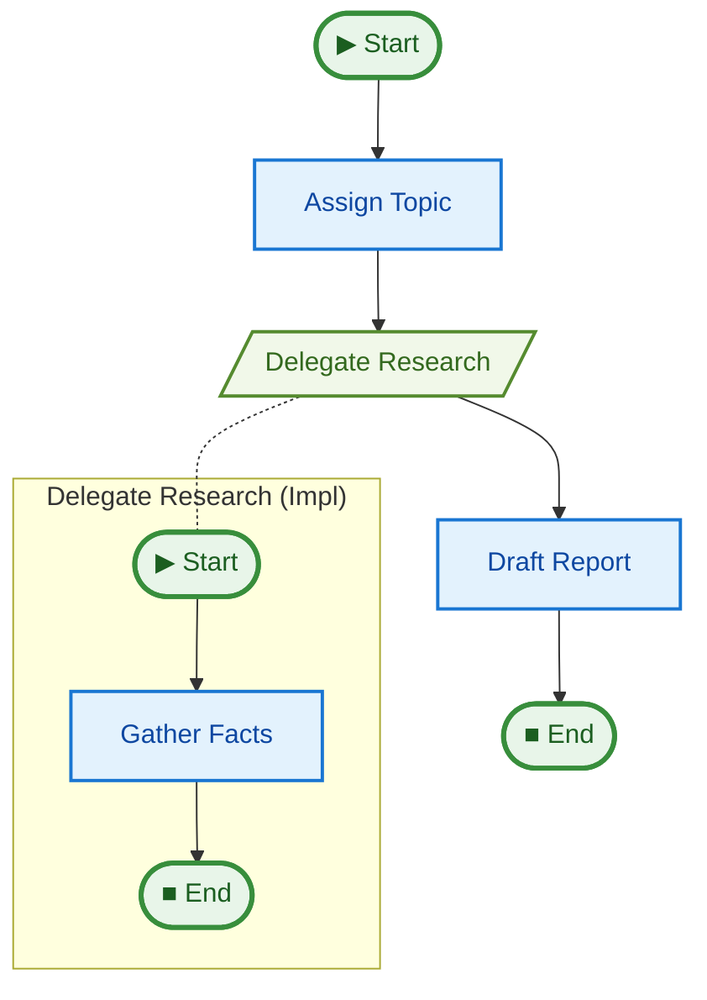

# 06 Sub-pipelines (Composition)

This example demonstrates how to compose pipelines by running one pipeline inside another. This allows you to build reusable, modular workflows.

## Key Concepts

1.  **`@pipe.sub(using=sub_pipe)`**: This decorator registers a step that executes a sub-pipeline.
2.  **State Adaptation**: The decorated function receives the parent's state and returns the state object to be passed to the sub-pipeline.
3.  **Shared State**: If both pipelines use the same state, the function can simply return the received state.
4.  **Event Namespacing**: Events from the sub-pipeline are automatically namespaced (e.g., `parent_step:child_step`).

## How to Run

```bash
uv run python examples/06_subpipelines/main.py
```

## Expected Output

```text
Starting Editor Pipeline...
-> Step started: assign_topic
[Editor] Assigned topic: Quantum Computing
-> Step started: delegate_research
[Editor] Delegating to Researcher pipeline...
-> Step started: delegate_research:gather_facts
  [Researcher] Researching topic: Quantum Computing
  [Researcher] Found 2 facts.
-> Step started: draft_report
[Editor] Drafting content...
[Editor] Report compiled: ... chars.

--- Final Output ---
Report on Quantum Computing:
- Fact 1 about Quantum Computing
- Fact 2 about Quantum Computing
```

## Pipeline Graph


