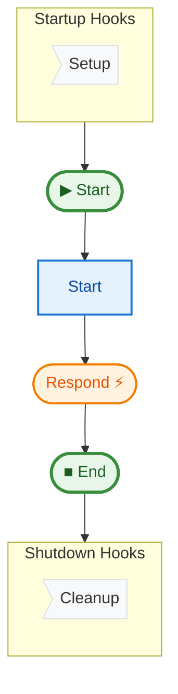

# 07 Streaming (Chatbot)

This example demonstrates how to implement a streaming step that yields partial results (tokens) in real-time. This is essential for building responsive LLM applications.

## Key Concepts

1.  **Async Generators**: Steps defined as `async def` functions that `yield` values are treated as streaming steps.
2.  **`TOKEN` Events**: Each yielded value emits a `TOKEN` event.
3.  **Real-time Consumption**: The caller of `pipe.run()` can consume these tokens immediately as they are generated.
4.  **Integration**: Uses `openai` library if available and configured.

## How to Run

1.  (Optional) Set your OpenAI API key:
    ```bash
    export OPENAI_API_KEY="sk-..."
    ```
    *If not set, the example runs in "Mock Mode".*

2.  Run the example:
    ```bash
    uv run python examples/07_streaming/main.py
    ```

## Expected Output (Mock Mode)

```text
--- Streaming Chatbot ---
User asking: What is the meaning of life?
Generating response...
Received token: 'Thinking'
Received token: '...'
Received token: ' '
...
Full Response: Thinking... Life is complexity.
Graph saved to ...
```

## Pipeline Graph


