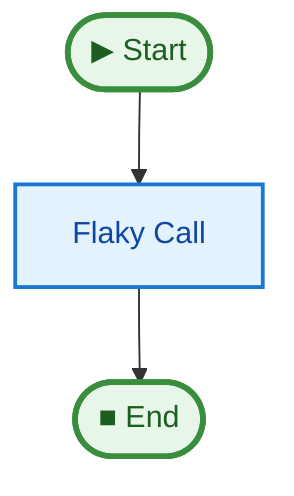

# 08 Reliability & Retry

This example demonstrates how `justpipe` integrates with `tenacity` to provide automatic retry logic for flaky steps.

## Key Concepts

1.  **`retries` parameter**: You can specify the number of retries for any step in the `@pipe.step` decorator.
2.  **`retry_wait_min` / `retry_wait_max`**: Control the exponential backoff timing between retries.
3.  **Automatic Integration**: If `tenacity` is installed, `justpipe` uses it to wrap the step function.
4.  **Error Handling**: If all retries fail, an `ERROR` event is yielded.

## How to Run

Make sure you have `tenacity` installed (or install this project with `[retry]` or `[examples]` extras):

```bash
uv run python examples/08_reliability_retry/main.py
```

## Expected Output

```text
Running pipeline with automatic retries...
Attempt 1: Calling flaky API...
Attempt 1: FAILED (simulated)
Attempt 2: Calling flaky API...
Attempt 2: FAILED (simulated)
Attempt 3: Calling flaky API...
Attempt 3: SUCCESS!

Successfully called flaky API after 3 attempts.
```

## Pipeline Graph


