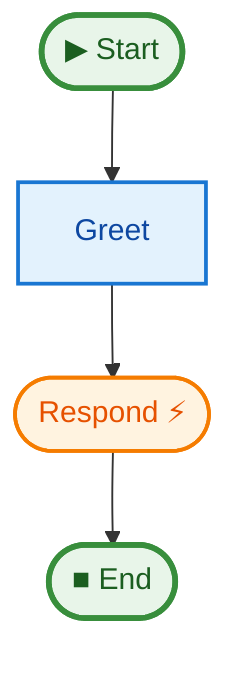

# 09 Middleware

This example demonstrates how to extend `justpipe` using custom middleware. Middleware wraps every step execution, allowing you to add cross-cutting concerns like logging, timing, tracing, or security checks.

## Key Concepts

1.  **Middleware Signature**: A middleware is a function that takes `(func, ctx: StepContext)` and returns a wrapped version of `func`. The `StepContext` provides:
    - `ctx.name`: The step name
    - `ctx.kwargs`: The decorator kwargs (e.g., `retries`, `timeout`)
    - `ctx.pipe_name`: The name of the pipe for correlation
2.  **`pipe.add_middleware(mw)`**: Registers a middleware for the entire pipeline.
3.  **Layered Execution**: Middleware are applied in order. The default `tenacity_retry_middleware` is applied first (if enabled), followed by your custom ones.
4.  **`rich` Integration**: This example uses the `rich` library for beautiful console output.

## How to Run

```bash
uv run python examples/09_middleware/main.py
```

## Pipeline Graph


