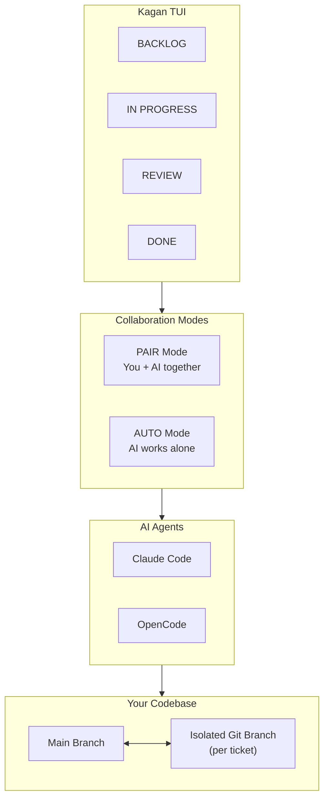
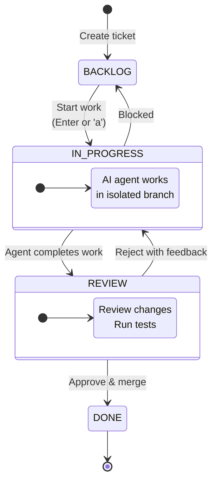

# Kagan

> **Keyboard-first Kanban TUI that turns your terminal into an AI-powered development workspace.**

## Quick Start

```bash
# 1. Install
uv tool install kagan

# 2. Launch (in any git repo)
cd your-project && kagan

# 3. Create your first ticket
# Press 'n' → enter title/description → press 'Enter' to start working
```

> **Requirements:** Python 3.12+, terminal (min 80x20), git repo (for worktrees), tmux (for PAIR mode)

## Keyboard Shortcuts

### Navigation

| Key                     | Action           |
| ----------------------- | ---------------- |
| ++h++ / ++left++        | Move focus left  |
| ++l++ / ++right++       | Move focus right |
| ++j++ / ++down++        | Move focus down  |
| ++k++ / ++up++          | Move focus up    |
| ++tab++ / ++shift+tab++ | Cycle columns    |

### Tickets

| Key       | Action                                   |
| --------- | ---------------------------------------- |
| ++n++     | New ticket                               |
| ++v++     | View details                             |
| ++e++     | Edit ticket                              |
| ++x++     | Delete ticket                            |
| ++enter++ | Open session (PAIR) / watch agent (AUTO) |
| ++slash++ | Search                                   |
| ++a++     | Start agent (AUTO)                       |
| ++s++     | Stop agent (AUTO)                        |
| ++w++     | Watch agent                              |
| ++y++     | Duplicate (yank) ticket                  |
| ++c++     | Copy ticket ID to clipboard              |

### Leader Keys (press ++g++, then)

| Sequence                  | Action                 |
| ------------------------- | ---------------------- |
| ++g++ ++h++ / ++g++ ++l++ | Move ticket left/right |
| ++g++ ++d++               | View diff              |
| ++g++ ++r++               | Review ticket          |
| ++g++ ++w++               | Watch agent            |

### Review

| Key         | Action       |
| ----------- | ------------ |
| ++shift+d++ | View diff    |
| ++r++       | Review modal |
| ++m++       | Merge ticket |

### Global

| Key          | Action           |
| ------------ | ---------------- |
| ++p++        | Planner mode     |
| ++comma++    | Settings         |
| ++f1++       | Help             |
| ++question++ | Help (vim-style) |
| ++ctrl+p++   | Command palette  |
| ++escape++   | Deselect / close |
| ++q++        | Quit             |

## Feature Highlights

### Two Collaboration Modes

**PAIR Mode** - Interactive tmux session where you work alongside your AI agent in real-time.

- Press ++enter++ on any ticket to open a shared terminal
- Agent has access to ticket context via MCP tools
- Perfect for complex problems requiring back-and-forth

**AUTO Mode** - Autonomous agents that work independently on tickets.

- Press ++a++ to start an agent, ++w++ to watch progress
- Agents run in background, signal completion via XML tags
- Ideal for well-defined tasks and parallel execution

### Kanban Board

Classic workflow: **BACKLOG** → **IN_PROGRESS** → **REVIEW** → **DONE**

Move tickets between columns with ++g++ ++h++ / ++g++ ++l++. Track multiple workstreams with visual priority badges and agent assignments.

### AI Planner

Press ++p++ to describe your goal in natural language. The planner breaks it down into actionable tickets with acceptance criteria. Review, refine, and approve—then watch your board populate automatically.

### Review Flow

Built-in code review with AI assistance:

1. Ticket moves to REVIEW when agent completes work
1. View diffs (++shift+d++), inspect commits, run tests
1. Approve (++a++) to merge or reject (++r++) with feedback
1. Auto-merge on approval (configurable)

### MCP Integration

Agents access ticket context through MCP (Model Context Protocol):

- `get_context(ticket_id)` - Full ticket details and acceptance criteria
- `update_scratchpad(ticket_id, content)` - Append progress notes
- `request_review(ticket_id, summary)` - Submit work for review

Run the MCP server: `kagan mcp`

## How It Works

### System Overview



Kagan orchestrates AI agents to work on your tickets. Each ticket gets its own isolated git branch, keeping your main branch safe until changes are reviewed and approved.

### Ticket Lifecycle



1. **BACKLOG** - Tickets waiting to be worked on
1. **IN_PROGRESS** - AI agent actively working in an isolated git branch
1. **REVIEW** - Work complete, ready for human review
1. **DONE** - Approved and merged to main branch

## Supported AI CLIs

- **Claude Code** (Anthropic)
- **OpenCode** (open source)

Coming soon: Gemini, Codex, and more.

## Configuration

Configuration lives in `.kagan/config.toml`. Key settings:

| Setting                 | Purpose                              |
| ----------------------- | ------------------------------------ |
| `auto_start`            | Auto-run agents on ticket creation   |
| `auto_approve`          | Skip permission prompts              |
| `auto_merge`            | Merge approved tickets automatically |
| `default_worker_agent`  | Default agent (e.g., "claude")       |
| `max_concurrent_agents` | Parallel agent limit                 |

See [Configuration](config.md) for full reference.

## Contributing

We welcome contributions! For development setup, testing, and code style guidelines:

**[Read CONTRIBUTING.md](https://github.com/aorumbayev/kagan/blob/main/CONTRIBUTING.md)**

- Report issues: [GitHub Issues](https://github.com/aorumbayev/kagan/issues)
- Submit PRs: [GitHub Pull Requests](https://github.com/aorumbayev/kagan/pulls)
- Discussions: [GitHub Discussions](https://github.com/aorumbayev/kagan/discussions)
