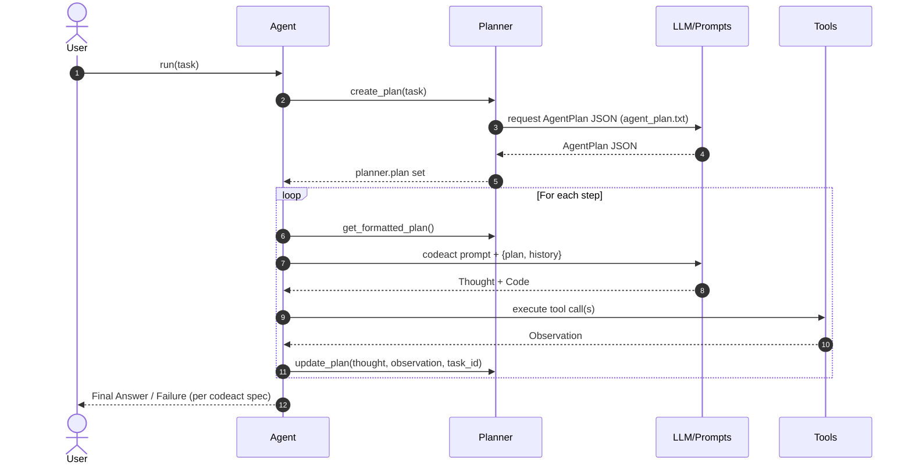

# KodeAgent: The Minimal Agent Engine

[](https://pypi.org/project/kodeagent/)
[](https://codecov.io/gh/barun-saha/kodeagent)
[](https://kodeagent.readthedocs.io/en/latest/?badge=latest)
[](https://opensource.org/licenses/Apache-2.0)
[](https://snyk.io/test/github/barun-saha/kodeagent)

[](https://docs.astral.sh/ruff/)


<a href="https://aiagentsdirectory.com?utm_source=badge&utm_medium=referral&utm_campaign=free_listing&utm_content=homepage" target="_blank" rel="noopener noreferrer">
  
</a>


KodeAgent is a frameworkless, minimalistic approach to building AI agents. Written in ~3 KLOC (~2.2K statements) of pure Python, KodeAgent is designed to be the robust reasoning core inside your larger system, not the entire platform.


## ✅ Why KodeAgent?

KodeAgent adheres to the **Unix Philosophy**: do one thing well and integrate seamlessly.

Use KodeAgent because it offers:
- **ReAct & CodeAct:** KodeAgent supports both ReAct and CodeAct agent paradigms out-of-the-box, enabling agents to reason and act using tools or by generating and executing code.
- **Guidance and Auto-Correction:** Includes a "Planner" to plan the steps and an internal "Observer" to monitor progress, detect loops or stalled plans, and provide corrective feedback to stay on track.
- **Scalable:** With only a few dependencies, KodeAgent perfectly integrates into serverless environments, standalone applications, or existing platforms.
- **LLM Agnostic:** Built on LiteLLM, KodeAgent easily swaps between models (e.g., Gemini, OpenAI, and Claude) without changing your core logic.
- **Lightweight Glass Box:** Read the entire source and debug without fighting opaque abstraction layers. Follow the key abstractions and build something on your own!


## ✋ Why Not?

Also, here are a few reasons why you shouldn't use KodeAgent:

- KodeAgent is actively evolving, meaning some aspects may change.
- You want to use some of the well-known frameworks.
- You need a full-fledged platform with built-in long-term, persistent memory management.


## 🚀 Quick Start

<a target="_blank" href="https://colab.research.google.com/drive/1D9ly3qi9sPZn_sUFdfC1XCFehldCVPXM?usp=sharing">
  
</a>


Install [KodeAgent](https://pypi.org/project/kodeagent/) via pip:
```bash
pip install -U kodeagent  # Upgrade existing installation
```

Or if you want to clone the KodeAgent GitHub repository locally and run from there, use:
```bash
git clone https://github.com/barun-saha/kodeagent.git

python -m venv venv
source venv/bin/activate
# venv\Scripts\activate.bat  # Windows

pip install -r requirements.txt
```

Now, in your application code, create a ReAct agent and run a task like this (see `examples/_quickstart/kodeagent_quickstart.py`):

```python
from kodeagent import ReActAgent, print_response
from kodeagent.tools import read_webpage, search_web

agent = ReActAgent(
    name='Web agent',
    model_name='gemini/gemini-2.5-flash-lite',
    tools=[search_web, read_webpage],
    max_iterations=5,
)

for task in [
    'What are the festivals in Paris? How they differ from Kolkata?',
]:
    print(f'User: {task}')

    async for response in agent.run(task):
        print_response(response, only_final=True)
```

You can also create a CodeActAgent, which leverages the core CodeAct pattern to generate and execute Python code on the fly for complex tasks. For example:

```python
from kodeagent import CodeActAgent
from kodeagent.tools import read_webpage, search_web, extract_as_markdown

agent = CodeActAgent(
    name='Web agent',
    model_name='gemini/gemini-2.0-flash-lite',
    tools=[search_web, read_webpage, extract_as_markdown],
    run_env='host',
    max_iterations=7,
    allowed_imports=[
        're', 'requests', 'ddgs', 'urllib', 'requests', 'bs4',
        'pathlib', 'urllib.parse', 'markitdown'
    ],
    pip_packages='ddgs~=9.5.2;beautifulsoup4~=4.14.2;"markitdown[all]";',
)
```

That's it! Your agent should start solving the task and keep streaming the updates.

By default, an agent is **memoryless** across tasks—each task begins with no prior context, a clean slate. To enable context from the previous task (only), use **Recurrent Mode**:

```python
# Enable recurrent mode to leverage context from the previous run
async for response in agent.run('Double the previous result', recurrent_mode=True):
    print_response(response)
```

For more examples, including how to provide files as inputs, see the [kodeagent.py](src/kodeagent/kodeagent.py) module and [API documentation](https://kodeagent.readthedocs.io/en/latest/usage.html).

### API Configuration

KodeAgent uses [LiteLLM](https://github.com/BerriAI/litellm) for model access and [Langfuse](https://langfuse.com/) or [LangSmith](https://www.langchain.com/langsmith) for observability. Set your API keys as environment variables or in a `.env` file:

| Service | Environment Variable |
| :--- | :--- |
| **Gemini** | `GOOGLE_API_KEY` |
| **OpenAI** | `OPENAI_API_KEY` |
| **Anthropic** | `ANTHROPIC_API_KEY` |
| **E2B Sandbox** | `E2B_API_KEY` |
| **Langfuse** | `LANGFUSE_PUBLIC_KEY`, `LANGFUSE_SECRET_KEY` |
| **LangSmith** | `LANGCHAIN_API_KEY`, `LANGCHAIN_TRACING_V2` |

Detailed configuration for various providers can be found in the [LiteLLM documentation](https://docs.litellm.ai/docs/set_keys).


### Code Execution

`CodeActAgent` executes LLM-generated code to leverage the tools. KodeAgent currently supports two different code run environments:
- `host`: The Python code will be run on the system where you created this agent. In other words, where the application is running.
- `e2b`:  The Python code will be run on an [E2B sandbox](https://e2b.dev/). You will need to set the `E2B_API_KEY` environment variable.

With `host` as the code running environment, no special steps are required, since it uses the current Python installation. However, with `e2b`, code (and tools) are copied to a different environment and are executed there. Therefore, some additional setup may be required.

You can also specify a `work_dir` to serve as a local workspace. For the `e2b` environment, any files generated by the agent in the sandbox will be automatically downloaded to this local `work_dir`. If specified, `work_dir` could be relative or absolute path, but it **must exist**; otherwise, a temporary directory will be created and used for each run.

```python
from kodeagent import CodeActAgent

agent = CodeActAgent(
    name='Data Agent',
    model_name='gemini/gemini-2.0-flash-lite',
    run_env='e2b',
    work_dir='/home/user/agent_workspace',  # Local workspace directory to copy files to/from E2B
    # ... other parameters
)
```


For example, the Python modules that are allowed to be used in code should be explicitly specified using `allowed_imports`. In addition, any additional Python package that may need to be installed should be specified as a comma-separated list via `pip_packages`.  

KodeAgent is under active development. Capabilities are limited. Use with caution.


## 🛠️ Tools

KodeAgent comes with the following built-in [tools](src/kodeagent/tools.py):
- **`calculator`**: A simple calculator tool to perform basic arithmetic operations. It imports the `ast`, `operator`, and `re` Python libraries.
- **`download_file`**: A tool to download a file from a given URL. It imports the `requests`, `re`, `tempfile`, `pathlib`, and `urllib.parse` Python libraries.
- **`extract_as_markdown`**: A tool to read file contents and return as Markdown using MarkItDown. It imports the `re`, `pathlib`, `urllib.parse`, and `markitdown` Python libraries.
- **`generate_image`**: A tool to generate an image based on a text prompt using the specified model. The (LiteLLM) model name to be used must be mentioned in the task, system prompt, or somehow. It imports the `os`, `base64`, and `litellm` Python libraries.
- **`read_webpage`**: A tool to read a webpage using BeautifulSoup. It imports the `re`, `requests`, `urllib.parse`, and `bs4` Python libraries.
- **`search_arxiv`**: A tool to search arXiv for research papers and return summaries and links. It imports the `arxiv` library.
- **`search_web`**: A web search tool using DuckDuckGo to fetch top search results. It imports the `datetime`, `random`, and `time` Python libraries.
- **`search_wikipedia`**: A tool to search Wikipedia and return summaries and links. It imports the `wikipedia` library.
- **`transcribe_audio`**: A tool to transcribe audio files using OpenAI's Whisper via [Fireworks API](https://fireworks.ai/). Need to set the `FIREWORKS_API_KEY` environment variable. It imports the `os` and `requests` Python libraries.
- **`transcribe_youtube`**: A tool to fetch YouTube video transcripts. It imports the `youtube_transcript_api` library.

Check out the docstrings of these tools in the [tools.py](src/kodeagent/tools.py) module for more details.

To add a new tool, use the `@tool` decorator from `kodeagent.tools` module. For example:
```python
from kodeagent import tool

@tool
def my_tool(param1: str) -> str:
    """Description of the tool.
    Args:
        param1 (str): Description of param1.
    Returns:
        str: Description of the return value.
    """
    # Tool implementation here
    return 'result'
```

Module imports and all variables should be inside the tool function. If you're using `CodeActAgent`, KodeAgent will execute the tool function in isolation.
For further details, refer to the [API documentation](https://kodeagent.readthedocs.io/en/latest/). Note: `async` tools are not supported.


## 🔭 Observability

In addition to the logs, KodeAgent enables agent observability via third-party solutions, such as [Langfuse](https://langfuse.com/) and [LangSmith](https://www.langchain.com/langsmith).

To enable tracing, set the relevant environment variables (e.g., `LANGFUSE_PUBLIC_KEY` and `LANGFUSE_SECRET_KEY` for Langfuse, or `LANGCHAIN_API_KEY` and `LANGCHAIN_TRACING_V2='true'` for LangSmith). Note that `langsmith` is not installed by default with KodeAgent and must be installed separately with `pip install langsmith`. Then, in the code, specify `tracing_type` as `langfuse` or `langsmith` when creating the agent:

```python
from kodeagent import ReActAgent

agent = ReActAgent(
    name='Web agent',
    model_name='gemini/gemini-2.5-flash-lite',
    tools=[search_web, read_webpage],
    tracing_type='langfuse',  # or 'langsmith'
)
```

Tracing is **disbled** by default (rather, a no-op tracer is used). You will need to explicitly enable it, as shown in the code snippet above. The screenshot below shows a sample trace of KodeAgent running a task on the Langfuse dashboard:


## ⊷ Sequence Diagram for CodeAct Agent (via CodeRabbit)



## 🧪 Run Tests

To run unit tests, use:
```bash
python -m pytest .\tests\unit -v --cov --cov-report=html
```

For integration tests involving calls to APIs, use:
```bash
python -m pytest .\tests\integration -v --cov --cov-report=html
```

Gemini and E2B API keys should be set in the `.env` file for integration tests to work.

A [Kaggle notebook](https://www.kaggle.com/code/barunsaha/kodeagent-benchmark/) for benchmarking KodeAgent is also available.

### Scalene Profiling

The following results were measured using [Scalene](https://github.com/plasma-umass/scalene) and `psutil` on development machine (Windows 10, Python 3.10). "Peak Memory" refers to the maximum Resident Set Size (RSS), i.e., the actual RAM used by the process.

```shell
python -m scalene run -c scalene.yaml -m src.kodeagent.kodeagent
scalene view
```

| Agent Type   | Avg. Runtime | Peak Memory (Scalene) | Peak Memory (psutil) | Notes                                        |
|--------------|--------------|------------------------|---------------------|----------------------------------------------|
| ReActAgent   | ~58s         | 21MB                   | 294MB               | Faster, because tools are directly executed  |
| CodeActAgent | ~155s        | 21MB                   | 253MB               | Slower, because of code review and execution |

**Notes:**
- _Scalene_ reports the maximum _sampled_ RSS during profiling, which is useful for comparing code sections but may miss short-lived or end-of-program memory spikes.
- _psutil_ reports the actual RSS at program _end_, which is typically higher and reflects the real-world memory footprint.
- Actual memory usage may vary depending on your system, Python version, and workload.


## 🗺️ Roadmap & Contributions

To be updated.


## 🙏 Acknowledgement

KodeAgent heavily borrows code and ideas from different places, such as:
- [LlamaIndex](https://docs.llamaindex.ai/en/stable/examples/agent/react_agent/)
- [Smolagents](https://github.com/huggingface/smolagents/tree/main)
- [LangGraph](https://github.com/langchain-ai/langgraph)
- [Building ReAct Agents from Scratch: A Hands-On Guide using Gemini](https://medium.com/google-cloud/building-react-agents-from-scratch-a-hands-on-guide-using-gemini-ffe4621d90ae)
- [LangGraph Tutorial: Build Your Own AI Coding Agent](https://medium.com/@mariumaslam499/build-your-own-ai-coding-agent-with-langgraph-040644343e73)
- Aider, Antigravity, CodeRabbit, GitHub Copilot, Jules, ...


## ⚠️ DISCLAIMER & LIABILITY

AI agents can occasionally cause unintended or unpredictable side effects. We urge users to **use KodeAgent with caution**. Always review generated code and test agents rigorously in a constrained, non-production environment before deployment.

**LIMITATION OF LIABILITY:**
By using this software, you agree that KodeAgent, its developers, contributors, supporters, and any other associated entities shall not be liable for any direct, indirect, incidental, special, exemplary, or consequential damages (including, but not limited to, procurement of substitute goods or services; loss of use, data, or profits; or business interruption) however caused and on any theory of liability, whether in contract, strict liability, or tort (including negligence or otherwise) arising in any way out of the use of this software.
