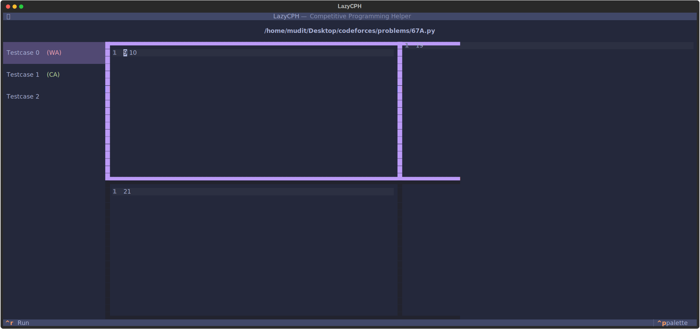

# LazyCPH



A beautiful Terminal User Interface (TUI) for competitive programming that helps you test your solutions quickly and efficiently.

## ✨ Features

- **Beautiful TUI** - Modern terminal interface built with [Textual](https://github.com/Textualize/textual)
- **Competitive Companion** - Compatible with the [competitive companion](https://github.com/jmerle/competitive-companion) browser extension
- **Easy CRUD** - Create, manage, and run multiple test cases for your solution
- **Multiple Languages** - C,C++,Python,Rust,Zig are supported out of the box
- **Fast** - Edit and Run your testcases quickly

## 🚀 Installation

```sh
pipx install lazycph
# or
uv tool install lazycph
```

Or if you prefer a standalone single-file binary; you can clone and setup the project, see [CONTIBUTING](./CONTIBUTING.md), and then run `uv run task build` to generate the binary in the `dist/` folder.

## 📖 Usage

### Basic Usage

Launch LazyCPH in the current directory:
```bash
lazycph
```

Launch in a specific directory:
```bash
lazycph /path/to/your/code
```

Open a specific file:
```bash
lazycph solution.py
```

### With [Competitive Companion](https://github.com/jmerle/competitive-companion)

LazyCPH also allows you to import problems and testcases directly from platforms like codeforces use the competitive companion browser extension.

```sh
lazycph --companion
# or
lazycph -c
```

<video src="https://github.com/user-attachments/assets/847adb36-1e08-4809-8b30-80eba615739e"></video>
[Companion Demo](https://github.com/TheComputerM/lazycph/blob/main/assets/companion.mp4)


## Integration with Zed

You can easily integrate LazyCPH with the [Zed](https://zed.dev) editor for a seamless competitive programming experience. You just need to configure a task and bind it to a shortcut key.

```jsonc
// ~/.config/zed/tasks.json
[
  {
    "label": "lazycph",
    "command": "uvx",
    "args": ["lazycph", "$ZED_FILE"],
    "use_new_terminal": true,
  }
]
```

```jsonc
// ~/config/zed/keymap.json
{
  "context": "Workspace",
  "bindings": {
    "alt-g": [
      "task::Spawn",
      { "task_name": "lazycph", "reveal_target": "center" }
    ]
  }
}
```

<video src="https://github.com/user-attachments/assets/a18089c0-594b-4bf6-8053-92a924c2af91"></video>
[Zed Demo](https://github.com/TheComputerM/lazycph/blob/main/assets/zed.mp4)

## Web UI

You can also run LazyCPH in a web browser (for whatever reason you desire) because it's made with [Textual](https://textual.textualize.io/), first create a file name *web.py* in the folder with your source code.

```py
# /// script
# dependencies = ["textual-serve"]
# ///

from textual_serve.server import Server
server = Server(f"uvx lazycph")
server.serve()
```

And then run:

```sh
uv run web.py
```

So now whenever you press your keybind (alt+g in this case), a new terminal window opens with LazyCPH running on the current file. [See how it looks](./assets/zed.mp4).

## 🛠️ Development

Want to contribute? Check out the [CONTRIBUTING.md](CONTRIBUTING.md) for setup instructions and development guidelines.

Contributions are welcome! Please feel free to submit a Pull Request. For major changes, please open an issue first to discuss what you would like to change.

## 📝 License

This project is open source and available under the MIT License.

## 💡 Inspiration

Built for competitive programmers who want the features of [CPH VSCode extension](https://marketplace.visualstudio.com/items?itemName=DivyanshuAgrawal.competitive-programming-helper) in any IDE or terminal.
