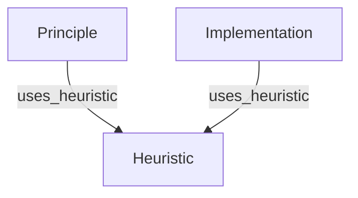

# Heuristic Page Definition

## 1. Core Definition
**Role:** Wisdom (Tactical Intuition)

A **Heuristic** captures tribal knowledge, decision frameworks, and optimizations. It represents the "Art" of engineering - practical wisdom, rules of thumb, and debugging tactics that are not explicitly stated in official documentation or code signatures.

## 2. Graph Connectivity (Top-Down DAG)

### Role in Graph
*   **Type:** Leaf Node (Target Only).
*   **Direction:** **Inward Only**. Heuristics do not depend on other nodes; they are *applied to* other nodes.

### Incoming Connections (Backlinks)
*   **From Principle:** `uses_heuristic`
    *   *Meaning:* "This theoretical concept has these known limitations or tricks."
*   **From Implementation:** `uses_heuristic`
    *   *Meaning:* "This specific code requires this specific configuration hack."

### Visualization

## 3. Key Purpose
1.  **Optimization:** Captures "How to make it fast/cheap" (e.g., Memory tricks, Batch sizing).
2.  **Troubleshooting:** Documents common pitfalls and solutions (e.g., OOM errors, Divergence).
3.  **Decision Making:** Provides frameworks for choices (e.g., "When to use Adam vs SGD").
