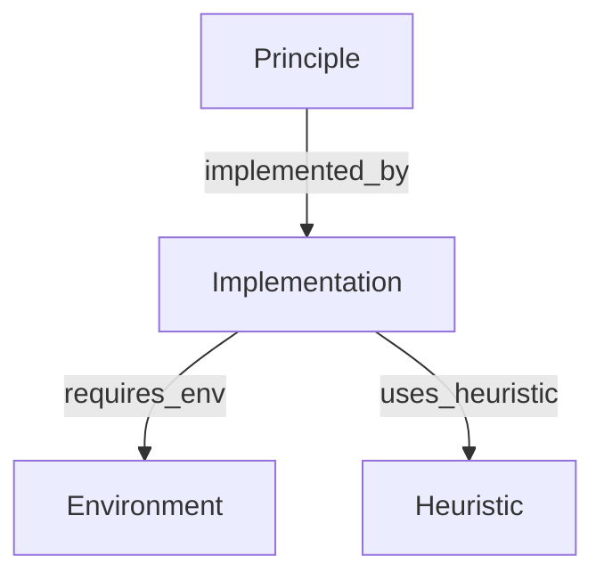

# Implementation Page Definition

## 1. Core Definition
**Role:** Tool (Source of Truth for Syntax)

An **Implementation** represents concrete code—a class, function, or module. It serves as the authoritative reference for how to use specific functionality in the repository. It bridges the gap between abstract theory (Principles) and actual execution (Code).

## 2. Graph Connectivity (Top-Down DAG)

### Role in Graph
*   **Type:** Leaf of the "Theory Spine".
*   **Direction:** **Execute Only**. Implementations run things; they don't define theory.

### Incoming Connections (Backlinks)
*   **From Principle:** `implemented_by`
    *   *Meaning:* "This code is the realization of that theory."
*   **From Workflow:** (Implicitly via Principles)
    *   *Meaning:* Workflows execute principles, which resolve to implementations.

### Outgoing Connections (Dependencies)
*   **To Environment:** `requires_env`
    *   *Meaning:* "I need this hardware/software context to run."
*   **To Heuristic:** `uses_heuristic`
    *   *Meaning:* "I have these known optimizations or hacks."

### Visualization

## 3. Key Purpose
1.  **Syntax Reference:** Defines the exact API (inputs/outputs).
2.  **Executability:** The node that actually *runs*.
3.  **Binding:** Connects abstract ideas to concrete Python/C++ objects.

