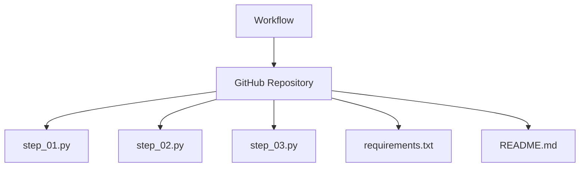

# Workflow Page Definition

## 1. Core Definition
**Role:** Recipe (High-value "Job to be Done")

A **Workflow** is an ordered sequence of steps that delivers a high-value business outcome. It is temporal (Start → End), representing a complete process (e.g., "Fine-tuning Llama-2" or "RAG Pipeline"). It is the "Root Intent" of the graph.

**Key Feature:** Each Workflow has an associated GitHub Repository containing the deterministic, executable implementation of all steps.

## 2. Graph Connectivity (Top-Down DAG)

### Role in Graph
*   **Type:** The Root / Entry Point.
*   **Direction:** **Orchestrator**. Workflows do not implement logic directly; they describe the process flow. The actual implementation lives in a GitHub repository.

### Outgoing Connections
*   **None** — Workflows are self-contained entry points with no outgoing wiki links.

### Associated Resources
*   **GitHub Repository:** A private repository containing the executable implementation.
    *   *Purpose:* Provides deterministic, version-controlled, testable code.
    *   *Structure:* One Python file per step, plus requirements.txt and README.md.

### Visualization

## 3. Key Purpose
1.  **Intent Mapping:** Maps high-level user goals ("Train a model") to executable implementations.
2.  **Process Documentation:** Captures the "Recipe" or "Standard Operating Procedure" in natural language.
3.  **Deterministic Execution:** Links to a GitHub repository with pinned dependencies for reproducibility.
4.  **Visualization:** Provides a clear flow diagram of how the process works.
