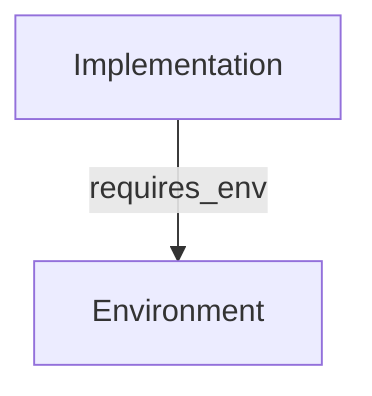

# Environment Page Definition

## 1. Core Definition
**Role:** Context (Prerequisite)

An **Environment** defines the hardware, OS, dependencies, and credentials required to successfully run a specific set of code (Implementation). It serves as the "Container" or "Context" layer of the Knowledge Graph.

## 2. Graph Connectivity (Top-Down DAG)

### Role in Graph
*   **Type:** Leaf Node (Target Only).
*   **Direction:** **Inward Only**. Nothing flows *out* of an Environment node; other nodes point *to* it.

### Incoming Connections (Backlinks)
*   **From Implementation:** `requires_env`
    *   *Meaning:* "This Implementation code cannot run unless this Environment is set up."

### Visualization

## 3. Key Purpose
1.  **Reproducibility:** Prevents "It works on my machine" by strictly defining the stack.
2.  **Hardware Awareness:** Explicitly calls out GPU/TPU/RAM needs.
3.  **Secret Management:** Documents *which* keys are needed (without storing the keys themselves).
