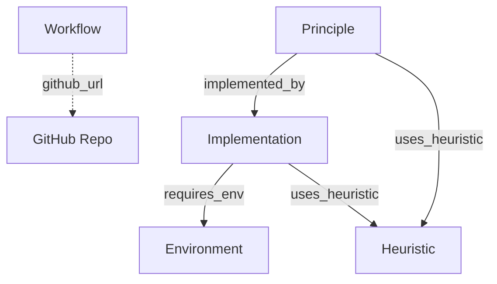

# Page Connections (Edges)

This document defines the strictly **Top-Down Directed Acyclic Graph (DAG)** schema for the wiki.

**Core Rule:** Connections always flow **Downwards** (Intent → Theory → Code) or **Outwards** (to Attributes like Environment/Heuristic). No loops allowed.

---

## Complete Edge Registry

### 1. Workflow Layer (The Recipe)
*Top-level entry points. Workflows are self-contained and link to external GitHub repositories for implementation.*

| Source Node | External Resource | Meaning |
|:---|:---|:---|
| **Workflow** | GitHub Repository | "This workflow's implementation lives at this URL." |

**Note:** Workflows no longer have outgoing wiki links. The executable implementation is stored in a GitHub repository linked via `[[github_url::...]]`.

### 2. Principle Layer (The Theory)
*The heavy lifter. Must be connected to Code.*

| Source Node | Edge Property | Target Node | Meaning | Constraint |
|:---|:---|:---|:---|:---|
| **Principle** | `implemented_by` | **Implementation** | "This theory runs via this code." | **MANDATORY (1+)** |
| **Principle** | `uses_heuristic` | **Heuristic** | "This theory is optimized by Wisdom Z." | Leaf |

*Note: Hierarchical relationships are managed dynamically by Composers, which create new parent Principle nodes by merging existing ones.*

### 3. Implementation Layer (The Code)
*The ground truth.*

| Source Node | Edge Property | Target Node | Meaning |
|:---|:---|:---|:---|
| **Implementation** | `requires_env` | **Environment** | "Needs Context X to run." |
| **Implementation** | `uses_heuristic` | **Heuristic** | "Uses Hack/Config Z." |

### 4. Leaf Nodes (Attributes)
These nodes are **Targets Only** in the core graph. They use **backlink edge types** to document incoming references.

| Leaf Node | Backlink Edge | Source Nodes | Meaning |
|:----------|:--------------|:-------------|:--------|
| **Environment** | `required_by` | Implementation | "This environment is required by X." |
| **Heuristic** | `used_by` | Implementation, Principle | "This heuristic is used by X." |

*   **Environment** (Hardware/OS context)
*   **Heuristic** (Wisdom/Tips)

---

## Visualization

---

## Link Integrity Rules

### Rule 1: The Executable Constraint
Every **Principle** MUST have at least one outgoing `[[implemented_by::Implementation:X]]` link.
- If the Principle is abstract (e.g., "Optimization"), it must link to a "Base Class" or "Interface" implementation.

### Rule 2: Workflow GitHub URL Constraint
Every **Workflow** MUST have a `[[github_url::...]]` link to a GitHub repository.
- The repository contains the executable implementation of the workflow steps.
- The repository must follow the standard structure (step files, requirements.txt, README.md).

### Rule 3: Top-Down Only
- **Implementations** never point to **Principles** (use inverse queries for navigation).
- **Heuristics** use `[[used_by::...]]` backlinks to document which pages reference them.
- **Environments** use `[[required_by::...]]` backlinks to document which Implementations require them.

### Rule 4: No Loops
The graph must remain a DAG. Do not create edges that point back up the hierarchy.
