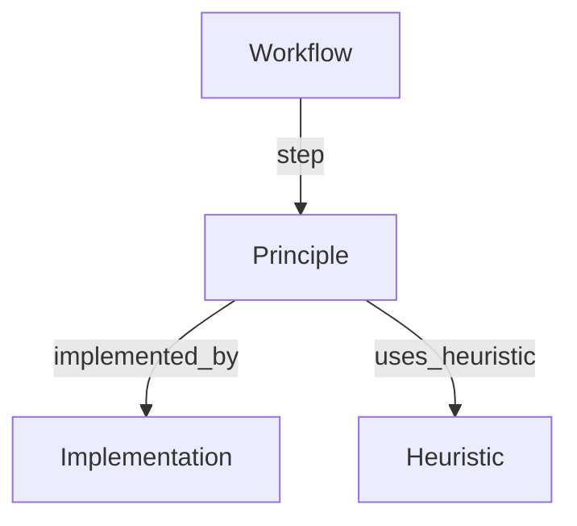

# Principle Page Definition

## 1. Core Definition
**Role:** Theory (Library-Agnostic)

A **Principle** is a single, atomic theoretical principle or algorithm. It answers "What is this technique?" and "Why does it work?" It represents the theoretical foundation that is independent of any specific implementation. It is the "Brain" of the graph.

## 2. Graph Connectivity (Top-Down DAG)

### Role in Graph
*   **Type:** The Core Node.
*   **Direction:** **Execution Bridge**. Principles connect Intent (Workflow) to Action (Implementation).

### Incoming Connections (Backlinks)
*   **From Workflow:** `step`
    *   *Meaning:* "This workflow executes this theoretical step."

### Outgoing Connections (Dependencies)
*   **To Implementation:** `implemented_by`
    *   *Meaning:* "This theory is realized by this concrete code."
    *   *Constraint:* **Mandatory (1+)**. Every Principle must link to at least one Implementation (or Base Class).
*   **To Heuristic:** `uses_heuristic`
    *   *Meaning:* "This theory is optimized/refined by this wisdom."

### Visualization

## 3. Key Purpose
1.  **Abstraction:** Decouples "What we do" (Theory) from "How we do it" (Library).
2.  **Validation:** Ensures every step in a workflow is theoretically sound.
3.  **Discovery:** Allows finding all code implementations for a single concept (e.g., "Show me all Adam Optimizers").

