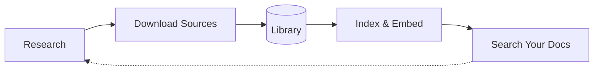
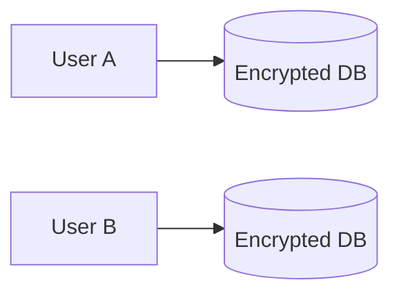

# Local Deep Research

<div align="center">

[](https://github.com/LearningCircuit/local-deep-research/stargazers)
[](https://hub.docker.com/r/localdeepresearch/local-deep-research)
[](https://pypi.org/project/local-deep-research/)

[](https://trendshift.io/repositories/14116)

[](https://github.com/LearningCircuit/local-deep-research/commits/main)
[](https://github.com/LearningCircuit/local-deep-research/commits/main)

[](https://github.com/LearningCircuit/local-deep-research/tree/main/community_benchmark_results)
[](docs/SQLCIPHER_INSTALL.md)

<!-- Well-known security scanners that visitors will recognize -->
[](https://securityscorecards.dev/viewer/?uri=github.com/LearningCircuit/local-deep-research)
[](https://github.com/LearningCircuit/local-deep-research/security/code-scanning)
[](https://github.com/LearningCircuit/local-deep-research/actions/workflows/semgrep.yml)

[](https://github.com/LearningCircuit/local-deep-research/actions/workflows/pytest-tests.yml)
[](https://github.com/LearningCircuit/local-deep-research/actions/workflows/pre-commit.yml)

[](https://github.com/LearningCircuit/local-deep-research/actions/workflows/docker-publish.yml)
[](https://github.com/LearningCircuit/local-deep-research/actions/workflows/publish.yml)

[](https://discord.gg/ttcqQeFcJ3)
[](https://www.reddit.com/r/LocalDeepResearch/)
[](https://www.youtube.com/@local-deep-research)


**AI-powered research assistant for deep, iterative research**

*Performs deep, iterative research using multiple LLMs and search engines with proper citations*

<a href="https://www.youtube.com/watch?v=pfxgLX-MxMY&t=1999">
  ▶️ Watch Review by The Art Of The Terminal
</a>

</div>

## 🚀 What is Local Deep Research?

AI research assistant you control. Run locally for privacy, use any LLM and build your own searchable knowledge base. You own your data and see exactly how it works.

## ⚡ Quick Start


**Docker Run (Linux):**
```bash
# Step 1: Pull and run Ollama
docker run -d -p 11434:11434 --name ollama ollama/ollama
docker exec ollama ollama pull gpt-oss:20b

# Step 2: Pull and run SearXNG for optimal search results
docker run -d -p 8080:8080 --name searxng searxng/searxng

# Step 3: Pull and run Local Deep Research
docker run -d -p 5000:5000 --network host \
  --name local-deep-research \
  --volume 'deep-research:/data' \
  -e LDR_DATA_DIR=/data \
  localdeepresearch/local-deep-research
```

**Exemplary Docker Compose:**
1. **Mac and no Nvidia-GPU:** [Docker Compose File](https://github.com/LearningCircuit/local-deep-research/blob/main/docker-compose.yml)
```bash
# download and up -d
curl -O https://raw.githubusercontent.com/LearningCircuit/local-deep-research/main/docker-compose.yml && docker compose up -d
```

2. **With NVIDIA GPU (Linux):**
```bash
# download and up -d
curl -O https://raw.githubusercontent.com/LearningCircuit/local-deep-research/main/docker-compose.yml && \
curl -O https://raw.githubusercontent.com/LearningCircuit/local-deep-research/main/docker-compose.gpu.override.yml && \
docker compose -f docker-compose.yml -f docker-compose.gpu.override.yml up -d
```

Open http://localhost:5000 after ~30 seconds. [More install options →](#-installation-options)

## 🏗️ How It Works

### Research

You ask a complex question. LDR:
- Does the research for you automatically
- Searches across web, academic papers, and your own documents
- Synthesizes everything into a report with proper citations

Choose from 20+ research strategies for quick facts, deep analysis, or academic research.

### Build Your Knowledge Base



Every research session finds valuable sources. Download them directly into your encrypted library—academic papers from ArXiv, PubMed articles, web pages. LDR extracts text, indexes everything, and makes it searchable. Next time you research, ask questions across your own documents and the live web together. Your knowledge compounds over time.

## 🛡️ Security

<div align="center">

<!-- Comprehensive Security Scanning -->
[](https://github.com/LearningCircuit/local-deep-research/actions/workflows/security-release-gate.yml)

<!-- Static Analysis (additional scanners beyond CodeQL/Semgrep) -->
[](https://github.com/LearningCircuit/local-deep-research/actions/workflows/devskim.yml)
[](https://github.com/LearningCircuit/local-deep-research/actions/workflows/bearer.yml)

<!-- Dependency & Secrets Scanning -->
[](https://github.com/LearningCircuit/local-deep-research/actions/workflows/gitleaks.yml)
[](https://github.com/LearningCircuit/local-deep-research/actions/workflows/osv-scanner.yml)
[](https://github.com/LearningCircuit/local-deep-research/actions/workflows/npm-audit.yml)
[](https://github.com/LearningCircuit/local-deep-research/actions/workflows/retirejs.yml)

<!-- Container Security -->
[](https://github.com/LearningCircuit/local-deep-research/actions/workflows/container-security.yml)
[](https://github.com/LearningCircuit/local-deep-research/actions/workflows/dockle.yml)
[](https://github.com/LearningCircuit/local-deep-research/actions/workflows/hadolint.yml)
[](https://github.com/LearningCircuit/local-deep-research/actions/workflows/checkov.yml)

<!-- Workflow & Runtime Security -->
[](https://github.com/LearningCircuit/local-deep-research/actions/workflows/zizmor-security.yml)
[](https://github.com/LearningCircuit/local-deep-research/actions/workflows/owasp-zap-scan.yml)
[](https://github.com/LearningCircuit/local-deep-research/actions/workflows/security-tests.yml)

</div>



Your data stays yours. Each user gets their own isolated SQLCipher database encrypted with AES-256 (Signal-level security). No password recovery means true zero-knowledge—even server admins can't read your data. Run fully local with Ollama + SearXNG and nothing ever leaves your machine.

**Supply Chain Security**: Docker images are signed with [Cosign](https://github.com/sigstore/cosign), include SLSA provenance attestations, and attach SBOMs. Verify with:
```bash
cosign verify localdeepresearch/local-deep-research:latest
```

[Detailed Architecture →](docs/architecture.md) | [Security Policy →](SECURITY.md)

## 📊 Performance

**~95% accuracy on SimpleQA benchmark** (preliminary results)
- Tested with GPT-4.1-mini + SearXNG + focused-iteration strategy
- Comparable to state-of-the-art AI research systems
- Local models can achieve similar performance with proper configuration
- [Join our community benchmarking effort →](https://github.com/LearningCircuit/local-deep-research/tree/main/community_benchmark_results)

## ✨ Key Features

### 🔍 Research Modes
- **Quick Summary** - Get answers in 30 seconds to 3 minutes with citations
- **Detailed Research** - Comprehensive analysis with structured findings
- **Report Generation** - Professional reports with sections and table of contents
- **Document Analysis** - Search your private documents with AI

### 🛠️ Advanced Capabilities
- **[LangChain Integration](docs/LANGCHAIN_RETRIEVER_INTEGRATION.md)** - Use any vector store as a search engine
- **[REST API](docs/api-quickstart.md)** - Authenticated HTTP access with per-user databases
- **[Benchmarking](docs/BENCHMARKING.md)** - Test and optimize your configuration
- **[Analytics Dashboard](docs/analytics-dashboard.md)** - Track costs, performance, and usage metrics
- **Real-time Updates** - WebSocket support for live research progress
- **Export Options** - Download results as PDF or Markdown
- **Research History** - Save, search, and revisit past research
- **Adaptive Rate Limiting** - Intelligent retry system that learns optimal wait times
- **Keyboard Shortcuts** - Navigate efficiently (ESC, Ctrl+Shift+1-5)
- **Per-User Encrypted Databases** - Secure, isolated data storage for each user

### 📰 News & Research Subscriptions
- **Automated Research Digests** - Subscribe to topics and receive AI-powered research summaries
- **Customizable Frequency** - Daily, weekly, or custom schedules for research updates
- **Smart Filtering** - AI filters and summarizes only the most relevant developments
- **Multi-format Delivery** - Get updates as markdown reports or structured summaries
- **Topic & Query Support** - Track specific searches or broad research areas

### 🌐 Search Sources

#### Free Search Engines
- **Academic**: arXiv, PubMed, Semantic Scholar
- **General**: Wikipedia, SearXNG
- **Technical**: GitHub, Elasticsearch
- **Historical**: Wayback Machine
- **News**: The Guardian, Wikinews

#### Premium Search Engines
- **Tavily** - AI-powered search
- **Google** - Via SerpAPI or Programmable Search Engine
- **Brave Search** - Privacy-focused web search

#### Custom Sources
- **Local Documents** - Search your files with AI
- **LangChain Retrievers** - Any vector store or database
- **Meta Search** - Combine multiple engines intelligently

[Full Search Engines Guide →](docs/search-engines.md)

## 📦 Installation Options

### Option 1: Docker

```bash
# Step 1: Pull and run SearXNG for optimal search results
docker run -d -p 8080:8080 --name searxng searxng/searxng

# Step 2: Pull and run Local Deep Research
docker run -d -p 5000:5000 --network host \
  --name local-deep-research \
  --volume 'deep-research:/data' \
  -e LDR_DATA_DIR=/data \
  localdeepresearch/local-deep-research
```

### Option 2: Docker Compose (Recommended)

LDR uses Docker compose to bundle the web app and all its dependencies so
you can get up and running quickly.

#### Option 2a: Quick Start (One Command)

**Default: CPU-only base (works on all platforms)**

The base configuration works on macOS (M1/M2/M3/M4 and Intel), Windows, and Linux without requiring any GPU hardware.

**Quick Start Command:**

**Note:** `curl -O` will overwrite existing docker-compose.yml files in the current directory.

Linux/macOS:

```bash
curl -O https://raw.githubusercontent.com/LearningCircuit/local-deep-research/main/docker-compose.yml && docker compose up -d
```

Windows (PowerShell required):

```powershell
curl.exe -O https://raw.githubusercontent.com/LearningCircuit/local-deep-research/main/docker-compose.yml
if ($?) { docker compose up -d }
```

**Use with a different model:**

```bash
curl -O https://raw.githubusercontent.com/LearningCircuit/local-deep-research/main/docker-compose.yml && MODEL=gpt-oss:20b docker compose up -d
```

---

##### **Option 2a-GPU: Add NVIDIA GPU Acceleration (Linux only)**

For users with NVIDIA GPUs who want hardware acceleration.

**Prerequisites:**

Install the NVIDIA Container Toolkit first (Ubuntu/Debian):

```bash
# Install NVIDIA Container Toolkit (for GPU support)
curl -fsSL https://nvidia.github.io/libnvidia-container/gpgkey | sudo gpg --dearmor -o /usr/share/keyrings/nvidia-container-toolkit-keyring.gpg \
  && curl -s -L https://nvidia.github.io/libnvidia-container/stable/deb/nvidia-container-toolkit.list | \
    sed 's#deb https://#deb [signed-by=/usr/share/keyrings/nvidia-container-toolkit-keyring.gpg] https://#g' | \
    sudo tee /etc/apt/sources.list.d/nvidia-container-toolkit.list

sudo apt-get update
sudo apt-get install nvidia-container-toolkit -y
sudo systemctl restart docker

# Verify installation
nvidia-smi
```

**Verify:** The `nvidia-smi` command should display your GPU information. If it fails, check your NVIDIA driver installation.

**Note:** For RHEL/CentOS/Fedora, Arch, or other Linux distributions, see the [NVIDIA Container Toolkit installation guide](https://docs.nvidia.com/datacenter/cloud-native/container-toolkit/install-guide.html).

**Quick Start Commands:**

**Note:** `curl -O` will overwrite existing files in the current directory.

```bash
curl -O https://raw.githubusercontent.com/LearningCircuit/local-deep-research/main/docker-compose.yml && \
curl -O https://raw.githubusercontent.com/LearningCircuit/local-deep-research/main/docker-compose.gpu.override.yml && \
docker compose -f docker-compose.yml -f docker-compose.gpu.override.yml up -d
```

**Optional: Create an alias for convenience**

```bash
alias docker-compose-gpu='docker compose -f docker-compose.yml -f docker-compose.gpu.override.yml'
# Then simply use: docker-compose-gpu up -d
```

---

Open http://localhost:5000 after ~30 seconds. This starts LDR with SearXNG and all dependencies.

#### Option 2b: DIY docker-compose
See [docker-compose.yml](./docker-compose.yml) for a docker-compose file with reasonable defaults to get up and running with ollama, searxng, and local deep research all running locally.

Things you may want/need to configure:
* Ollama GPU driver
* Ollama context length (depends on available VRAM)
* Ollama keep alive (duration model will stay loaded into VRAM and idle before getting unloaded automatically)
* Deep Research model (depends on available VRAM and preference)

#### Option 2c: Use Cookie Cutter to tailor a docker-compose to your needs:

##### Prerequisites

- [Docker](https://docs.docker.com/engine/install/)
- [Docker Compose](https://docs.docker.com/compose/install/)
- `cookiecutter`: Run `pip install --user cookiecutter`

Clone the repository:

```bash
git clone https://github.com/LearningCircuit/local-deep-research.git
cd local-deep-research
```

### Configuring with Docker Compose

Cookiecutter will interactively guide you through the process of creating a
`docker-compose` configuration that meets your specific needs. This is the
recommended approach if you are not very familiar with Docker.

In the LDR repository, run the following command
to generate the compose file:

```bash
cookiecutter cookiecutter-docker/
docker compose -f docker-compose.default.yml up
```

[Docker Compose Guide →](docs/docker-compose-guide.md)

### Option 3: Unraid

**For Unraid users:**

Local Deep Research is fully compatible with Unraid servers!

#### Quick Install (Template Method)

1. Navigate to **Docker** tab → **Docker Repositories**
2. Add template repository:
   ```
   https://github.com/LearningCircuit/local-deep-research
   ```
3. Click **Add Container** → Select **LocalDeepResearch** from template
4. Configure paths (default: `/mnt/user/appdata/local-deep-research/`)
5. Click **Apply**

#### Docker Compose Manager Plugin

If you prefer using Docker Compose on Unraid:

1. Install "Docker Compose Manager" from Community Applications
2. Create a new stack with the compose file from this repo
3. Update volume paths to Unraid format (`/mnt/user/appdata/...`)

**Features on Unraid:**
- ✅ Pre-configured template with sensible defaults
- ✅ Automatic SearXNG and Ollama integration
- ✅ NVIDIA GPU passthrough support (optional)
- ✅ Integration with Unraid shares for document search
- ✅ Backup integration with CA Appdata Backup plugin

[Complete Unraid Setup Guide →](docs/deployment/unraid.md)

### Option 4: Python Package

```bash
# Step 1: Install the package
pip install local-deep-research

# Step 2: Setup SearXNG for best results
docker pull searxng/searxng
docker run -d -p 8080:8080 --name searxng searxng/searxng

# Step 3: Install Ollama from https://ollama.ai

# Step 4: Download a model
ollama pull gemma3:12b

# Step 5: Start the web interface
python -m local_deep_research.web.app
```

> **Note:** For development from source, see the [Development Guide](docs/developing.md).

#### Optional Dependencies

VLLM support (for running transformer models directly):
```bash
pip install "local-deep-research[vllm]"
```
This installs torch, transformers, and vllm for advanced local model hosting. Most users running Ollama or LlamaCpp don't need this.

[Full Installation Guide →](https://github.com/LearningCircuit/local-deep-research/wiki/Installation)

## 💻 Usage Examples

### Python API
```python
from local_deep_research.api import LDRClient, quick_query

# Option 1: Simplest - one line research
summary = quick_query("username", "password", "What is quantum computing?")
print(summary)

# Option 2: Client for multiple operations
client = LDRClient()
client.login("username", "password")
result = client.quick_research("What are the latest advances in quantum computing?")
print(result["summary"])
```

### HTTP API

*The code example below shows the basic API structure - for working examples, see the link below*

```python
import requests
from bs4 import BeautifulSoup

# Create session and authenticate
session = requests.Session()
login_page = session.get("http://localhost:5000/auth/login")
soup = BeautifulSoup(login_page.text, "html.parser")
login_csrf = soup.find("input", {"name": "csrf_token"}).get("value")

# Login and get API CSRF token
session.post("http://localhost:5000/auth/login",
            data={"username": "user", "password": "pass", "csrf_token": login_csrf})
csrf = session.get("http://localhost:5000/auth/csrf-token").json()["csrf_token"]

# Make API request
response = session.post("http://localhost:5000/api/start_research",
                       json={"query": "Your research question"},
                       headers={"X-CSRF-Token": csrf})
```

🚀 **[Ready-to-use HTTP API Examples → examples/api_usage/http/](examples/api_usage/http/)**
- ✅ **Automatic user creation** - works out of the box
- ✅ **Complete authentication** with CSRF handling
- ✅ **Result retry logic** - waits until research completes
- ✅ **Progress monitoring** and error handling

### Command Line Tools

```bash
# Run benchmarks from CLI
python -m local_deep_research.benchmarks --dataset simpleqa --examples 50

# Manage rate limiting
python -m local_deep_research.web_search_engines.rate_limiting status
python -m local_deep_research.web_search_engines.rate_limiting reset
```

## 🔗 Enterprise Integration

Connect LDR to your existing knowledge base:

```python
from local_deep_research.api import quick_summary

# Use your existing LangChain retriever
result = quick_summary(
    query="What are our deployment procedures?",
    retrievers={"company_kb": your_retriever},
    search_tool="company_kb"
)
```

Works with: FAISS, Chroma, Pinecone, Weaviate, Elasticsearch, and any LangChain-compatible retriever.

[Integration Guide →](docs/LANGCHAIN_RETRIEVER_INTEGRATION.md)

## 📊 Performance & Analytics

### Benchmark Results
Early experiments on small SimpleQA dataset samples:

| Configuration | Accuracy | Notes |
|--------------|----------|--------|
| gpt-4.1-mini + SearXNG + focused_iteration | 90-95% | Limited sample size |
| gpt-4.1-mini + Tavily + focused_iteration | 90-95% | Limited sample size |
| gemini-2.0-flash-001 + SearXNG | 82% | Single test run |

Note: These are preliminary results from initial testing. Performance varies significantly based on query types, model versions, and configurations. [Run your own benchmarks →](docs/BENCHMARKING.md)

### Built-in Analytics Dashboard
Track costs, performance, and usage with detailed metrics. [Learn more →](docs/analytics-dashboard.md)

## 🤖 Supported LLMs

### Local Models (via Ollama)
- Llama 3, Mistral, Gemma, DeepSeek
- LLM processing stays local (search queries still go to web)
- No API costs

### Cloud Models
- OpenAI (GPT-4, GPT-3.5)
- Anthropic (Claude 3)
- Google (Gemini)
- 100+ models via OpenRouter

[Model Setup →](docs/env_configuration.md)

## 📚 Documentation

### Getting Started
- [Installation Guide](https://github.com/LearningCircuit/local-deep-research/wiki/Installation)
- [Frequently Asked Questions](docs/faq.md)
- [API Quickstart](docs/api-quickstart.md)
- [Configuration Guide](docs/env_configuration.md)

### Core Features
- [All Features Guide](docs/features.md)
- [Search Engines Guide](docs/search-engines.md)
- [Analytics Dashboard](docs/analytics-dashboard.md)

### Advanced Features
- [LangChain Integration](docs/LANGCHAIN_RETRIEVER_INTEGRATION.md)
- [Benchmarking System](docs/BENCHMARKING.md)
- [Elasticsearch Setup](docs/elasticsearch_search_engine.md)
- [SearXNG Setup](docs/SearXNG-Setup.md)

### Development
- [Docker Compose Guide](docs/docker-compose-guide.md)
- [Development Guide](docs/developing.md)
- [Security Guide](docs/security/CODEQL_GUIDE.md)
- [Release Guide](docs/RELEASE_GUIDE.md)

### Examples & Tutorials
- [API Examples](examples/api_usage/)
- [Benchmark Examples](examples/benchmarks/)
- [Optimization Examples](examples/optimization/)

## 📰 Featured In

> "Local Deep Research **deserves special mention** for those who prioritize privacy... **tuned to use open-source LLMs** that can run on consumer GPUs or even CPUs. Journalists, researchers, or companies with sensitive topics can investigate information **without queries ever hitting an external server**."
>
> — [Medium: Open-Source Deep Research AI Assistants](https://medium.com/@leucopsis/open-source-deep-research-ai-assistants-157462a59c14)

### News & Articles
- [Korben.info](https://korben.info/local-deep-research-alternative-gratuite-recherche-ia-sourcee.html) - French tech blog ("Sherlock Holmes numérique")
- [Roboto.fr](https://www.roboto.fr/blog/local-deep-research-l-alternative-open-source-gratuite-deep-research-d-openai) - "L'alternative open-source gratuite à Deep Research d'OpenAI"
- [KDJingPai AI Tools](https://www.kdjingpai.com/en/local-deep-research/) - AI productivity tools coverage
- [AI Sharing Circle](https://aisharenet.com/en/local-deep-research/) - AI resources coverage

### Community Discussions
- [Hacker News](https://news.ycombinator.com/item?id=43330164) - 190+ points, community discussion
- [LangChain Twitter/X](https://x.com/LangChainAI/status/1901347759757902038) - Official LangChain promotion
- [LangChain LinkedIn](https://www.linkedin.com/posts/langchain_local-deep-research-an-ai-research-activity-7307113456095137792-cXRH) - 400+ likes

### International Coverage

#### 🇨🇳 Chinese
- [Juejin (掘金)](https://juejin.cn/post/7481604667589885991) - Developer community
- [Cnblogs (博客园)](https://www.cnblogs.com/qife122/p/18955032) - Developer blogs
- [GitHubDaily (Twitter/X)](https://x.com/GitHub_Daily/status/1900169979313741846) - Influential tech account
- [Zhihu (知乎)](https://zhuanlan.zhihu.com/p/30886269290) - Tech community
- [A姐分享](https://www.ahhhhfs.com/68713/) - AI resources
- [CSDN](https://blog.csdn.net/gitblog_01198/article/details/147061415) - Installation guide
- [NetEase (网易)](https://www.163.com/dy/article/JQKAS50205567BLV.html) - Tech news portal

#### 🇯🇵 Japanese
- [note.com: 調査革命：Local Deep Research徹底活用法](https://note.com/r7038xx/n/nb3b74debbb30) - Comprehensive tutorial
- [Qiita: Local Deep Researchを試す](https://qiita.com/orca13/items/635f943287c45388d48f) - Docker setup guide
- [LangChainJP (Twitter/X)](https://x.com/LangChainJP/status/1902918110073807073) - Japanese LangChain community

#### 🇰🇷 Korean
- [PyTorch Korea Forum](https://discuss.pytorch.kr/t/local-deep-research/6476) - Korean ML community
- [GeekNews (Hada.io)](https://news.hada.io/topic?id=19707) - Korean tech news

### Reviews & Analysis
- [BSAIL Lab: How useful is Deep Research in Academia?](https://uflbsail.net/uncategorized/how-useful-is-deep-research-in-academia/) - Academic review by contributor [@djpetti](https://github.com/djpetti)
- [The Art Of The Terminal: Use Local LLMs Already!](https://youtu.be/pfxgLX-MxMY?t=1999) - Comprehensive review of local AI tools, featuring LDR's research capabilities (embeddings now work!)

### Related Projects
- [SearXNG LDR-Academic](https://github.com/porespellar/searxng-LDR-academic) - Academic-focused SearXNG fork with 12 research engines (arXiv, Google Scholar, PubMed, etc.) designed for LDR
- [DeepWiki Documentation](https://deepwiki.com/LearningCircuit/local-deep-research) - Third-party documentation and guides

> **Note:** Third-party projects and articles are independently maintained. We link to them as useful resources but cannot guarantee their code quality or security.

## 🤝 Community & Support

- [Discord](https://discord.gg/ttcqQeFcJ3) - Get help and share research techniques
- [Reddit](https://www.reddit.com/r/LocalDeepResearch/) - Updates and showcases
- [GitHub Issues](https://github.com/LearningCircuit/local-deep-research/issues) - Bug reports

## 🚀 Contributing

We welcome contributions! See our [Contributing Guide](CONTRIBUTING.md) to get started.

## 📄 License

MIT License - see [LICENSE](LICENSE) file.

**Dependencies:** All third-party packages use permissive licenses (MIT, Apache-2.0, BSD, etc.) - see [allowlist](.github/workflows/dependency-review.yml#L50-L68)

Built with: [LangChain](https://github.com/hwchase17/langchain), [Ollama](https://ollama.ai), [SearXNG](https://searxng.org/), [FAISS](https://github.com/facebookresearch/faiss)

> **Support Free Knowledge:** Consider donating to [Wikipedia](https://donate.wikimedia.org), [arXiv](https://arxiv.org/about/give), or [PubMed](https://www.nlm.nih.gov/pubs/donations/donations.html).
