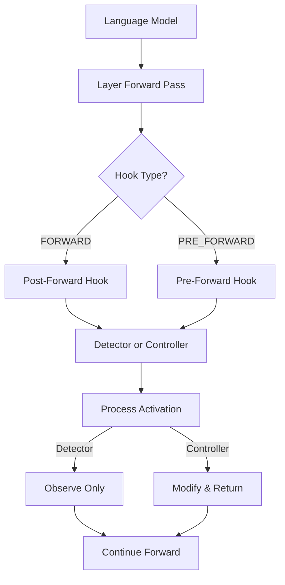

# Hooks System Overview

The hooks system is the foundation of mi-crow's interpretability capabilities. It provides a powerful, flexible framework for intercepting and processing model activations during inference.

## What are Hooks?

Hooks are callbacks that execute at specific points during a neural network's forward pass. In mi-crow, hooks allow you to:

- **Observe** activations without modifying them (Detectors)
- **Modify** activations to change model behavior (Controllers)
- **Compose** multiple hooks for complex experiments
- **Manage** hook lifecycle (register, enable, disable, unregister)

## Why Hooks Matter

Hooks are central to everything mi-crow does:

- **Activation Saving**: Detectors capture activations for analysis
- **SAE Integration**: SAEs work as hooks to decode activations
- **Concept Discovery**: Text tracking uses detectors to collect examples
- **Model Steering**: Controllers modify activations to change behavior
- **Experimentation**: Combine multiple hooks for intervention studies

Without hooks, you'd need to modify model code directly. Hooks provide a clean, non-invasive way to inspect and control models.

## Hook Architecture



## Detectors vs Controllers

### Detectors

**Purpose**: Observe and collect data without modification

**Use Cases**:
- Saving activations for analysis
- Tracking statistics (mean, variance, etc.)
- Collecting top activating texts
- Debugging model behavior

**Key Property**: Detectors never modify activations - they're purely observational.

### Controllers

**Purpose**: Modify activations to change model behavior

**Use Cases**:
- Amplifying or suppressing specific features
- Concept manipulation through SAE neurons
- Intervention experiments
- Model steering

**Key Property**: Controllers return modified activations that replace the original.

## Hook Types

Hooks can execute at two points:

- **PRE_FORWARD**: Before a layer processes its input
  - Receives: Layer inputs
  - Can modify: Inputs before processing
  - Use case: Modify what the layer receives

- **FORWARD**: After a layer produces its output
  - Receives: Layer outputs
  - Can modify: Outputs before passing to next layer
  - Use case: Modify what the layer produces

Most hooks use FORWARD hooks, as they operate on layer outputs (activations).

## Quick Reference

| Feature | Detector | Controller |
|---------|----------|-------------|
| Modifies activations | ❌ No | ✅ Yes |
| Can save to Store | ✅ Yes | Optional |
| Accumulates metadata | ✅ Yes | Optional |
| Returns modified value | ❌ No | ✅ Yes |
| Use case | Observation | Intervention |

## Documentation Structure

This hooks guide is organized into:

1. **[Fundamentals](fundamentals.md)** - Core concepts, lifecycle, and basics
2. **[Detectors](detectors.md)** - Using detector hooks for observation
3. **[Controllers](controllers.md)** - Using controller hooks for modification
4. **[Registration](registration.md)** - Managing hooks on layers
5. **[Advanced](advanced.md)** - Advanced patterns and best practices

## Getting Started

If you're new to hooks, start here:

1. Read [Fundamentals](fundamentals.md) to understand the basics
2. Try [Detectors](detectors.md) for observation tasks
3. Explore [Controllers](controllers.md) for modification tasks
4. Learn [Registration](registration.md) for hook management
5. Check [Advanced](advanced.md) for complex patterns

## Example: Simple Hook Usage

```python
from mi_crow.hooks import LayerActivationDetector
from mi_crow.language_model import LanguageModel
from mi_crow.store import LocalStore

# Setup
store = LocalStore(base_path="./store")
lm = LanguageModel.from_huggingface("gpt2", store=store)

# Create a detector hook
detector = LayerActivationDetector(
    layer_signature="transformer.h.0.attn.c_attn"
)

# Register the hook
hook_id = lm.layers.register_hook("transformer.h.0.attn.c_attn", detector)

# Run inference - hook automatically executes
outputs, encodings = lm.inference.execute_inference(["Hello, world!"])

# Access collected data
activations = detector.tensor_metadata.get("activations")

# Clean up
lm.layers.unregister_hook(hook_id)
```

This simple example demonstrates the core hook workflow: create, register, use, and cleanup.

## Integration with Other Features

Hooks integrate seamlessly with other mi-crow features:

- **SAEs**: Work as both detectors and controllers
- **Activation Saving**: Uses detectors internally
- **Concept Discovery**: Uses detectors for text tracking
- **Model Steering**: Uses controllers for interventions

Understanding hooks is essential for understanding how mi-crow works under the hood.

## Next Steps

- **[Hooks Fundamentals](fundamentals.md)** - Start here for detailed explanation
- **[Using Detectors](detectors.md)** - Learn about observation hooks
- **[Using Controllers](controllers.md)** - Learn about modification hooks
- **[Workflows](../workflows/activation-control.md)** - See hooks in action

