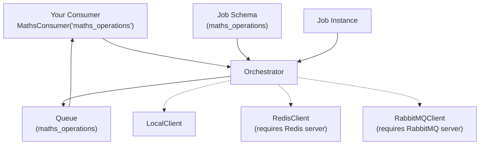

[](https://pypi.org/project/mindtrace-jobs/)
[](https://github.com/mindtrace/mindtrace/blob/main/mindtrace/jobs/LICENSE)
[](https://pepy.tech/projects/mindtrace-jobs)

# Mindtrace Jobs

A job queue system that works with different backends (local, Redis, RabbitMQ).

## Backends
- Local
- Redis
- RabbitMQ

**Setup Redis:**
```bash
# Local installation
redis-server

# Using Docker
docker run -d --name redis -p 6379:6379 redis:latest

# Test connection
redis-cli ping 
```

### RabbitMQ Backend

**Setup RabbitMQ:**
```bash
# Using Docker (recommended)
docker run -d --name rabbitmq -p 5672:5672 -p 15672:15672 -e RABBITMQ_DEFAULT_USER=user -e RABBITMQ_DEFAULT_PASS=password rabbitmq:3-management
```

**Core Components:**
- `Consumer` - Base class for processing jobs
- `Orchestrator` - Manages job queues and routing
- `Job`, `JobSchema` - Job data structures
- `LocalClient`, `RedisClient`, `RabbitMQClient` - Backend implementations


## Architecture 



## Basic Example

```python
from mindtrace.jobs import Orchestrator, LocalClient, Consumer, JobSchema, job_from_schema
from pydantic import BaseModel

# Set up the orchestrator with local backend
orchestrator = Orchestrator(LocalClient())

# Define your job input/output models (inherit from BaseModel directly)
class MathsInput(BaseModel):
    operation: str = "add"
    a: float = 2.0
    b: float = 1.0

class MathsOutput(BaseModel):
    result: float = 0.0
    operation_performed: str = ""

schema = JobSchema(name="maths_operations", input_schema=MathsInput, output_schema=MathsOutput)
orchestrator.register(schema)

# Create a consumer
class MathsConsumer(Consumer):
    def run(self, job_dict: dict) -> dict:
        # Access input data from the dict
        input_data = job_dict.get('input_data', {})
        operation = input_data.get('operation', 'add')
        a = input_data.get('a')
        b = input_data.get('b')
        
        # Your processing logic here
        if operation == "add":
            result = a + b
        elif operation == "multiply":
            result = a * b
        elif operation == "power":
            result = a ** b
        else:
            raise ValueError(f"Unknown operation: {operation}")
        
        return {
            "result": result,
            "operation_performed": f"{operation}({a}, {b}) = {result}"
        }

# Connect and consume jobs
consumer = MathsConsumer("maths_operations")
consumer.connect(orchestrator)

# Add a job to the queue
job = job_from_schema(schema, MathsInput(
    operation="multiply",
    a=7.0,
    b=3.0
))
orchestrator.publish("maths_operations", job)

# Process jobs
consumer.consume(num_messages=1)
```

## Using Different Backends

### Redis Backend
```python
from mindtrace.jobs import RedisClient

redis_backend = RedisClient(host="localhost", port=6379, db=0)
orchestrator = Orchestrator(redis_backend)

consumer = MathsConsumer("maths_operations")
consumer.connect(orchestrator)
consumer.consume()
```

### RabbitMQ Backend
```python
from mindtrace.jobs import RabbitMQClient

rabbitmq_backend = RabbitMQClient(
    host="localhost", 
    port=5672, 
    username="user", 
    password="password"
)
orchestrator = Orchestrator(rabbitmq_backend)

consumer = MathsConsumer("maths_operations")
consumer.connect(orchestrator)
consumer.consume()
```

## Backend Switching

The job system supports seamless switching between backends without changing your consumer code:

```python
# Development: Use local backend
backend = LocalClient()

# Testing: Switch to Redis
backend = RedisClient(host="localhost", port=6379, db=0)

# Production: Switch to RabbitMQ  
backend = RabbitMQClient(host="localhost", port=5672, username="user", password="password")

# Same orchestrator and consumer code works with any backend
orchestrator = Orchestrator(backend)
consumer = MathsConsumer("maths_operations")
consumer.connect(orchestrator)
consumer.consume()
```

## Automatic Backend Detection

When you connect a consumer, the orchestrator automatically detects the backend type and creates the appropriate consumer backend:

```python
consumer = MathsConsumer("maths_operations")
consumer.connect(orchestrator)  # Automatically detects backend type
```

**Implementation:**

1. The `Orchestrator` detects its backend type using `type(self.backend).__name__`
2. Creates the corresponding consumer backend:
   - `LocalClient` → `LocalConsumerBackend`
   - `RedisClient` → `RedisConsumerBackend`  
   - `RabbitMQClient` → `RabbitMQConsumerBackend`

```python
def create_consumer_backend_for_schema(self, schema: JobSchema) -> ConsumerBackendBase:
    backend_type = type(self.backend).__name__
    if backend_type == "LocalClient":
        return LocalConsumerBackend(queue_name, self)
    elif backend_type == "RedisClient":
        return RedisConsumerBackend(queue_name, self, poll_timeout=5)
    elif backend_type == "RabbitMQClient":
        return RabbitMQConsumerBackend(queue_name, self, prefetch_count=1)
```

## Priority Queues

### Local Priority Queue
```python
# Declare priority queue
backend = LocalClient()
orchestrator = Orchestrator(backend)
backend.declare_queue("priority_tasks", queue_type="priority")

# Publish with different priorities (higher numbers = higher priority)
orchestrator.publish("priority_tasks", urgent_job, priority=10)
orchestrator.publish("priority_tasks", normal_job, priority=5)
orchestrator.publish("priority_tasks", background_job, priority=1)
```

### Redis Priority Queue
```python
# REQUIRES: Redis server running
redis_backend = RedisClient(host="localhost", port=6379, db=0)
orchestrator = Orchestrator(redis_backend)
redis_backend.declare_queue("redis_priority", queue_type="priority")

# Higher priority jobs processed first
orchestrator.publish("redis_priority", critical_job, priority=100)
orchestrator.publish("redis_priority", normal_job, priority=50)
```

### RabbitMQ Priority Queue
```python
# REQUIRES: RabbitMQ server running
rabbitmq_backend = RabbitMQClient(host="localhost", port=5672, username="user", password="password")
orchestrator = Orchestrator(rabbitmq_backend)
# RabbitMQ supports max priority 0-255
rabbitmq_backend.declare_queue("rabbitmq_priority", max_priority=255)

orchestrator.publish("rabbitmq_priority", critical_job, priority=255)
orchestrator.publish("rabbitmq_priority", normal_job, priority=128)
```

## API Reference

### Consumer
```python
class Consumer:
    def __init__(self, job_type_name: str)
    def connect(self, orchestrator: Orchestrator)
    def consume(self, num_messages: Optional[int] = None)
    def run(self, job_dict: dict) -> dict  # Implement this method
```

### Orchestrator
```python
class Orchestrator:
    def __init__(self, backend)
    def register(self, schema: JobSchema) -> str
    def publish(self, queue_name: str, job: Job, **kwargs) -> str
    def receive_message(self, queue_name: str) -> Optional[dict]
    def count_queue_messages(self, queue_name: str) -> int
```
