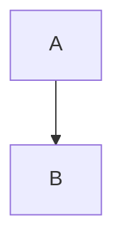
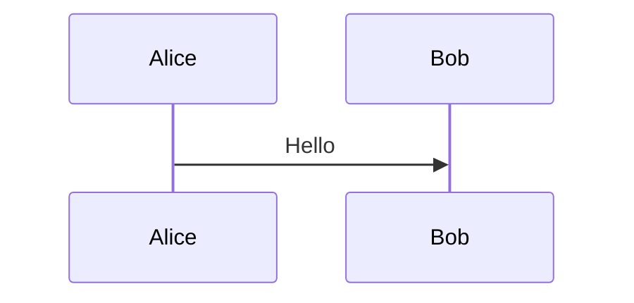

# mkdocs-mermaid-to-svg

[![PyPI - Python Version][python-image]][pypi-link]
[![Linux Support][linux-image]](#requirements)
[![Windows Support][windows-image]](#requirements)

**Japanese** | [English](./README.md)

MermaidチャートをSVG画像へ変換するMkDocsプラグインです。

Mermaidコードブロックを検出し、SVG画像へ置き換えます。JavaScriptを扱えないPDF出力などで特に有用です。

- [Documentation](https://kind-ground-03224aa00.3.azurestaticapps.net/)
- [DeepWiki](https://deepwiki.com/nuitsjp/mkdocs-mermaid-to-svg)

## 特長

- **SVG出力**: Mermaidダイアグラムを高品質なSVGで生成
- **自動変換**: Mermaidコードブロックを自動検出して変換
- **柔軟な設定**: Mermaidのテーマや各種設定を指定可能
- **beautiful-mermaidレンダリング**: [beautiful-mermaid](https://github.com/nuitsjp/beautiful-mermaid) オプションで色・フォント・余白を細かく制御
- **環境変数による制御**: 環境変数で有効/無効を切り替え可能

## 必要要件

実行には [Node.js](https://nodejs.org/) が事前に必要です。

### Mermaid CLI

```bash
# Mermaid CLI をグローバルインストール
npm install -g @mermaid-js/mermaid-cli

# プロジェクト単位でインストールする場合
npm install @mermaid-js/mermaid-cli
```

### Puppeteer

```bash
# Puppeteer をインストール
npm install puppeteer

# Puppeteer 用のブラウザをインストール（必須）
npx puppeteer browsers install chrome-headless-shell
```

## セットアップ

pipでプラグインをインストールします。

```bash
pip install mkdocs-mermaid-to-svg
```

`mkdocs.yml` でプラグインを有効化します（PDF生成向けの推奨設定）。

```yaml
plugins:
  - mermaid-to-svg:
      image_id_enabled: true
      image_id_prefix: mermaid-diagram
      # PDF互換のため HTML labels を無効化
      mermaid_config:
        htmlLabels: false
        flowchart:
          htmlLabels: false
        class:
          htmlLabels: false
  - to-pdf:  # PDF生成プラグイン併用時
      enabled_if_env: ENABLE_PDF_EXPORT

> **Note**
> `mermaid_config` を省略した場合でも、プラグインが自動で `htmlLabels`（`flowchart` と `class` を含む）を無効化した一時設定ファイルを生成します。PDF互換の基本設定は常に適用されるため、独自のMermaid設定が必要な場合だけ `mermaid_config` を指定してください。
```

### PDF互換性

`htmlLabels` が有効な場合、Mermaid CLIはHTMLを含む `<foreignObject>` を含んだSVGを生成します。PDF生成ツールはこれらのHTML要素を正しく描画できず、テキストが消える原因になります。

- **影響を受けるダイアグラム**: フローチャート、クラス図などラベルにHTMLを使う図
- **影響を受けないもの**: シーケンス図は標準のSVGテキスト要素のみを使うためPDFでも問題ありません

## 設定

`mkdocs.yml` でプラグインの動作をカスタマイズできます。すべてオプションです。

### 条件付き有効化

PDF生成時だけプラグインを有効にする場合、to-pdfプラグインと同じ環境変数を利用します。

```yaml
plugins:
  - mermaid-to-svg:
      enabled_if_env: "ENABLE_PDF_EXPORT"  # to-pdf と同じ環境変数を利用
      mermaid_config:
        htmlLabels: false
        flowchart:
          htmlLabels: false
        class:
          htmlLabels: false
  - to-pdf:
      enabled_if_env: ENABLE_PDF_EXPORT
```

実行例:
```bash
ENABLE_PDF_EXPORT=1 mkdocs build
```

### 高度なオプション

```yaml
plugins:
  - mermaid-to-svg:
      renderer: "auto"                 # auto: beautiful-mermaid優先, mmdc: 従来CLI固定
      mmdc_path: "mmdc"                   # Mermaid CLI へのパス
      css_file: "custom-mermaid.css"      # カスタムCSS
      puppeteer_config: "puppeteer.json"  # Puppeteer設定ファイル
      error_on_fail: false                # 生成失敗時も処理を続行
      log_level: "WARNING"                # 現状は mkdocs CLI のフラグで上書き（後述）
      cleanup_generated_images: true      # ビルド後に生成画像を削除
      image_id_enabled: true              # 生成した  にIDを付与
      image_id_prefix: "mermaid-diagram"  # IDプレフィックス（attr_list必須）
```

### beautiful-mermaid レンダリングオプション

`renderer: "auto"` 使用時、[beautiful-mermaid](https://github.com/nuitsjp/beautiful-mermaid) のレンダリングオプションを `mkdocs.yml` でグローバルに設定できます。

```yaml
plugins:
  - mermaid-to-svg:
      renderer: "auto"
      theme: "tokyo-night"                # 名前付きテーマ（tokyo-night, nord 等）
      beautiful_mermaid_bg: "#1a1b26"     # 背景色
      beautiful_mermaid_fg: "#c0caf5"     # 前景（テキスト）色
      beautiful_mermaid_line: "#565f89"   # 線・エッジの色
      beautiful_mermaid_accent: "#7aa2f7" # アクセント色
      beautiful_mermaid_font: "Inter"     # フォントファミリー
      beautiful_mermaid_padding: 20       # 図の余白（px）
      beautiful_mermaid_node_spacing: 80  # ノード間隔（px）
      beautiful_mermaid_transparent: true # 背景を透過にする
```

利用可能なオプション:

| オプション | 型 | 説明 |
|--------|------|-------------|
| `beautiful_mermaid_bg` | `str` | 背景色 |
| `beautiful_mermaid_fg` | `str` | 前景（テキスト）色 |
| `beautiful_mermaid_line` | `str` | 線・エッジの色 |
| `beautiful_mermaid_accent` | `str` | アクセント色 |
| `beautiful_mermaid_muted` | `str` | ミュート色 |
| `beautiful_mermaid_surface` | `str` | サーフェス色 |
| `beautiful_mermaid_border` | `str` | ボーダー色 |
| `beautiful_mermaid_font` | `str` | フォントファミリー |
| `beautiful_mermaid_padding` | `int` | 図の余白（px） |
| `beautiful_mermaid_node_spacing` | `int` | ノード間隔（px） |
| `beautiful_mermaid_layer_spacing` | `int` | レイヤー間隔（px） |
| `beautiful_mermaid_transparent` | `bool` | 背景を透過にする |

#### ブロック単位の上書き

コードフェンスの属性でグローバル設定をブロック単位で上書きできます。

````markdown

````

ブロック属性は `mkdocs.yml` のグローバル設定より優先されます。`theme` もブロック単位で上書き可能です。

````markdown

````

> **注意**: beautiful-mermaidオプションは `renderer: "auto"` かつ対応する図種（flowchart, sequence, class, ER, state）でのみ適用されます。未対応の図種（pie, gantt等）はmmdcにフォールバックし、これらのオプションは無視されます。

> **Mermaid image IDs**
> `image_id_enabled: true` で、生成画像ごとに決定的なID（例: `mermaid-diagram-guide-1`）を付与できます。ダイアグラム単位でのCSS指定やPDF時のサイズ調整に便利です。
>
> - Markdownの [`attr_list`](https://python-markdown.github.io/extensions/attr_list/) 拡張を有効にしない場合、MkDocsは `{#...}` を文字列として扱います。
> - `image_id_prefix` でプレフィックスを変更できます。コードフェンスに `{id: "custom-id"}` を付与すれば個別IDも指定できます。

設定例:

```yaml
markdown_extensions:
  - attr_list

plugins:
  - mermaid-to-svg:
      image_id_enabled: true
      image_id_prefix: "diagram"
```

## 設定オプション一覧

| Option | Default | Description |
|--------|---------|-------------|
| `enabled_if_env` | `None` | 環境変数でプラグインを有効化する場合の変数名 |
| `output_dir` | `"assets/images"` | 生成したSVGを配置するディレクトリ |
| `theme` | `"default"` | Mermaidのテーマ — mmdc組み込み（default, dark, forest, neutral）またはbeautiful-mermaid名前付きテーマ（tokyo-night, nord等） |
| `renderer` | `"mmdc"` | `auto`=beautiful-mermaid優先（未導入/未対応時はmmdcへ）, `mmdc`=従来CLI固定 |
| `mmdc_path` | `"mmdc"` | `mmdc` 実行ファイルのパス |
| `cli_timeout` | `90` | Mermaid CLIのタイムアウト（秒）。図が極端に小さい/重い場合に調整 |
| `mermaid_config` | `None` | Mermaid設定の辞書 |
| `css_file` | `None` | カスタムCSSファイルのパス |
| `puppeteer_config` | `None` | Puppeteer設定ファイルのパス |
| `error_on_fail` | `true` | 生成エラー時にビルドを停止するか |
| `log_level` | `auto` | `mkdocs.yml` の値は無視され、`mkdocs build --verbose/-v` 時は `DEBUG`、それ以外は `WARNING` で固定 |
| `cleanup_generated_images` | `true` | ビルド後に生成画像を削除するか |
| `image_id_enabled` | `false` | 生成した画像Markdownに `{#id}` を付与（`attr_list` 必須） |
| `image_id_prefix` | `"mermaid-diagram"` | `image_id_enabled` が true の場合に使うIDプレフィックス |
| `beautiful_mermaid_*` | `None` | beautiful-mermaidレンダリングオプション（[beautiful-mermaid レンダリングオプション](#beautiful-mermaid-レンダリングオプション)を参照） |

> **ログレベルの挙動**
> `mkdocs build --verbose` または `-v` を付けると `DEBUG`、付けない場合は `WARNING` に強制されます。現状 `mkdocs.yml` に記載した値は無視されます。

### 実行時の注意点

- `mkdocs serve` ではMermaidのコードブロックをそのまま残し、`mkdocs build` 時のみ変換を実行します。
- `enabled_if_env` は「存在してかつ空文字列でない」環境変数が必要です。未設定または空の場合は無効のままです。
- 指定した `mmdc_path` が使えない場合、`npx mmdc` へフォールバックします。
- `puppeteer_config` が省略または存在しない場合、ヘッドレス実行向けの一時設定を自動生成し、使用後にクリーンアップします。
- `renderer: auto` を使う場合は `node` と `beautiful-mermaid`（例: `npm install beautiful-mermaid`）が必要です。
- `renderer: auto` は未対応図種（pie/ganttなど）やレンダラー失敗時にmmdcへフォールバックします。

### SVGゴールデンテスト

SVGの完全一致テストはデフォルトで実行され、次の環境変数で制御できます。

```bash
SKIP_SVG_GOLDEN=1 uv run pytest tests/integration/test_svg_golden.py
```

期待値を更新する場合:

```bash
REGENERATE_SVG_GOLDENS=1 uv run pytest tests/integration/test_svg_golden.py
```

## PDF生成

このプラグインはPDF互換性を考慮して設計されています。

### なぜSVGなのか

- **ベクター形式**: どんな解像度でも美しくスケール
- **テキスト保持**: PDFでもテキスト選択・検索が可能
- **JavaScript不要**: JavaScriptを無効化しているPDF生成ツールでも動作

## 利用例

1. MarkdownにMermaid図を書く:

   ````markdown
   ```mermaid
   graph TD
       A[Start] --> B{Decision}
       B -->|Yes| C[Action 1]
       B -->|No| D[Action 2]
   ```
   ````

2. ビルド時に自動でSVGへ変換されます:

   ```html
   <p></p>
   ```

3. PDFにエクスポートしても、滑らかで選択可能なテキスト付きの図として表示されます。

[pypi-link]: https://pypi.org/project/mkdocs-mermaid-to-svg/
[python-image]: https://img.shields.io/pypi/pyversions/mkdocs-mermaid-to-svg?logo=python&logoColor=aaaaaa&labelColor=333333
[linux-image]: https://img.shields.io/badge/Linux-supported-success?logo=linux&logoColor=white&labelColor=333333
[windows-image]: https://img.shields.io/badge/Windows-supported-success?logo=windows&logoColor=white&labelColor=333333
