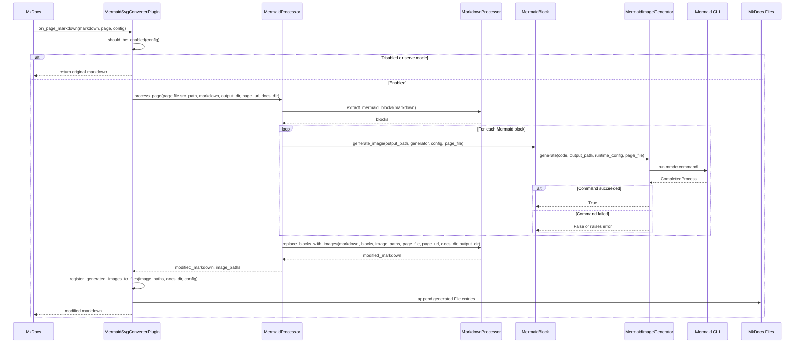
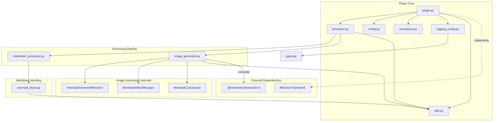
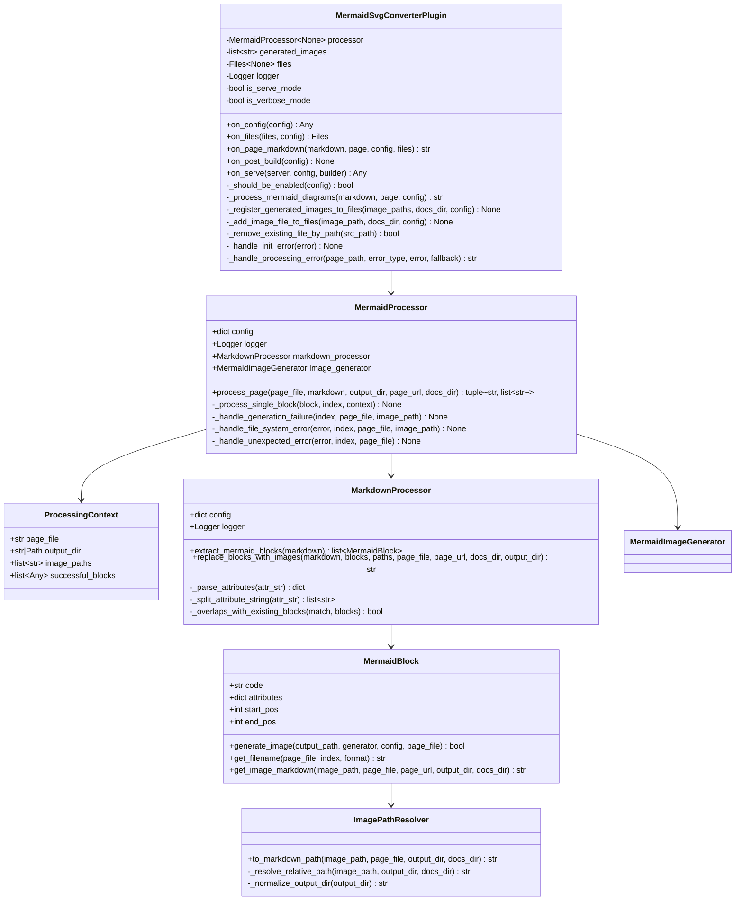
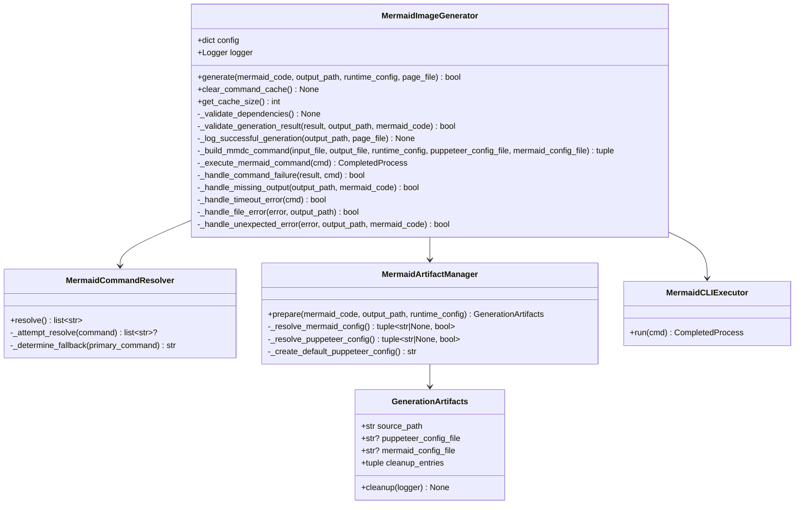

# Architecture Documentation

## Overview

The MkDocs Mermaid to SVG plugin turns Mermaid code fences into static SVG images during a MkDocs build so that PDF export and offline browsing work without client-side JavaScript. During `on_config` the plugin validates the configuration, honours the optional `enabled_if_env` gate, and wires up a `MermaidProcessor` instance. When MkDocs renders pages, `on_page_markdown` delegates to the processor (unless we are serving live content) and collects every generated asset so that `on_post_build` can register or clean them via `Files`.

Key runtime traits:

- Configuration is validated and augmented with derived values such as `log_level` based on `--verbose` flags.
- The plugin can be disabled entirely through `enabled_if_env` or by running MkDocs in `serve` mode.
- Generated assets are tracked in-memory so that they can be injected into `Files` and removed when `cleanup_generated_images` is enabled.
- When `image_id_enabled` is true the plugin validates that `attr_list` is present in `markdown_extensions` and assigns deterministic IDs to successful blocks.
- Errors are normalised through `_handle_processing_error`, mapping low-level failures onto the typed exception hierarchy in `exceptions.py`.

## Processing Pipeline

1. **MkDocs hook** – `MermaidSvgConverterPlugin.on_page_markdown` short-circuits for `serve` mode and otherwise invokes `_process_mermaid_diagrams`.
2. **Page processing** – `MermaidProcessor.process_page` extracts all Mermaid blocks, iterates them with a `ProcessingContext`, and collects rewritten Markdown plus image paths.
3. **Markdown extraction** – `MarkdownProcessor` finds both attribute-rich and plain Mermaid fences, parses attributes into dictionaries, and keeps positional information for later replacement.
4. **Image generation** – Each `MermaidBlock.generate_image` call hands the diagram code to `MermaidImageGenerator`, which resolves the CLI command, prepares temp artifacts, executes `mmdc`, and validates outputs.
5. **Markdown rewrite** – Successful blocks replace their source spans with image Markdown that respects the page depth, docs root, and configured `output_dir` via `ImagePathResolver`.

## Sequence Diagram



## Project Structure

```
mkdocs-mermaid-to-svg/
└── src/
    └── mkdocs_mermaid_to_svg/
        ├── __init__.py             # Package init and version exposure
        ├── _version.py             # Version string wiring for mkdocs
        ├── plugin.py               # MermaidSvgConverterPlugin MkDocs entry point and lifecycle hooks
        ├── processor.py            # MermaidProcessor and ProcessingContext coordinating block/image handling
        ├── markdown_processor.py   # MarkdownProcessor + helpers to extract and rewrite Mermaid fences
        ├── image_generator.py      # MermaidImageGenerator plus CLI resolver/executor/artifact manager
        ├── mermaid_block.py        # MermaidBlock & ImagePathResolver for per-block rendering metadata
        ├── config.py               # ConfigManager schema, validation, and file existence checks
        ├── types.py                # LogContext TypedDict shared with logging utilities
        ├── exceptions.py           # Structured exception hierarchy used across the pipeline
        ├── logging_config.py       # Structured logging setup and contextual adapters
        └── utils.py                # Shared helpers (filenames, temp files, CLI detection, cleanup)
```

## Component Dependencies



## Mermaid Image IDs

- `MermaidSvgConverterPlugin.on_config` throws a `MermaidConfigError` when `image_id_enabled` is set but the Markdown `attr_list` extension is not enabled, preventing broken `{#...}` literals.
- After successful rendering, `MermaidProcessor` calls `MermaidBlock.set_render_context` with a generated ID composed from `image_id_prefix`, the page stem, and a 1-based index.
- Individual Mermaid fences can override the generated ID by supplying an `{id: "custom-id"}` attribute, which is respected during Markdown replacement.

## Class Architecture





## Configuration Highlights

- `enabled_if_env` toggles the plugin unless a non-empty environment variable is present.
- `output_dir` controls where SVGs are written relative to `docs_dir` and feeds directly into Markdown rewriting logic.
- `theme`, `css_file`, and `mermaid_config` influence Mermaid CLI rendering; dictionary Mermaid configs are serialised to a temp file.
- `puppeteer_config` can point at an existing file; otherwise the artifact manager writes a Chrome-friendly default and tears it down afterward.
- `mmdc_path` (and its fallback logic) is resolved through `MermaidCommandResolver`, with results cached across generations.
- `cleanup_generated_images` toggles post-build removal using `utils.clean_generated_images`.
- `log_level` is derived from CLI verbosity or `MKDOCS_MERMAID_LOG_LEVEL` and applied through `logging_config.setup_plugin_logging`.
- `error_on_fail` guards whether failures raise typed exceptions (`MermaidFileError`, `MermaidImageError`, etc.) or silently preserve the original Markdown block.
