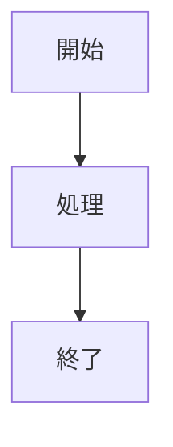

# Quickstart: beautiful-mermaidレンダリングオプション

**Date**: 2026-01-31 | **Feature**: 001-beautiful-mermaid-options

## 基本的な使い方

### 1. グローバル設定（mkdocs.yml）

```yaml
plugins:
  - mermaid_to_svg:
      renderer: auto
      theme: tokyo-night
      beautiful_mermaid_font: "Noto Sans JP"
      beautiful_mermaid_padding: 50
```

### 2. 名前付きテーマの使用

```yaml
plugins:
  - mermaid_to_svg:
      renderer: auto
      theme: catppuccin-mocha    # beautiful-mermaidの名前付きテーマ
```

利用可能なbeautiful-mermaidテーマ:
- `tokyo-night`, `tokyo-night-storm`, `tokyo-night-light`
- `catppuccin-mocha`, `catppuccin-latte`
- `nord`, `nord-light`
- `dracula`
- `github-light`, `github-dark`
- `solarized-light`, `solarized-dark`
- `one-dark`
- `zinc-dark`

### 3. テーマ＋個別色カスタマイズ

```yaml
plugins:
  - mermaid_to_svg:
      renderer: auto
      theme: nord                          # ベーステーマ
      beautiful_mermaid_bg: "#000000"      # 背景だけ上書き
      beautiful_mermaid_transparent: true   # 透過背景
```

### 4. ブロック単位のカスタマイズ

Markdownファイル内でブロックごとにオプションを指定:

````markdown

````

ブロック属性はグローバル設定より優先されます。

### 5. 全オプション一覧

| mkdocs.ymlキー | ブロック属性キー | 説明 |
|----------------|----------------|------|
| `beautiful_mermaid_bg` | `bg` | 背景色 |
| `beautiful_mermaid_fg` | `fg` | テキスト色 |
| `beautiful_mermaid_line` | `line` | エッジ色 |
| `beautiful_mermaid_accent` | `accent` | ハイライト色 |
| `beautiful_mermaid_muted` | `muted` | セカンダリテキスト色 |
| `beautiful_mermaid_surface` | `surface` | ノード塗り色 |
| `beautiful_mermaid_border` | `border` | 枠線色 |
| `beautiful_mermaid_font` | `font` | フォントファミリー |
| `beautiful_mermaid_padding` | `padding` | キャンバスパディング（px） |
| `beautiful_mermaid_node_spacing` | `node_spacing` | ノード間隔（px） |
| `beautiful_mermaid_layer_spacing` | `layer_spacing` | レイヤー間隔（px） |
| `beautiful_mermaid_transparent` | `transparent` | 透過背景 |

### 注意事項

- `renderer: mmdc`使用時、`beautiful_mermaid_*`オプションは警告付きで無視されます
- 未指定のオプションはbeautiful-mermaidのデフォルト値が使用されます
- 既存プロジェクトでオプション未設定の場合、動作は変更前と完全に同一です
