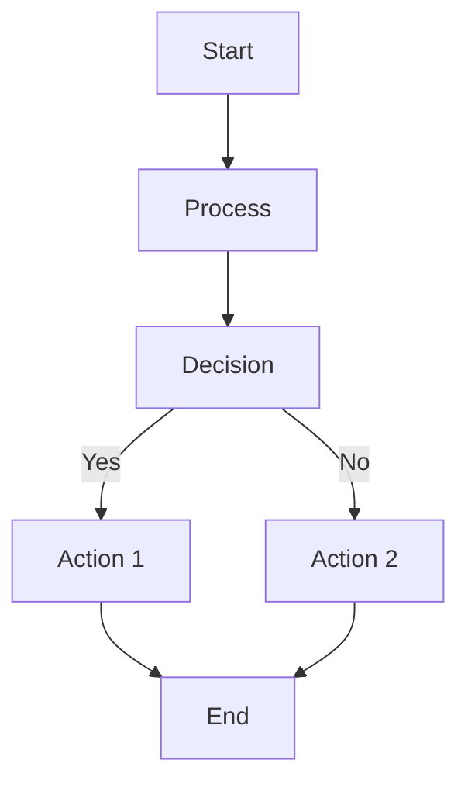
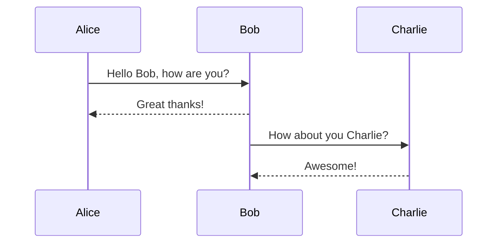
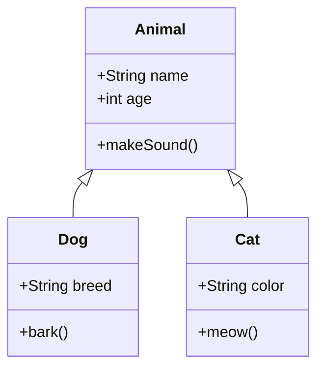
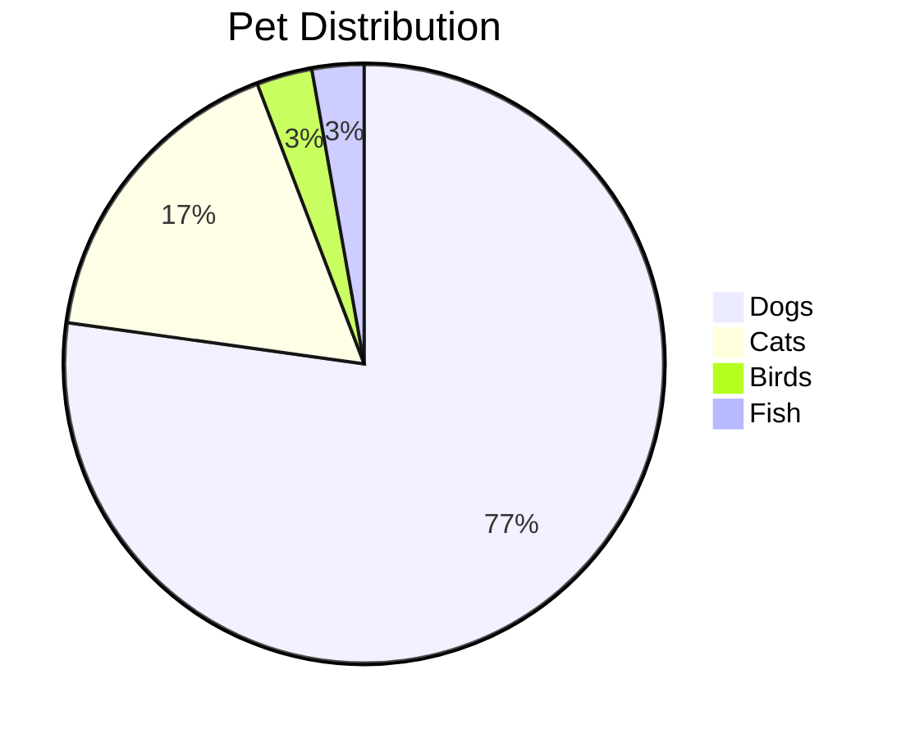

# Test Document with Mermaid Diagrams

This is a test document containing multiple Mermaid diagrams.

## Basic Flowchart



## Sequence Diagram with Theme



## Class Diagram



## Some Regular Content

This is just regular markdown content that should not be affected by the plugin.

### Code Block (Not Mermaid)

```python
def hello_world():
    print("Hello, World!")
```

## Another Mermaid Diagram


