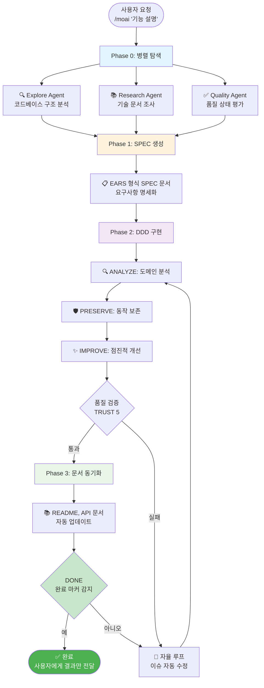
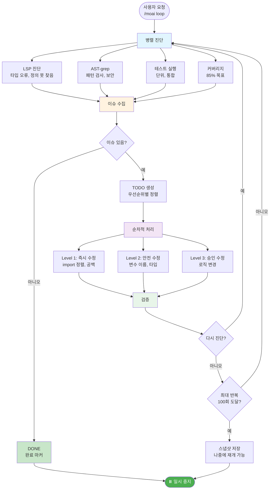
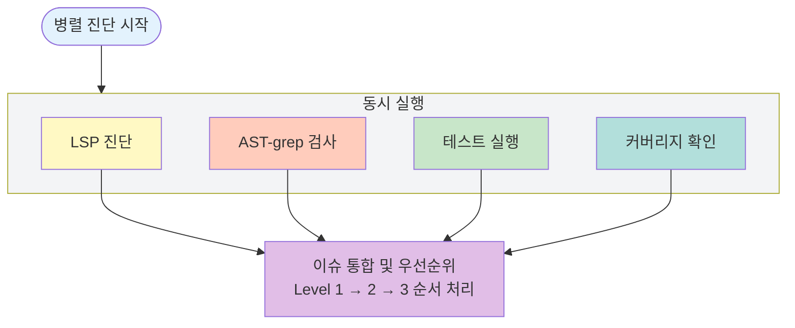
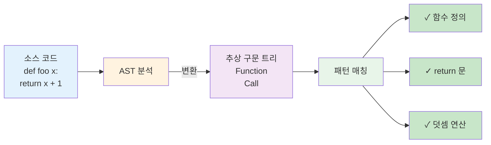
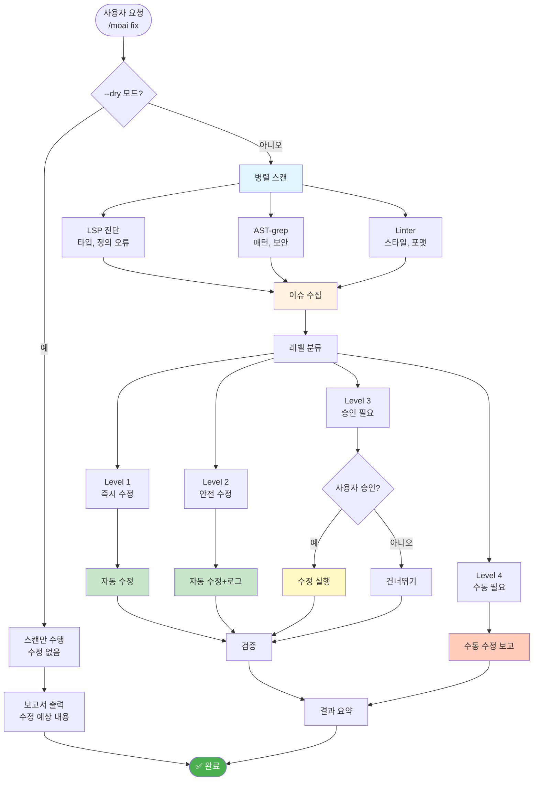
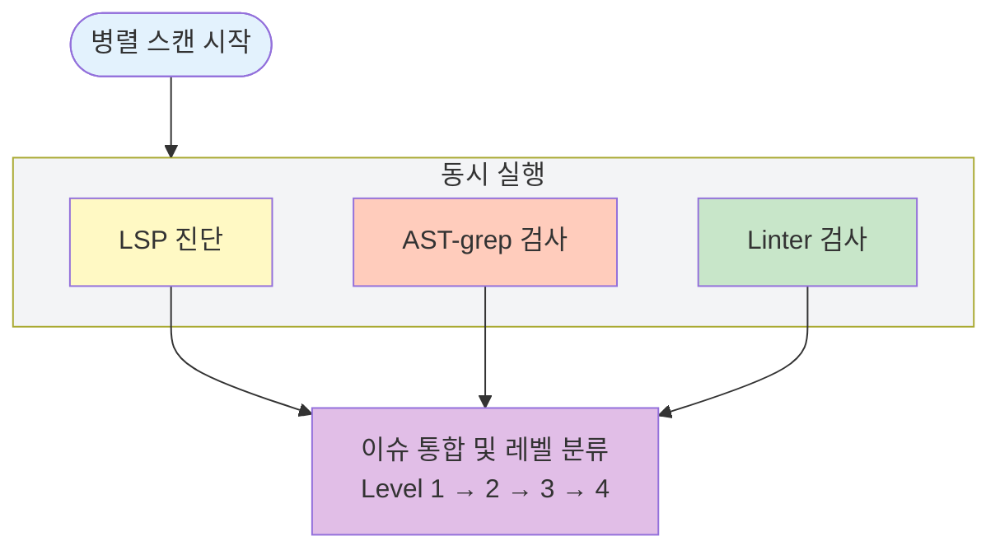
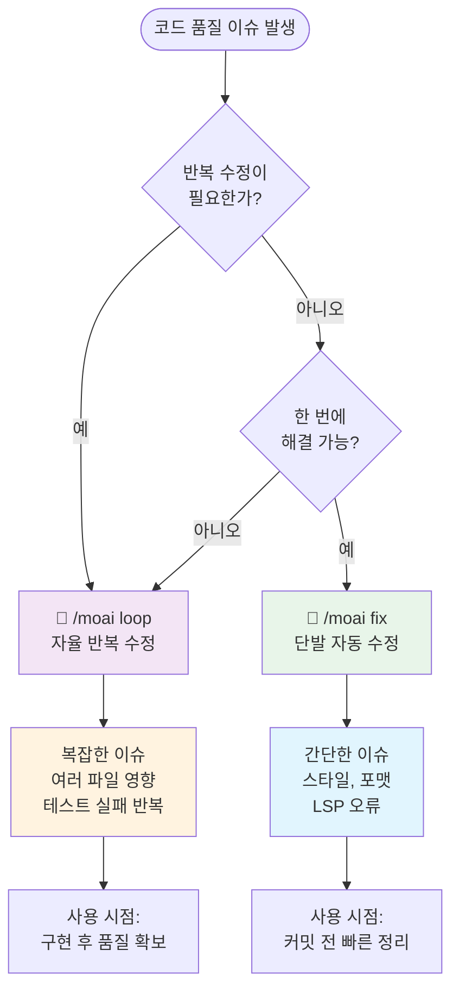
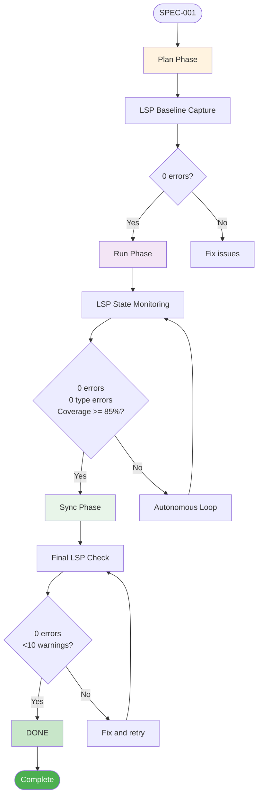
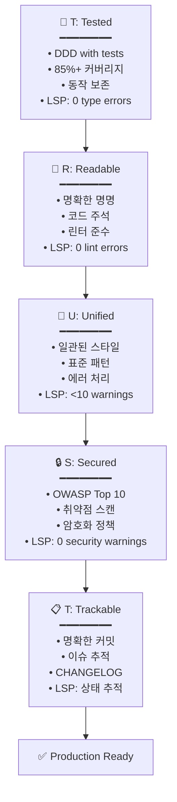

# 🗿 MoAI-ADK: Agentic AI 개발 프레임워크


**사용 가능한 언어:** [🇰🇷 한국어](./README.ko.md) | [🇺🇸 English](./README.md) | [🇯🇵 日本語](./README.ja.md) | [🇨🇳 中文](./README.zh.md)

[](https://pypi.org/project/moai-adk/)
[](./LICENSE)
[](https://www.python.org/)

> **"바이브 코딩의 목적은 빠른 생산성이 아니라 코드 품질이다."**

MoAI-ADK는 **품질 있는 코드를 만드는 AI 개발 환경**을 제공합니다. SPEC-First DDD (Domain-Driven Development), 동작 보존을 통한 지속적 리팩토링과 20개 전문 AI 에이전트가 함께합니다.

---

## 🎁 MoAI-ADK 스폰서: z.ai GLM 4.7

### 비용 효율적인 AI 개발을 위한 최적 솔루션

MoAI-ADK는 **z.ai GLM 4.7**과 파트너십을 통해 개발자들에게 경제적인 AI 개발 환경을 제공합니다.

### 🚀 GLM 4.7 특별 혜택

| 혜택                  | 설명                                           |
| --------------------- | ---------------------------------------------- |
| **💰 70% 비용 절감**  | Claude 대비 1/7 가격으로 동등한 성능           |
| **⚡ 빠른 응답 속도** | 최적화된 인프라로 저지연 응답 제공             |
| **🔄 호환성**         | Claude Code와 완벽 호환, 별도 코드 수정 불필요 |
| **📈 무제한 사용**    | 일간/주간 토큰 리밋 없이 자유롭게 사용         |

### 🎁 가입 특별 할인

**👉 [GLM 4.7 가입하기 (10% 추가 할인)](https://z.ai/subscribe?ic=1NDV03BGWU)**

이 링크를 통해 가입하면:

- ✅ **추가 10% 할인** 혜택
- ✅ **MoAI 오픈소스 개발**에 기여 (리워드 크레딧은 오픈소스 프로젝트에 사용됩니다)

### 💡 사용 가이드

```bash
# 1. GLM API 키 발급
위 링크에서 가입 후 API 키 발급

# 2. MoAI-ADK에 GLM 설정
moai glm YOUR_API_KEY
```

> **💡 팁**: Worktree 환경에서 GLM 4.7을 활용하면 Opus로 설계하고 GLM으로 대량 구현하여 비용을 최대 70% 절감할 수 있습니다.

---

## 🌟 핵심 가치

- **🎯 SPEC-First**: 명확한 명세서로 90% 재작업 감소
- **🔵 DDD**: ANALYZE-PRESERVE-IMPROVE 사이클로 동작 보존 리팩토링
- **🤖 AI 오케스트레이션**: 20개 전문 에이전트 + 52개 스킬
- **🧠 Sequential Thinking MCP**: 단계별 추론을 통한 구조화된 문제 해결
- **🌐 다국어 라우팅**: 한국어/영어/일본어/중국어 자동 지원
- **🌳 Worktree 병렬 개발**: 완전 격리 환경에서 무제한 병렬 작업
- **🏆 MoAI Rank**: 바이브 코딩 리더보드로 동기부여
- **🔗 Ralph-Style LSP 통합**: 실시간 품질 피드백을 위한 LSP 기반 자율 워크플로우

---

> **📚 상세 내용은 공식 온라인 문서를 참고하세요:** [https://adk.mo.ai.kr](https://adk.mo.ai.kr)

## 1. 30초 설치

> **⚠️ Windows 사용자**: MoAI-ADK는 **PowerShell**과 **WSL (Windows Subsystem for Linux)**을 지원합니다. 명령 프롬프트(cmd.exe)는 **지원하지 않습니다**. PowerShell, Windows Terminal 또는 WSL을 사용해주세요.

### 📋 필수 의존성

**필요 패키지:**

- **Python 3.11+**: MoAI-ADK는 Python 3.11 이상이 필요합니다
- **PyYAML 6.0+**: Hook 스크립트 실행에 필요합니다 (`uv run --with pyyaml`로 자동 설치)
- **uv**: Python 패키지 설치 도구 (MoAI-ADK 설치 시 포함)

**참고**: PyYAML은 다음 기능에 필요합니다:
- AST-grep 다중 문서 YAML 파싱
- 설정 파일 읽기/쓰기
- SPEC 파일 YAML 프론트매터 파싱
- 스킬 메타데이터 처리

PyYAML이 없는 경우 hook이 자동으로 `uv run --with pyyaml`를 사용하여 설치를 시도합니다.

### 🚀 방법 1: 빠른 설치 (권장)

```bash
curl -LsSf https://modu-ai.github.io/moai-adk/install.sh | sh
```

### 🔧 방법 2: 수동 설치

```bash
# MoAI-ADK 설치
uv tool install moai-adk
```

### 🎨 대화형 설정 마법사

`moai init` 명령어 실행 시 대화형 마법사가 시작됩니다:


---

#### Step 1: 언어 선택

대화 언어를 선택합니다. 이후 모든 안내가 선택한 언어로 표시됩니다.

```text
🌐 Language Selection
❯ Select your conversation language: [↑↓] Navigate  [Enter] Select
❯ Korean (한국어)
  English
  Japanese (日本語)
  Chinese (中文)
```

---

#### Step 2: 이름 입력

사용자 이름을 입력합니다. AI가 개인화된 응답을 제공합니다.

```text
👤 사용자 설정
❯ 사용자 이름을 입력하세요 (선택사항):
```

---

#### Step 3: GLM API 키 입력

Z.AI사의 GLM API 키를 입력합니다.

```text
🔑 API 키 입력
GLM CodePlan API key (optional - press Enter to skip)

✓ 기존 GLM API 키를 찾았습니다: 99c1a2df...
Enter를 누르면 기존 키 유지, 새 키를 입력하면 교체됩니다

? GLM API 키를 입력하세요:
```

> 🎁 **GLM 가입 혜택**: GLM 계정이 없다면 아래 링크로 가입하세요!
>
> **👉 [GLM 가입하기 (10% 추가 할인)](https://z.ai/subscribe?ic=1NDV03BGWU)**
>
> 이 링크를 통해 가입하면 **추가 10% 할인** 혜택을 받을 수 있습니다.
> 또한 링크를 통한 가입 시 발생하는 리워드는 **MoAI 오픈소스 개발**에 사용됩니다. 🙏

---

#### Step 4: 프로젝트 설정

프로젝트 이름을 입력합니다.

```text
📁 프로젝트 설정
❯ 프로젝트 이름: MoAI-ADK
```

---

#### Step 5: Git 설정

Git 모드를 선택합니다.

```text
🔀 Git 설정
❯ Git 모드를 선택하세요: [↑↓] Navigate  [Enter] Select
❯ manual (로컬만) - 로컬 저장소만 사용
  personal (GitHub 개인) - GitHub 개인 계정 사용
  team (GitHub 팀) - GitHub 팀/조직 사용
```

---

#### Step 6: GitHub 사용자명

personal/team 선택 시 GitHub 사용자명을 입력합니다.

```text
❯ GitHub 사용자명:
```

---

#### Step 7: 커밋 메시지 언어

Git 커밋 메시지에 사용할 언어를 선택합니다.

```text
🗣️ 출력 언어 설정
❯ 커밋 메시지 언어: [↑↓] Navigate  [Enter] Select
  English
❯ Korean (한국어)
  Japanese (日本語)
  Chinese (中文)
```

---

#### Step 8: 코드 주석 언어

코드 주석에 사용할 언어를 선택합니다.

```text
❯ 코드 주석 언어: [↑↓] Navigate  [Enter] Select
  English
❯ Korean (한국어)
  Japanese (日本語)
  Chinese (中文)
```

---

#### Step 9: 문서 언어

문서에 사용할 언어를 선택합니다.

```text
❯ 문서 언어: [↑↓] Navigate  [Enter] Select
  English
❯ Korean (한국어)
  Japanese (日本語)
  Chinese (中文)
```

> 💡 **토큰 최적화 전략**: 에이전트에게 지시하는 내부 프롬프트는 **영어로 고정**되어 있습니다.
>
> **이유**: 비영어권 언어는 Claude에서 **12%~20% 토큰을 추가 소모**합니다. 무한 반복 에이전트 작업이 많아지면 비용과 주간 토큰 리밋에 큰 영향을 주기 때문에, MoAI는 내부 에이전트 지시는 영어로 고정하고 **일반 대화만 사용자 언어로 제공**합니다.
>
> 이것이 MoAI의 **토큰 낭비를 줄이기 위한 노력**입니다.

---

#### 설치 완료

모든 설정이 완료되면 5단계 설치가 자동 진행됩니다:

```text
🚀 Starting installation...

Phase 1: Preparation and backup...        ████████████████ 100%
Phase 2: Creating directory structure...  ████████████████ 100%
Phase 3: Installing resources...          ████████████████ 100%
Phase 4: Generating configurations...     ████████████████ 100%
Phase 5: Validation and finalization...   ████████████████ 100%

✅ Initialization Completed Successfully!
────────────────────────────────────────────────────────────────

📊 Summary:
  📁 Location:   /path/to/my-project
  🌐 Language:   Auto-detect (use /moai project)
  🔀 Git:        manual (github-flow, branch: manual)
  🌍 Locale:     ko
  📄 Files:      47 created
  ⏱️  Duration:   1234ms

🚀 Next Steps:
  1. Run cd my-project to enter the project
  2. Run /moai project in Claude Code for full setup
  3. Start developing with MoAI-ADK!
```

### 기존 프로젝트에 추가

```bash
cd your-existing-project
moai init .
# 기존 파일은 그대로 유지됩니다
```

### WSL (Windows Subsystem for Linux) 지원

MoAI-ADK는 Windows 10과 Windows 11에서 **WSL 1**과 **WSL 2**를 완벽하게 지원합니다.

#### WSL에 설치하기

```bash
# WSL에서 MoAI-ADK 설치
uv tool install moai-adk

# 프로젝트 초기화
cd your-project-directory
moai-adk init
```

#### 경로 처리

MoAI-ADK는 Windows와 WSL 경로 형식을 자동으로 변환합니다:

- **Windows 경로**: `C:\Users\goos\project` → **WSL 경로**: `/mnt/c/Users/goos/project`
- 수동 설정 불필요
- Linux 파일시스템(`/home/user/`)과 Windows 파일시스템(`/mnt/c/`) 모두에서 원활하게 동작

#### 권장 사항

**권장**: 최적의 성능을 위해 Linux 파일시스템에 프로젝트 배치
```bash
# ✅ 최고 성능
cd ~/projects
moai-adk init
```

**지원됨**: Windows 파일시스템의 프로젝트도 사용 가능
```bash
# ✅ 동작하지만 약간의 오버헤드 발생 가능
cd /mnt/c/Users/YourName/projects
moai-adk init
```

#### WSL 문제 해결

**WSL 환경 확인:**
```bash
# WSL에서 실행 중인지 확인
echo $WSL_DISTRO_NAME

# CLAUDE_PROJECT_DIR 확인 (Claude Code가 설정)
echo $CLAUDE_PROJECT_DIR
```

**경로 문제:**
- 훅이 실패하는 경우, `CLAUDE_PROJECT_DIR`이 올바르게 설정되었는지 확인하세요
- MoAI-ADK는 Windows 경로를 WSL 형식으로 자동 변환합니다
- `.claude/settings.json`에서 경로 참조가 올바른지 확인하세요

**관련 이슈:**
- [Issue #295: WSL Support Request](https://github.com/modu-ai/moai-adk/issues/295)
- [Claude Code Issue #19653: WSL Path Handling](https://github.com/anthropics/claude-code/issues/19653)

---

### 🔄 MoAI-ADK 업데이트

기존 프로젝트를 최신 버전으로 업데이트합니다.

```bash
moai update
```

**3단계 스마트 업데이트 워크플로우**:

```text
Stage 1: 📦 패키지 버전 확인
         └─ PyPI에서 최신 버전 확인 → 필요시 자동 업그레이드

Stage 2: 🔍 Config 버전 비교
         └─ 패키지 템플릿 vs 프로젝트 설정 비교
         └─ 동일하면 스킵 (70-80% 성능 향상)

Stage 3: 📄 템플릿 동기화
         └─ 백업 생성 → 템플릿 업데이트 → 사용자 설정 복원
```

**주요 옵션**:

```bash
# 버전만 확인 (업데이트 없음)
moai update --check

# 템플릿만 동기화 (패키지 업그레이드 스킵)
moai update --templates-only

# 설정 편집 모드 (init 마법사 재실행)
moai update --config
moai update -c

# 백업 없이 강제 업데이트
moai update --force

# All is well~  자동 모드 (모든 확인 자동 승인)
moai update --yes
```

**머지 전략 선택**:

```text
🔀 Choose merge strategy:
  [1] Auto-merge (default)
      → 템플릿 + 사용자 변경 사항 자동 보존
  [2] Manual merge
      → 백업 + 머지 가이드 생성 (직접 제어)
```

```bash
# Auto-merge 강제 (기본값)
moai update --merge

# Manual merge 강제
moai update --manual
```

**자동 보존되는 항목**:

| 항목                | 설명                                          |
| ------------------- | --------------------------------------------- |
| **사용자 설정**     | `.claude/settings.local.json` (MCP, GLM 설정) |
| **커스텀 에이전트** | 템플릿에 없는 사용자 생성 에이전트            |
| **커스텀 명령어**   | 사용자 정의 슬래시 명령어                     |
| **커스텀 스킬**     | 사용자 정의 스킬                              |
| **커스텀 훅**       | 사용자 정의 훅 스크립트                       |
| **SPEC 문서**       | `.moai/specs/` 폴더 전체                      |
| **리포트**          | `.moai/reports/` 폴더 전체                    |

> 💡 **업데이트 팁**: `moai update -c`로 언제든 언어, API 키, Git 설정을 변경할 수 있습니다.
> 사용자의 명령어, 에이전트, 스킬, 훅은 moai 이외의 폴더에 생성해서 사용 하시면 좋습니다.

---

## ⚠️ 알려진 문제 및 해결 방안

### pip와 uv tool 충돌

**문제점**: pip와 uv tool을 함께 사용하여 MoAI-ADK를 설치한 경우 버전 충돌이 발생할 수 있습니다.

**증상**:
```bash
# moai update는 최신 버전을 표시
moai update
✓ Package already up to date (1.5.0)

# 하지만 실제 명령어는 구버전 사용
which moai
~/.pyenv/shims/moai  # pip 버전 사용 (예: 1.1.0)

# hook에서 import 오류
ModuleNotFoundError: No module named 'yaml'
```

**근본 원인**:
- `uv tool install`은 `~/.local/bin/moai`에 설치
- `pip install`은 `~/.pyenv/shims/moai`에 설치
- PATH 우선순위에 따라 사용 버전이 결정됨
- **Windows 사용자는 Python 환경 차이로 더 심각한 문제 발생 가능**

**해결 방법**:

#### 옵션 1: uv tool로 깨끗하게 재설치 (권장)

```bash
# 기존 설치 제거
pip uninstall moai-adk -y
uv tool uninstall moai-adk

# uv tool로 재설치
uv tool install moai-adk

# 확인
moai --version  # 최신 버전 표시되어야 함
```

#### 옵션 2: 쉘 설정 업데이트

**macOS/Linux (~/.zshrc 또는 ~/.bashrc)**:
```bash
# PATH에 추가
export PATH="$HOME/.local/bin:$PATH"
```

**Windows (PowerShell $PROFILE)**:
```powershell
# $PROFILE에 추가
$env:PATH = "$env:USERPROFILE\.local\bin;$env:PATH"
```

**예방**:
- 항상 `uv tool install moai-adk`로 설치
- 정기적으로 `which moai`로 활성 설치 확인

---

## 2. 핵심 명령어 모음

### 🎯 `/moai project` - 프로젝트 문서 생성

```bash
> /moai project
```

신규 프로젝트나 기존 프로젝트에서 **Claude Code가 프로젝트를 이해하는 데 도움**이 되는 프로젝트 문서를 자동 생성합니다. 프로젝트의 현재 상태를 분석하여 구조, 기술 스택, 제품 정보를 문서화합니다.

**생성되는 3개 파일**:

| 파일                         | 목적          | 주요 내용                                                  |
| ---------------------------- | ------------- | ---------------------------------------------------------- |
| `.moai/project/product.md`   | **제품 개요** | 프로젝트 이름/설명, 타겟 사용자, 핵심 기능, 사용 사례      |
| `.moai/project/structure.md` | **구조 분석** | 디렉토리 트리, 주요 폴더 목적, 핵심 파일 위치, 모듈 구성   |
| `.moai/project/tech.md`      | **기술 스택** | 사용 기술, 프레임워크 선택 이유, 개발 환경, 빌드/배포 설정 |

**왜 필요한가요?**

- **컨텍스트 제공**: Claude Code가 프로젝트 맥락을 빠르게 파악
- **일관성 유지**: 팀원 간 프로젝트 이해도 공유
- **온보딩 가속화**: 새 개발자의 프로젝트 파악 시간 단축
- **AI 협업 최적화**: 더 정확한 코드 제안과 리뷰 가능

> 💡 **팁**: 프로젝트 초기 또는 구조 변경 시 `/moai project`를 실행하면 최신 상태로 문서가 갱신됩니다.

---

### 📋 `/moai plan` - SPEC 작성

```bash
> /moai plan "기능 설명"
> /moai plan "기능 설명" --worktree
```

EARS 형식을 사용하여 모호함 없는 명세서를 자동으로 생성합니다. 요구사항 정의, 성공 기준, 테스트 시나리오를 포함하여 개발 방향을 명확히 제시합니다. 생성된 SPEC은 개발팀과 AI가 동일한 이해를 공유하는 단일 출처(Source of Truth)로 작동합니다.

**자동 생성**:

- EARS 형식 명세서
- 요구사항 정의
- 성공 기준
- 테스트 시나리오

**예시**:

```bash
> /moai plan "사용자 프로필 페이지"
# → SPEC-002 생성

> /moai plan "결제 API"
# → SPEC-003 생성
```

**중요**: 반드시 다음에 `> /clear` 실행

---

### 💻 `/moai run` - DDD 구현

```bash
> /clear  # 항상 코드 생성 전에 clear 실행해서 세션 초기화
> /moai run SPEC-001
```

DDD (Domain-Driven Development) 방법론으로 ANALYZE-PRESERVE-IMPROVE 사이클을 실행합니다:

**DDD 사이클**:

- 🔍 **ANALYZE**: 도메인 경계 및 결합도 분석
- 🛡️ **PRESERVE**: 특성 테스트로 동작 보존
- ✨ **IMPROVE**: 점진적 구조 개선

**LSP 강화 품질 게이트**:
- 단계 시작 시 LSP 베이스라인 캡처
- 실시간 회귀 감지
- 0 errors, 0 type errors, coverage >= 85% 시 자동 완료
- 완료 마커 감지: `<moai>DONE</moai>`

**검증 항목**:

- 테스트 커버리지 >= 85%
- 린팅 통과
- 타입 검사 통과
- 보안 검사 통과
- ✅ TRUST 5 검증

---

### 📚 `/moai sync` - 문서 동기화

```bash
> /clear  # 항상 sync 전에 clear 실행해서 세션 초기화 후 품질 검사 실행
> /moai sync SPEC-001
```

품질 검증을 시작으로 문서 동기화, Git 커밋, PR 자동화를 수행합니다. API 문서, 아키텍처 다이어그램, README, CHANGELOG를 자동으로 생성하고 최신 상태로 유지합니다. 변경사항을 자동으로 커밋하고 팀 모드에서는 PR을 Draft에서 Ready로 전환합니다.

**자동 실행되는 작업**:

1. **Phase 1: 품질 검증**
   - 테스트 실행 (pytest, jest, go test 등)
   - 린터 검사 (ruff, eslint, golangci-lint 등)
   - 타입 체커 (mypy, tsc, go vet 등)
   - 코드 리뷰 (manager-quality)

2. **Phase 2-3: 문서 동기화**
   - API 문서 자동 생성
   - 아키텍처 다이어그램 업데이트
   - README 업데이트
   - SPEC 문서 동기화

3. **Phase 4: Git 자동화**
   - 변경사항 커밋
   - PR Draft → Ready 전환
   - (선택) Auto-merge

**실행 모드**:

- `auto` (기본): 변경된 파일만 선택 동기화
- `force`: 전체 문서 재생성
- `status`: 상태 확인만 수행
- `project`: 프로젝트 전체 동기화

**자세한 내용**: 명령 파일 참조

---

### 🚀 `/moai` - 완전 자율 자동화

```bash
> /moai "기능 설명"
```

사용자가 목표를 제시하면 AI가 스스로 탐색, 계획, 구현, 검증을 모두 수행합니다. 병렬 탐색으로 코드베이스를 분석하고, 자율 루프를 통해 이슈를 스스로 수정합니다. 완료 마커(`<moai>DONE</moai>`)를 감지하면 자동으로 종료되어 개발자는 최종 결과만 확인하면 됩니다.

#### LSP 강화 자율 모드

**자율 모드**:
- 시작 시 LSP 베이스라인 캡처
- 각 변환 후 즉시 회귀 감지
- 완료 마커 만족 시 자동 완료
- 루프 방지 가드

**인터랙티브 모드** (기본값):
- 각 단계별 수동 승인
- 기존 워크플로우와 호환

#### 개념과 워크플로우



#### 상세 프로세스

**한 번에 실행**:

1. **Phase 1: 병렬 탐색** (3-4배 빠른 분석)
   - **Explore Agent**: 코드베이스 구조, 패턴, 관련 파일 분석
   - **Research Agent**: 기술 문서, 베스트 프랙티스 조사
   - **Quality Agent**: 현재 품질 상태, 잠재 이슈 식별

2. **Phase 2: SPEC 생성** (EARS 형식)
   - 명확한 요구사항 정의
   - 수용 조건 명세
   - 사용자 스토리 작성

3. **Phase 3: DDD 구현** (자율 루프)
   - **ANALYZE**: 도메인 경계 및 결합도 분석
   - **PRESERVE**: 특성 테스트로 동작 보존
   - **IMPROVE**: 점진적 구조 개선
   - **루프**: 품질 검증 실패 시 자동으로 이슈 수정 반복

4. **Phase 4: 문서 동기화**
   - README, API 문서 자동 업데이트
   - CHANGELOG 자동 생성
   - 사용자 가이드 최신화

#### 언제 사용하나요?

| 상황                 | 설명                               | 예시                         |
| -------------------- | ---------------------------------- | ---------------------------- |
| **새로운 기능 개발** | 처음부터 끝까지 AI가 자동으로 처리 | "JWT 인증 시스템 추가"       |
| **복잡한 리팩토링**  | 여러 파일에 영향이 있는 큰 변경    | "데이터베이스 계층 재구성"   |
| **버그 수정**        | 원인 파악부터 수정까지 자동화      | "로그인 실패 버그 수정"      |
| **SPEC 기반 개발**   | SPEC 문서가 있는 기능 구현         | `/moai SPEC-AUTH-001` |

**옵션**:

- `--loop`: 자율 반복 수정 활성화 (AI가 스스로 이슈 해결)
- `--max N`: 최대 반복 횟수 지정 (기본값: 100)
- `--sequential` / `--seq`: 순차 탐색 (디버깅용) - 병렬이 기본값
- `--branch`: 기능 브랜치 자동 생성
- `--pr`: 완료 후 Pull Request 생성
- `--resume SPEC`: 이어서 하기

> **성능**: 병렬 탐색이 기본값으로 변경되어 3-4배 빠른 분석이 가능합니다. `--sequential`은 디버깅용으로만 사용하세요.

**예시**:

```bash
# 기본 자율 실행 (병렬이 기본값)
> /moai "JWT 인증 추가"

# 자동 루프 + 순차 탐색 (디버깅용)
> /moai "JWT 인증" --loop --seq

# 이어서 하기
> /moai resume SPEC-AUTH-001

# UltraThink 모드 (Sequential Thinking으로 심층 분석)
> /moai "JWT 인증 추가" --ultrathink
```

**UltraThink 모드** (`--ultrathink`): Sequential Thinking MCP를 자동으로 적용하여 요청을 심층 분석하고 최적의 실행 계획을 생성하는 강화된 분석 모드입니다.

`--ultrathink`가 추가되면 MoAI가 구조화된 추론을 활성화하여:
- 복잡한 문제를 관리 가능한 단계로 분해
- 각 하위 작업을 적절한 에이전트에 매핑
- 병렬 vs 순차 실행 기회 식별
- 최적의 에이전트 위임 전략 생성

**UltraThink 예제 출력**:
```
thought: "요청 분석: 사용자가 JWT 인증을 원합니다. 다음이 포함됩니다: 사용자 모델(backend), API 엔드포인트(backend), 로그인 폼(frontend), 인증 컨텍스트(frontend), 테스트(testing)."

thought: "하위 작업 분해: 1) 사용자 모델 → expert-backend, 2) JWT API → expert-backend, 3) 로그인 폼 → expert-frontend, 4) 인증 컨텍스트 → expert-frontend, 5) 테스트 → expert-testing."

thought: "실행 전략: Phase 1 - 사용자 모델 + API를 위해 expert-backend를 병렬 실행. Phase 2 - UI를 위해 expert-frontend 실행. Phase 3 - 테스트를 위해 expert-testing 실행."

thought: "최종 계획: Use the expert-backend subagent (parallel), then Use the expert-frontend subagent, then Use the expert-testing subagent."
```

다음 경우에 `--ultrathink`를 사용하세요:
- 복잡한 다중 도메인 작업 (backend + frontend + testing)
- 여러 파일에 영향을 주는 아키텍처 결정
- 분석이 필요한 성능 최적화
- 보안 검토 필요
- 동작 보존 리팩토링

---

### 🔁 `/moai loop` - 자율 반복 수정

```bash
> /moai loop
```

AI가 스스로 LSP 오류, 테스트 실패, 커버리지 부족을 진단하고 수정을 반복합니다. 병렬 진단으로 LSP, AST-grep, Tests, Coverage를 동시에 실행하여 3-4배 빠르게 이슈를 해결합니다. 완료 마커를 감지하거나 최대 반복 횟수에 도달할 때까지 자율적으로 실행됩니다.

#### 개념과 워크플로우



#### 병렬 진단 상세

**병렬 진단** (3.75배 빠름):



#### 📖 AST-grep이란?

> **"grep은 텍스트를 찾지만, AST-grep은 코드 구조를 찾습니다."**

**개념**:

AST-grep은 **구조적 코드 검사 도구**입니다. 일반 grep이나 정규식이 텍스트를 검색하는 것과 달리, AST-grep은 코드의 **추상 구문 트리**(Abstract Syntax Tree)를 분석하여 코드의 **구조와 패턴**을 검사합니다.

**텍스트 검색 vs 구조 검색**:

| 특징        | grep/정규식                      | AST-grep                   |
| ----------- | -------------------------------- | -------------------------- |
| 검색 대상   | 텍스트 문자열                    | 코드 구조 (AST)            |
| 예시        | `print("hello")`                 | `print(__)`                |
| 의미        | "print"라는 글자 찾기            | print 함수 호출 패턴 찾기  |
| 공백 민감도 | 예 (공백, 들여쓰기 중요)         | 아니오 (구조만 분석)       |
| 변수 구분   | 어려움 (예: `x=1`, `y=1`은 다름) | 가능 (모든 변수 할당 패턴) |

**작동 원리**:



**AST-grep이 감지하는 것**:

1. **보안 취약점**
   - SQL 인젝션 패턴: `execute(f"SELECT * FROM users WHERE id={user_input}")`
   - 하드코딩된 비밀번호: `password = "123456"`
   - 안전하지 않은 함수 사용: `eval(user_input)`

2. **코드 스멀 (Code Smells)**
   - 중복 코드: 유사한 구조의 반복
   - 긴 함수: 너무 많은 복잡도
   - 매직 넘버: `if x == 42` (의미 없는 숫자)

3. **안티 패턴 (Anti-patterns)**
   - 빈 except 블록: `except: pass`
   - 전역 변수 수정
   - 순환 의존성

4. **모범 사례 위반**
   - 타입 힌트 누락
   - 문서화 누락
   - 에러 처리 누락

**예시 시나리오**:

```python
# AST-grep가 문제를 찾는 코드 예시
def process_user_input(user_input):
    # ⚠️ 경고: eval 사용 (보안 취약점)
    result = eval(user_input)

    # ⚠️ 경고: 빈 except (안티 패턴)
    try:
        save_to_database(result)
    except:
        pass

    # ⚠️ 경고: 매직 넘버 (코드 스멀)
    if result > 42:
        return True
```

**왜 중요한가요?**

- **정확성**: 코드의 의미를 이해하고 검사하므로 오탐(False Positive)이 적습니다
- **40개 언어 지원**: Python, TypeScript, Go, Rust, Java 등 다양한 언어에서 작동
- **자동 수정 가능**: 패턴을 찾을 뿐만 아니라 자동으로 수정 제안도 생성
- **보안 강화**: OWASP Top 10 등 보안 취약점을 자동으로 탐지

**MoAI-ADK에서의 활용**:

`/moai loop`와 `/moai fix` 명령어에서 AST-grep은 병렬 진단의 핵심 구성 요소로 작동합니다:

- **LSP**: 타입 오류, 정의 찾기
- **AST-grep**: 구조적 패턴, 보안 취약점 ← **이것이 우리의 관심사!**
- **Tests**: 테스트 실패
- **Coverage**: 커버리지 부족

이 네 가지가 **동시에 실행**되어 3.75배 더 빠르게 코드 품질을 진단합니다.

---

#### 상세 프로세스

**자율 루프 흐름**:

1. **병렬 진단** (동시 실행)
   - **LSP**: 타입 오류, 정의 못 찾음, 잠재적 버그
   - **AST-grep**: 코드 패턴 검사, 보안 취약점
   - **Tests**: 단위 테스트, 통합 테스트 실행
   - **Coverage**: 85% 커버리지 목표 달성 확인

2. **TODO 생성** (우선순위별)
   - Level 1: 즉시 수정 (import 정렬, 공백, 포맷팅)
   - Level 2: 안전 수정 (변수 이름, 타입 추가)
   - Level 3: 승인 수정 (로직 변경, API 수정)
   - Level 4: 수동 필요 (보안, 아키텍처)

3. **순차적 수정**
   - TODO 항목을 하나씩 처리
   - 각 수정 후 검증
   - 실패 시 다시 진단

4. **반복 또는 완료**
   - 모든 이슈 해결 시 `<moai>DONE</moai>` 마커
   - 최대 100회 반복 후 스냅샷 저장

#### 언제 사용하나요?

| 상황                  | 설명                             | 예시                           |
| --------------------- | -------------------------------- | ------------------------------ |
| **구현 후 품질 확보** | 코드 작성 후 자동으로 품질 개선  | 기능 구현 후 `/moai loop` 실행 |
| **테스트 실패 수정**  | 테스트 실패를 자동으로 분석 수정 | 테스트 실행 후 실패 시         |
| **커버리지 향상**     | 85% 목표를 자동으로 달성         | 새 코드 작성 후                |
| **리팩토링**          | 코드 품질을 지속적으로 개선      | 주기적 실행으로 유지보수       |

**옵션**:

- `--max N`: 최대 반복 횟수 (기본값: 100)
- `--auto`: 자동 수정 활성화 (Level 1-3)
- `--sequential` / `--seq`: 순차 진단 (디버깅용) - 병렬이 기본값
- `--errors`: 에러만 수정
- `--coverage`: 커버리지 포함 (100% 목표)
- `--resume ID`: 스냅샷 복구

> **성능**: 병렬 진단이 기본값으로 변경되어 LSP, AST-grep, Tests, Coverage를 동시에 실행합니다 (3.75배 빠름).

**예시**:

```bash
# 기본 자율 루프 (병렬이 기본값)
> /moai loop

# 순차 + 자동 수정 (디버깅용)
> /moai loop --seq --auto

# 최대 50회 반복
> /moai loop --max 50

# 스냅샷 복구
> /moai loop --resume latest
```

---

### 🔧 `/moai fix` - 단발 자동 수정

```bash
> /moai fix
```

LSP 오류, linting 이슈를 병렬로 스캔하고 한 번에 수정합니다. Level 1-2는 즉시 수정하고, Level 3은 사용자 승인 후 수정하며, Level 4는 수동 수정이 필요하다고 보고합니다. `--dry` 옵션으로 미리보기를 확인 후 실제 수정을 적용할 수 있습니다.

#### 개념과 워크플로우



#### 병렬 스캔 상세

**병렬 스캔** (3.75배 빠름):



#### 상세 프로세스

**수정 레벨별 처리**:

| Level | 설명      | 위험도 | 승인   | 자동화 | 예시                 |
| ----- | --------- | ------ | ------ | ------ | -------------------- |
| 1     | 즉시 수정 | 낮음   | 불필요 | ✅     | import 정렬, 공백    |
| 2     | 안전 수정 | 낮음   | 로그만 | ✅     | 변수 이름, 타입 추가 |
| 3     | 승인 필요 | 중간   | 필요   | ⚠️     | 로직 변경, API 수정  |
| 4     | 수동 필요 | 높음   | 불가능 | ❌     | 보안, 아키텍처       |

**1회 실행 과정**:

1. **병렬 스캔** (동시 실행)
   - **LSP**: 타입 오류, 정의 못 찾음, 심각한 버그
   - **AST-grep**: 코드 패턴, 보안 취약점
   - **Linter**: 스타일, 포맷팅, 네이밍

2. **이슈 수집 및 분류**
   - 모든 이슈를 레벨별로 분류
   - 우선순위: Level 1 → 2 → 3 → 4

3. **일괄 수정** (한 번에 실행)
   - Level 1-2: 자동으로 즉시 수정
   - Level 3: 사용자 승인 후 수정
   - Level 4: 수동 수정 필요 사항 보고

4. **검증 및 결과**
   - 수정 후 테스트 실행
   - 변경 사항 요약 보고

#### 언제 사용하나요?

| 상황                  | 설명                             | 예시                          |
| --------------------- | -------------------------------- | ----------------------------- |
| **코드 작성 후 정리** | 스타일, 포맷팅 한 번에 정리      | 코드 작성 후 `/moai fix` 실행 |
| **커밋 전 검사**      | LSP 오류, linting 이슈 사전 해결 | `git commit` 전 실행          |
| **빠른 수정**         | 반복 수정 없이 한 번에 해결      | 간단한 이슈 수정 시           |
| **미리보기 확인**     | 수정 내용 미리 확인 후 결정      | `/moai fix --dry` 실행        |

#### `/moai fix` vs `/moai loop` 선택 가이드



**수정 레벨**:

| Level | 설명      | 승인   | 예시                 |
| ----- | --------- | ------ | -------------------- |
| 1     | 즉시 수정 | 불필요 | import 정렬, 공백    |
| 2     | 안전 수정 | 로그만 | 변수 이름, 타입 추가 |
| 3     | 승인 필요 | 필요   | 로직 변경, API 수정  |
| 4     | 수동 필요 | 불가능 | 보안, 아키텍처       |

**옵션**:

- `--dry`: 미리보기만 (실제 수정 없음)
- `--sequential` / `--seq`: 순차 스캔 (디버깅용) - 병렬이 기본값
- `--level N`: 최대 수정 레벨 (기본값: 3)
- `--errors`: 에러만 수정
- `--security`: 보안 검사 포함
- `--no-fmt`: 포맷팅 스킵

> **성능**: 병렬 스캔이 기본값으로 변경되어 LSP, AST-grep, Linter를 동시에 실행합니다 (3.75배 빠름).

**예시**:

```bash
# 기본 수정 (병렬이 기본값)
> /moai fix

# 순차 스캔 (디버깅용)
> /moai fix --seq

# 미리보기
> /moai fix --dry

# 특정 파일
> /moai fix src/auth.py
```

---

## 3. MoAI 오케스트레이터와 Sub-Agents

### 🎩 MoAI - Strategic Orchestrator (전략적 오케스트레이터)

**역할**: 사용자 요청을 분석하고 적절한 전문 에이전트에게 위임

**작업 흐름**:

1. **Understand**: 요청 분석 및 명확화
2. **Plan**: Plan 에이전트를 통한 실행 계획 수립
3. **Execute**: 전문 에이전트에게 작업 위임 (순차/병렬)
4. **Integrate**: 결과 통합 및 사용자 보고

### 🌐 다국어 자동 라우팅 (NEW)

MoAI는 4개 언어 요청을 자동으로 인식하고 올바른 에이전트를 호출합니다:

| 요청 언어 | 예시                        | 호출 에이전트  |
| --------- | --------------------------- | -------------- |
| 영어      | "Design backend API"        | expert-backend |
| 한국어    | "백엔드 API 설계해줘"       | expert-backend |
| 일본어    | "バックエンドAPIを設計して" | expert-backend |
| 중국어    | "设计后端API"               | expert-backend |

---

### 🔧 Tier 1: 도메인 전문가 (9개)

| 에이전트               | 전문 분야                  | 사용 예시              |
| ---------------------- | -------------------------- | ---------------------- |
| **expert-backend**     | FastAPI, Django, DB 설계   | API 설계, 쿼리 최적화  |
| **expert-frontend**    | React, Vue, Next.js        | UI 컴포넌트, 상태 관리 |
| **expert-stitch**      | Google Stitch, UI/UX 디자인 | AI 기반 UI 생성        |
| **expert-security**    | 보안 분석, OWASP           | 보안 감사, 취약점 분석 |
| **expert-devops**      | Docker, K8s, CI/CD         | 배포 자동화, 인프라    |
| **expert-debug**       | 버그 분석, 성능            | 문제 진단, 병목 해결   |
| **expert-performance** | 프로파일링, 최적화         | 응답 시간 개선         |
| **expert-refactoring** | 코드 리팩토링, AST-Grep    | 대규모 코드 변환       |
| **expert-testing**     | 테스트 전략, E2E           | 테스트 계획, 커버리지  |

---

### 🎯 Tier 2: 워크플로우 관리자 (7개)

| 에이전트               | 역할                    | 자동 호출 시점    |
| --------------------- | ---------------------- | ----------------- |
| **manager-spec**      | SPEC 작성 (EARS)       | `/moai plan`    |
| **manager-ddd**       | DDD 구현 실행          | `/moai run`     |
| **manager-docs**      | 문서 자동 생성         | `/moai sync`    |
| **manager-quality**   | TRUST 5 검증           | 구현 완료 후      |
| **manager-strategy**  | 실행 전략 수립         | 복잡한 기획 시    |
| **manager-project**   | 프로젝트 초기화 & 설정 | `/moai project` |
| **manager-git**       | Git 워크플로우         | 브랜치/PR 관리    |

---

### 🏗️ Tier 3: Claude Code Builder (4개)

| 에이전트            | 역할             | 사용 예시            |
| ------------------- | ---------------- | -------------------- |
| **builder-agent**   | 새 에이전트 생성 | 조직 전문가 에이전트 |
| **builder-skill**   | 새 스킬 생성     | 팀 전용 스킬 모듈    |
| **builder-command** | 새 명령어 생성   | 커스텀 워크플로우    |
| **builder-plugin**  | 플러그인 생성    | 배포용 플러그인      |

---

### 🧠 Sequential Thinking MCP 지원

모든 에이전트는 깊은 분석을 위해 Sequential Thinking MCP를 사용하는 `--ultrathink` 플래그를 지원합니다:

**사용법**:
```bash
> /moai "JWT 인증 추가" --ultrathink
```

**에이전트별 UltraThink 예제**:

| 에이전트 타입       | UltraThink 심층 분석 초점                              |
| ------------------- | ----------------------------------------------------- |
| **expert-backend**  | API 설계 패턴, 데이터베이스 스키마, 쿼리 최적화        |
| **expert-frontend** | 컴포넌트 아키텍처, 상태 관리, UI/UX 설계                |
| **expert-security** | 위협 분석, 취약점 패턴, OWASP 준수                     |
| **expert-devops**   | 배포 전략, CI/CD 파이프라인, 인프라                     |
| **manager-ddd**     | 리팩토링 전략, 동작 보존, 레거시 코드                    |
| **manager-spec**    | 요구사항 분석, 인수 조건, 사용자 스토리                  |

`--ultrathink`가 에이전트 호출에 추가되면, 에이전트는 Sequential Thinking MCP를 활성화하여:
- 복잡한 문제를 관리 가능한 단계로 분해
- 도메인별 패턴과 모범 사례 분석
- 적절한 실행 전략에 하위 작업 매핑
- 최적의 구현 계획 생성

---

## 4. Ralph-Style LSP 통합 워크플로우

### LSP 기반 자율 개발

MoAI-ADK는 LSP 진단 통합으로 Ralph 스타일 자율 워크플로우를 구현합니다. 시스템은 워크플로우 진입 시 LSP 상태를 캡처하고, 실행 중 모니터링하며, 품질 임계값이 충족되면 단계를 자동으로 완료합니다.

### 워크플로우 단계



### 완료 마커

**Plan Phase**:
- SPEC 문서 생성 완료
- LSP 베이스라인 기록
- 차단 이슈 없음

**Run Phase**:
- 0 errors
- 0 type errors
- Coverage >= 85%
- 테스트 통과

**Sync Phase**:
- 0 errors
- < 10 warnings
- 문서 동기화 완료

### 설정

```yaml
# .moai/config/sections/workflow.yaml
execution_mode:
  autonomous:
    user_approval_required: false
    continuous_loop: true
    completion_marker_based: true
    lsp_feedback_integration: true
```

### 루프 방지

- 최대 100회 반복
- 진전 없음 감지 (5회 반복)
- 정체 시 대안 전략
- 재개 가능한 스냅샷 저장

---

## 5. Agent-Skills

### 📚 스킬 라이브러리 구조

```text
🏗️ Foundation (6)    → 핵심 철학, 실행 규칙
🎯 Domain (4)        → 도메인 전문 지식
💻 Language (16)     → 16개 프로그래밍 언어
🚀 Platform (10)     → 클라우드/BaaS 통합
📋 Workflow (8)      → 자동화 워크플로우
📚 Library (3)       → 특수 라이브러리
🛠️ Tool (2)          → 개발 도구
📑 Docs (1)          → 문서 생성
📊 Formats (1)       → 데이터 포맷 처리
🖥️ Framework (1)     → 애플리케이션 프레임워크
```

### 자주 쓰는 스킬 조합

| 목적              | 스킬 조합                                                                |
| ----------------- | ------------------------------------------------------------------------ |
| **백엔드 API**    | `moai-lang-python` + `moai-domain-backend` + `moai-platform-supabase`    |
| **프론트엔드 UI** | `moai-lang-typescript` + `moai-domain-frontend` + `moai-library-shadcn`  |
| **문서 생성**     | `moai-library-nextra` + `moai-workflow-docs` + `moai-library-mermaid`    |
| **테스트**        | `moai-lang-python` + `moai-workflow-testing` + `moai-foundation-quality` |

### 스킬 사용법

```python
# 방법 1: 직접 호출 (Agent)
Skill("moai-lang-python")

# 방법 2: MoAI 자동 선택 (일반 사용자)
"FastAPI 서버 만들어줘"
→ MoAI가 자동으로 moai-lang-python 선택
```

---

## 6. Google Stitch MCP - AI 기반 UI/UX 디자인

### 개요

**Google Stitch**는 텍스트 설명으로 UI 화면을 생성하는 AI 기반 디자인 도구입니다. MoAI-ADK는 Stitch MCP 통합을 통해 디자인 컨텍스트 추출, 화면 생성, 코드 내보내기를 자동화합니다.

### 핵심 기능

| 기능                          | 설명                                        |
| ----------------------------- | ------------------------------------------- |
| `generate_screen_from_text`   | 텍스트 설명으로 UI 화면 생성                |
| `extract_design_context`      | 기존 화면에서 "Design DNA" 추출 (색상, 폰트, 레이아웃) |
| `fetch_screen_code`           | 생성된 화면의 HTML/CSS/JS 코드 다운로드     |
| `fetch_screen_image`          | 화면 스크린샷 다운로드                      |
| `create_project` / `list_projects` | Stitch 프로젝트 관리                   |

### 빠른 시작

**1. Google Cloud 설정**:

```bash
# Stitch API 활성화
gcloud beta services mcp enable stitch.googleapis.com

# 인증
gcloud auth application-default login

# 환경 변수 설정 (.bashrc 또는 .zshrc)
export GOOGLE_CLOUD_PROJECT="YOUR_PROJECT_ID"
```

**2. MCP 설정** (`.claude/.mcp.json`):

```json
{
  "mcpServers": {
    "stitch": {
      "command": "npx",
      "args": ["-y", "stitch-mcp"],
      "env": {
        "GOOGLE_CLOUD_PROJECT": "YOUR_PROJECT_ID"
      }
    }
  }
}
```

### 사용 예시

**로그인 화면 생성**:

```text
> 로그인 화면을 만들어줘. 이메일 입력, 비밀번호 입력(보기/숨기기 토글),
> 로그인 버튼, 비밀번호 찾기 링크, 소셜 로그인(Google, Apple) 포함.
> 모바일: 세로 스택. 데스크톱: 400px 카드 중앙 배치.
```

**디자인 일관성 유지 워크플로우**:

1. `extract_design_context`: 기존 화면에서 디자인 토큰 추출
2. `generate_screen_from_text`: 추출된 컨텍스트로 새 화면 생성
3. `fetch_screen_code`: 프로덕션 코드 내보내기

### 프롬프트 작성 팁

| 항목 | 권장 |
| ---- | ---- |
| **컴포넌트** | 버튼, 입력, 카드 등 필요한 UI 요소 명시 |
| **레이아웃** | single-column, grid, sidebar 등 지정 |
| **반응형** | 모바일/데스크톱 동작 명시 |
| **스타일** | 색상, 폰트, 호버 효과 지정 |

> **참고**: 한 번에 하나의 화면, 한두 가지 수정만 요청하는 것이 최선의 결과를 얻는 방법입니다.

### 상세 문서

전체 프롬프트 템플릿, 에러 처리, 고급 패턴은 스킬 문서를 참조하세요:

- **스킬**: `.claude/skills/moai-platform-stitch/SKILL.md`
- **에이전트**: `expert-stitch` (UI/UX 디자인 전문 에이전트)

---

## 6.1 Memory MCP - 세션 간 지속 저장소

### 개요

**Memory MCP**는 Claude Code 세션 간에 지속적인 저장소를 제공하여 MoAI가 사용자 선호도, 프로젝트 컨텍스트, 학습된 패턴을 기억할 수 있게 합니다.

### 주요 기능

| 기능 | 설명 |
| --- | --- |
| **사용자 선호도** | 대화 언어, 코딩 스타일, 명명 규칙 기억 |
| **프로젝트 컨텍스트** | 기술 스택, 아키텍처 결정, 프로젝트 관례 저장 |
| **학습된 패턴** | 자주 사용하는 라이브러리, 일반적인 오류 해결책 저장 |
| **세션 상태** | 마지막 작업한 SPEC, 보류 중인 작업 추적 |

### 메모리 카테고리

| 접두사 | 카테고리 | 예시 |
| --- | --- | --- |
| `user_` | 사용자 선호도 | `user_language`, `user_coding_style` |
| `project_` | 프로젝트 컨텍스트 | `project_tech_stack`, `project_architecture` |
| `pattern_` | 학습된 패턴 | `pattern_preferred_libraries`, `pattern_error_resolutions` |
| `session_` | 세션 상태 | `session_last_spec`, `session_pending_tasks` |

### 설치

Claude Code 설정에 Memory MCP를 추가하세요:

```json
// .claude/settings.local.json
{
  "mcpServers": {
    "memory": {
      "command": "npx",
      "args": ["-y", "@anthropic/memory-mcp-server"]
    }
  }
}
```

### 사용 예시

**사용자 선호도 저장**:
```
"대화는 한국어로 해줘"
→ MoAI 저장: user_language = "ko"
```

**교정에서 학습**:
```
"Python 변수는 snake_case로 써줘"
→ MoAI 저장: user_coding_style = "snake_case"
```

**컨텍스트 조회**:
```
"마지막으로 작업하던 SPEC이 뭐였지?"
→ MoAI 조회: session_last_spec
```

### 모범 사례

- 설명적이고 카테고리화된 키 이름 사용
- 값은 간결하게 유지 (1000자 이하)
- 민감한 자격 증명 저장 금지
- 개인 데이터가 아닌 선호도 저장

---

## 7. TRUST 5 품질 원칙

MoAI-ADK의 모든 프로젝트는 **TRUST 5** 품질 프레임워크를 따릅니다.

### 🏆 TRUST 5 = Test + Readable + Unified + Secured + Trackable



### TRUST 5와 LSP 통합

| TRUST 5 기둥 | LSP 품질 지표 |
| -------------- | ---------------------- |
| **Tested** | 단위 테스트 통과, LSP type errors = 0 |
| **Readable** | 린팅 청결, 명명 규칙 준수 |
| **Unified** | 경고 < 임계값, 일관된 패턴 |
| **Secured** | 보안 스캔 통과, 보안 경고 없음 |
| **Trackable** | LSP 상태 변경 로그, 진단 추적 |

### T - Tested (테스트 검증됨)

**원칙**: 모든 구현은 테스트로 검증

**검증**:

- 테스트 커버리지 >= 85%
- 기존 코드에 대한 특성화 테스트
- 동작 보존 검증
- 점진적 개선

### R - Readable (가독성)

**원칙**: 코드는 명확하고 이해하기 쉬워야 함

**검증**:

- 명확한 변수명
- 복잡한 로직에 주석
- 코드 리뷰 통과
- 린터 검사 통과

### U - Unified (통일성)

**원칙**: 프로젝트 전체에 일관된 스타일 유지

**검증**:

- 프로젝트 스타일 가이드 준수
- 일관된 명명 규칙
- 통일된 에러 처리
- 표준 문서 형식

### S - Secured (보안)

**원칙**: 모든 코드는 보안 검사 통과

**검증**:

- OWASP Top 10 체크
- 의존성 취약점 스캔
- 암호화 정책 준수
- 접근 제어 검증

### T - Trackable (추적 가능성)

**원칙**: 모든 변경은 명확하게 추적 가능

**검증**:

- 명확한 커밋 메시지
- 이슈 추적 (GitHub Issues)
- CHANGELOG 유지
- 코드 리뷰 기록

---

## 8. 자동 품질 검사

### 🔍 AST-Grep 기반 구조적 검사

**AST-Grep**는 텍스트가 아닌 **코드 구조**를 분석합니다:

| 기능              | 설명             | 예시                                  |
| ----------------- | ---------------- | ------------------------------------- |
| **구조적 검색**   | AST 패턴 매칭    | 파라미터화되지 않은 SQL 쿼리 찾기     |
| **보안 스캔**     | 자동 취약점 탐지 | SQL Injection, XSS, 하드코딩된 비밀키 |
| **패턴 리팩토링** | 안전한 코드 변환 | 변수명 일괄 변경, 함수 추출           |
| **다국어 지원**   | 40+ 언어         | Python, TypeScript, Go, Rust...       |

### 자동 검사 흐름

```text
코드 작성
    ↓
[Hook] AST-Grep 자동 스캔
    ↓
⚠️  취약점 발견시 즉시 알림
    ↓
✅ 안전한 코드로 리팩토링
```

**검출 예시**:

```bash
⚠️  AST-Grep: Potential SQL injection in src/auth.py:47
   Pattern: execute(f"SELECT * FROM users WHERE id={user_id}")
   Suggestion: execute("SELECT * FROM users WHERE id=%s", (user_id,))
```

---

### 🛡️ 보안 가드 - 명령어 보호

MoAI-ADK는 위험한 작업으로부터 보호하는 **보안 가드 훅**을 포함합니다:

| 카테고리 | 보호 대상 명령어 | 플랫폼 |
|----------|------------------|--------|
| **데이터베이스 삭제** | `supabase db reset`, `neon database delete`, `pscale database delete` | 전체 |
| **SQL 위험 명령** | `DROP DATABASE`, `DROP SCHEMA`, `TRUNCATE TABLE` | 전체 |
| **파일 삭제** | `rm -rf /`, `rm -rf ~`, `rm -rf .git` | Unix |
| **파일 삭제** | `rd /s /q C:\`, `Remove-Item -Recurse -Force` | Windows |
| **Git 위험 명령** | `git push --force origin main`, `git branch -D main` | 전체 |
| **클라우드 인프라** | `terraform destroy`, `az group delete`, `aws delete-*` | 전체 |
| **Docker 정리** | `docker system prune -a`, `docker volume prune`, `docker image prune -a` | 전체 |

**보호 수준**:

| 수준 | 동작 | 예시 |
|------|------|------|
| **차단** | 즉시 차단 | `rm -rf /`, `DROP DATABASE`, `docker system prune -a` |
| **확인** | 사용자 확인 필요 | `git reset --hard`, `prisma migrate reset` |
| **허용** | 정상 진행 | 안전한 작업 |

**작동 방식**:

```text
사용자가 명령 실행
    ↓
[Hook] 보안 가드 검사
    ↓
⚠️  위험 패턴 감지 → 차단 또는 확인 요청
    ↓
✅ 안전하게 진행
```

> **참고**: 보안 가드는 플랫폼별 명령 패턴으로 Unix(macOS/Linux)와 Windows 사용자 모두를 보호합니다.

**수동 실행**: 실제로 이러한 명령이 필요할 때는 터미널에서 직접 실행하세요:

```bash
# Docker 정리 (필요시 수동 실행)
docker system prune -a        # 미사용 이미지, 컨테이너, 네트워크 모두 삭제
docker volume prune           # 미사용 볼륨 삭제 (⚠️ 데이터 손실 위험)
docker image prune -a         # 미사용 이미지 모두 삭제

# 데이터베이스 작업 (필요시 수동 실행)
supabase db reset             # 로컬 데이터베이스 초기화
DROP DATABASE dbname;         # SQL: 데이터베이스 삭제

# 파일 작업 (필요시 수동 실행)
rm -rf node_modules           # node_modules 삭제
```

---

## 9. 📊 Statusline 커스터마이징

MoAI-ADK는 Claude Code 터미널에 실시간 상태 정보를 표시하는 사용자 정의 가능한 statusline을 제공합니다.

### 기본 레이아웃

```text
🤖 Opus 4.5 | 🔋 [████████░░░░] 67% | 💬 MoAI | 📁 MoAI-ADK | 📊 +0 M26 ?4 | 🔅 1.9.0 | 🔀 main
```

### 사용 가능한 컴포넌트

| 아이콘 | 컴포넌트 | 설명                                            | 설정 키          |
| ------ | -------- | ----------------------------------------------- | ---------------- |
| 🤖     | 모델     | Claude 모델 (Opus, Sonnet 등)                   | `model`          |
| 🔋     | 컨텍스트 | 컨텍스트 윈도우 사용량 (프로그레스 바 + 퍼센트) | `context_window` |
| 💬     | 스타일   | 활성 아웃풋 스타일 (예: MoAI)              | `output_style`   |
| 📁     | 디렉토리 | 현재 프로젝트 이름                              | `directory`      |
| 📊     | Git 상태 | 스테이징/수정/추적되지 않은 파일 수             | `git_status`     |
| 🔅     | 버전     | MoAI-ADK 버전                                   | `version`        |
| 🔀     | 브랜치   | 현재 Git 브랜치                                 | `branch`         |

### 설정

`.moai/config/statusline-config.yaml`에서 표시 항목을 설정합니다:

```yaml
display:
  model: true # 🤖 Claude 모델
  context_window: true # 🔋 컨텍스트 윈도우 (프로그레스 바)
  output_style: true # 💬 아웃풋 스타일
  directory: true # 📁 프로젝트 이름
  git_status: true # 📊 Git 상태
  version: true # 🔅 MoAI-ADK 버전
  branch: true # 🔀 Git 브랜치
```

### 디스플레이 모드

| 모드       | 최대 길이 | 사용 사례     |
| ---------- | --------- | ------------- |
| `compact`  | 80자      | 표준 터미널   |
| `extended` | 120자     | 와이드 터미널 |
| `minimal`  | 40자      | 좁은 터미널   |

모드 설정:

```bash
export MOAI_STATUSLINE_MODE=extended
```

---

## 10. 🌳 Worktree 병렬 개발

MoAI-ADK의 핵심 혁신: **Worktree로 완전 격리, 무제한 병렬 개발**

### 💡 왜 Worktree인가?

**문제점**: `moai glm`/`moai cc`로 LLM을 변경하면 **모든 열려있는 세션**에 적용됩니다. 동일 세션에서 모델을 변경하면 인증 오류로 이어서 진행이 어렵습니다.

**해결책**: Git Worktree로 각 SPEC을 완전히 격리하여 독립적인 LLM 설정 유지

---

### 📦 Worktree 워크플로우

```text
┌─────────────────────────────────────────────────────────────────┐
│  터미널 1 (Claude Opus) - SPEC 설계 전용                        │
│  ━━━━━━━━━━━━━━━━━━━━━━━━━━━━━━━━━━━━━━━━━━━━━━━━━━━━━━━━━━━━━  │
│  $ cd my-project                                                │
│  $ claude                                                        │
│                                                                  │
│  > /moai plan "사용자 인증 시스템" --worktree                   │
│  ✅ SPEC-AUTH-001 생성 완료                                      │
│  ✅ Worktree 생성: ~/moai/worktrees/my-project/SPEC-AUTH-001     │
│  ✅ Branch: feature/SPEC-AUTH-001                                │
│                                                                  │
│  > /moai plan "결제 시스템" --worktree                          │
│  ✅ SPEC-PAY-002 생성 완료                                       │
│  ✅ Worktree 생성: ~/moai/worktrees/my-project/SPEC-PAY-002      │
│                                                                  │
│  > /moai plan "대시보드 UI" --worktree                         │
│  ✅ SPEC-UI-003 생성 완료                                        │
│  ✅ Worktree 생성: ~/moai/worktrees/my-project/SPEC-UI-003       │
│                                                                  │
│  💡 Opus로 모든 SPEC 계획 완료 (세션 유지 중...)                  │
└─────────────────────────────────────────────────────────────────┘

┌─────────────────────────────────────────────────────────────────┐
│  터미널 2 - SPEC-AUTH-001 Worktree (GLM 4.7)                    │
│  ━━━━━━━━━━━━━━━━━━━━━━━━━━━━━━━━━━━━━━━━━━━━━━━━━━━━━━━━━━━━━  │
│  $ moai-worktree go SPEC-AUTH-001                                │
│  # 또는 단축어: moai-wt go SPEC-AUTH-001                          │
│                                                                  │
│  📁 현재 위치: ~/moai/worktrees/my-project/SPEC-AUTH-001        │
│  🔀 Branch: feature/SPEC-AUTH-001                                │
│                                                                  │
│  $ moai glm                                                       │
│  ✅ Switched to GLM backend                                      │
│                                                                  │
│  $ claude                                                        │
│  > /moai run SPEC-AUTH-001                                     │
│  🔄 DDD 실행 중... (Analyze → Preserve → Improve)                 │
│  ✅ 구현 완료!                                                   │
│  ✅ 테스트 통과 (Coverage: 92%)                                  │
│                                                                  │
│  > /moai sync SPEC-AUTH-001                                    │
│  ✅ 문서 동기화 완료                                             │
│                                                                  │
│  # 완료 후 병합                                                   │
│  $ git checkout main                                             │
│  $ git merge feature/SPEC-AUTH-001                               │
│  $ moai-worktree clean --merged-only                             │
└─────────────────────────────────────────────────────────────────┘

┌─────────────────────────────────────────────────────────────────┐
│  터미널 3 - SPEC-PAY-002 Worktree (GLM 4.7)                     │
│  ━━━━━━━━━━━━━━━━━━━━━━━━━━━━━━━━━━━━━━━━━━━━━━━━━━━━━━━━━━━━━  │
│  $ moai-wt go SPEC-PAY-002                                       │
│  $ moai glm                                                       │
│  $ claude                                                        │
│                                                                  │
│  > /moai SPEC-PAY-002                                     │
│  🔄 Plan → Run → Sync 자동 실행                                  │
│  ✅ 완료!                                                        │
│                                                                  │
│  $ git checkout main && git merge feature/SPEC-PAY-002           │
└─────────────────────────────────────────────────────────────────┘

┌─────────────────────────────────────────────────────────────────┐
│  터미널 4 - SPEC-UI-003 Worktree (GLM 4.7)                      │
│  ━━━━━━━━━━━━━━━━━━━━━━━━━━━━━━━━━━━━━━━━━━━━━━━━━━━━━━━━━━━━━  │
│  $ moai-wt go SPEC-UI-003                                        │
│  $ moai glm                                                       │
│  $ claude                                                        │
│  > /moai SPEC-UI-003                                      │
│  ✅ 완료!                                                        │
└─────────────────────────────────────────────────────────────────┘
```

---

### 🎯 핵심 워크플로우

#### Phase 1: Claude 4.5 Opus로 계획 (터미널 1)

```bash
/moai plan "기능 설명" --worktree
```

- ✅ SPEC 문서 생성
- ✅ Worktree 자동 생성
- ✅ 기능 브랜치 자동 생성

#### Phase 2: GLM 4.7으로 구현 (터미널 2, 3, 4...)

```bash
moai-wt go SPEC-ID
moai glm
claude

# 방법 1: 개별 실행
> /moai run SPEC-ID
> /moai sync SPEC-ID

# 방법 2: 한번에 실행 (권장)
> /moai SPEC-ID
```

- ✅ 독립된 작업 환경
- ✅ GLM 비용 효율
- ✅ 충돌 없는 병렬 개발
- ✅ `/moai SPEC-ID`로 Plan → Run → Sync 자동 실행

#### Phase 3: 병합 및 정리

```bash
# 방법 1: 한번에 완료 (권장)
moai-wt done SPEC-ID              # checkout main → merge → cleanup
moai-wt done SPEC-ID --push       # 위 + 원격 푸시

# 방법 2: 수동 처리
git checkout main
git merge feature/SPEC-ID
moai-wt clean --merged-only
```

---

### ✨ Worktree 장점

| 장점            | 설명                                      |
| --------------- | ----------------------------------------- |
| **완전 격리**   | 각 SPEC이 독립된 Git 상태, 파일 충돌 없음 |
| **LLM 독립**    | 각 Worktree에서 별도 LLM 설정 가능        |
| **무제한 병렬** | 의존성없이 무제한 SPEC 병렬 개발          |
| **안전 병합**   | 완료된 SPEC만 순차적으로 main에 병합      |

---

### 📊 Worktree 명령어

| 명령어                   | 설명                             | 사용 예시                      |
| ------------------------ | -------------------------------- | ------------------------------ |
| `moai-wt new SPEC-ID`    | 새 Worktree 생성                 | `moai-wt new SPEC-AUTH-001`    |
| `moai-wt go SPEC-ID`     | Worktree 진입 (새 셸 열기)       | `moai-wt go SPEC-AUTH-001`     |
| `moai-wt list`           | Worktree 목록 확인               | `moai-wt list`                 |
| `moai-wt done SPEC-ID`   | 병합 후 정리 (checkout→merge→rm) | `moai-wt done SPEC-AUTH-001`   |
| `moai-wt remove SPEC-ID` | Worktree 제거                    | `moai-wt remove SPEC-AUTH-001` |
| `moai-wt status`         | Worktree 상태 및 레지스트리 확인 | `moai-wt status`               |
| `moai-wt sync [SPEC-ID]` | Worktree 동기화                  | `moai-wt sync --all`           |
| `moai-wt clean`          | 병합된 Worktree 정리             | `moai-wt clean --merged-only`  |
| `moai-wt recover`        | 디스크에서 레지스트리 복구       | `moai-wt recover`              |
| `moai-wt config`         | Worktree 설정 확인               | `moai-wt config root`          |

---

## 11. CLAUDE.md 이해하기

MoAI-ADK 설치 후 프로젝트 루트에 생성되는 `CLAUDE.md`는 **MoAI(AI 오케스트레이터)의 실행 지침서**입니다. 이 파일은 Claude Code가 프로젝트에서 어떻게 동작할지 정의합니다.

### CLAUDE.md란?

`CLAUDE.md`는 Claude Code가 세션 시작 시 자동으로 읽어들이는 프로젝트 설정 파일입니다. MoAI-ADK에서는 이 파일을 통해 **MoAI 오케스트레이터**의 행동 규칙을 정의합니다.

```text
📁 프로젝트 루트
├── CLAUDE.md              ← MoAI 실행 지침서 (수정 비권장)
├── CLAUDE.local.md        ← 개인 커스텀 지침 (선택사항)
├── .claude/
│   ├── settings.json      ← Claude Code 설정 (업데이트 시 덮어쓰기)
│   ├── settings.local.json← 개인 설정 (선택사항, 덮어쓰기 안됨)
│   ├── agents/            ← 서브에이전트 정의
│   ├── commands/          ← 슬래시 명령어
│   └── skills/            ← 스킬 정의
└── .moai/
    └── config/            ← MoAI 설정
```

### CLAUDE.md 핵심 구조

| 섹션                            | 설명               | 주요 내용                                              |
| ------------------------------- | ------------------ | ------------------------------------------------------ |
| **Core Identity**               | MoAI의 역할 정의 | 전략적 오케스트레이터, HARD 규칙                       |
| **Request Processing Pipeline** | 요청 처리 흐름     | Analyze → Route → Execute → Report                     |
| **Command Reference**           | 명령어 분류        | Type A (Workflow), Type B (Utility), Type C (Feedback) |
| **Agent Catalog**               | 서브에이전트 목록  | Manager 8개, Expert 8개, Builder 4개                   |
| **SPEC-Based Workflow**         | SPEC 기반 개발     | Plan → Run → Sync 흐름                                 |
| **Quality Gates**               | 품질 검증 규칙     | HARD/SOFT 규칙 체크리스트                              |
| **Configuration Reference**     | 설정 참조          | 언어, 출력 형식 규칙                                   |

### 사용 방법: 수정하지 마세요

> **권장**: `CLAUDE.md`는 **수정하지 않고 그대로 사용**하세요.

**이유**:

- MoAI-ADK 업데이트 시 자동으로 최신 버전으로 교체됩니다
- 수정하면 업데이트 충돌이 발생할 수 있습니다
- 에이전트 간 일관된 동작을 보장합니다

```bash
# 업데이트 시 CLAUDE.md는 자동으로 최신화
moai update
```

### 커스터마이징: CLAUDE.local.md 사용

추가 지침이 필요하면 **`CLAUDE.local.md`** 파일을 생성하세요.

```bash
# 프로젝트 루트에 CLAUDE.local.md 생성
touch CLAUDE.local.md
```

**CLAUDE.local.md 예시**:

```markdown
# 프로젝트 로컬 지침

## 코딩 스타일

- 모든 함수에 타입 힌트 필수
- docstring은 Google 스타일 사용

## 프로젝트 특수 규칙

- API 응답은 항상 snake_case 사용
- 테스트 파일은 test\_ 접두사 필수

## 금지 사항

- console.log 사용 금지 (logger 사용)
- any 타입 사용 금지
```

**장점**:

- `CLAUDE.md` 업데이트와 충돌 없음
- 프로젝트별 맞춤 설정 가능
- `.gitignore`에 추가하여 개인 설정 유지 가능

### CLAUDE.md vs CLAUDE.local.md

| 구분         | CLAUDE.md        | CLAUDE.local.md         |
| ------------ | ---------------- | ----------------------- |
| **목적**     | MoAI 실행 지침 | 개인/프로젝트 추가 지침 |
| **수정**     | 비권장           | 자유롭게 수정           |
| **업데이트** | MoAI가 자동 관리 | 사용자가 직접 관리      |
| **Git**      | 커밋 대상        | 선택 (.gitignore 가능)  |
| **우선순위** | 기본 규칙        | 추가/오버라이드 규칙    |

### 설정 커스터마이징: settings.local.json 사용

v1.8.12부터 `.claude/settings.json`은 `moai update` 실행 시 **항상 덮어쓰기**됩니다. 개인 설정이 필요한 경우 **`settings.local.json`** 파일을 생성하세요.

```bash
# .claude/ 디렉토리에 settings.local.json 생성
touch .claude/settings.local.json
```

**settings.local.json 예시**:

```json
{
  "env": {
    "CLAUDE_CODE_DISABLE_NONESSENTIAL_TRAFFIC": "1",
    "DISABLE_NON_ESSENTIAL_MODEL_CALLS": "1",
    "MY_CUSTOM_VAR": "value"
  },
  "permissions": {
    "allow": [
      "Bash(docker:*)",
      "Bash(kubectl:*)"
    ]
  }
}
```

**장점**:

- `settings.json` 업데이트와 충돌 없음
- 개인 환경 변수 및 권한 설정 가능
- `.gitignore`에 추가하여 비공개 설정 유지 가능

### settings.json vs settings.local.json

| 구분         | settings.json       | settings.local.json        |
| ------------ | ------------------- | -------------------------- |
| **목적**     | MoAI 기본 설정      | 개인/프로젝트 추가 설정    |
| **수정**     | 비권장              | 자유롭게 수정              |
| **업데이트** | MoAI가 덮어쓰기     | 사용자가 직접 관리         |
| **Git**      | 커밋 대상           | 선택 (.gitignore 가능)     |
| **우선순위** | 기본 설정           | 병합됨 (높은 우선순위)     |

### 핵심 규칙 (HARD Rules)

`CLAUDE.md`에 정의된 **HARD 규칙**은 반드시 준수됩니다:

1. **Language-Aware Responses**: 사용자 언어로 응답
2. **Parallel Execution**: 독립 작업은 병렬 실행
3. **No XML in User Responses**: 사용자 응답에 XML 태그 미표시

이 규칙들은 `CLAUDE.local.md`로도 오버라이드할 수 없습니다.

---

## 12. MoAI Rank 소개

**에이전틱 코딩의 새로운 차원**: 당신의 코딩 여정을 추적하고, 글로벌 개발자들과 경쟁하세요!

### 왜 MoAI Rank인가?

| 기능                    | 설명                       |
| ----------------------- | -------------------------- |
| **📊 토큰 트래킹**      | 세션별 AI 사용량 자동 기록 |
| **🏆 글로벌 리더보드**  | 일간/주간/월간/전체 순위   |
| **🎭 코딩 스타일 분석** | 당신만의 개발 패턴 발견    |
| **📈 대시보드**         | 시각화된 통계와 인사이트   |

---

### 🚀 CLI 명령어

```bash
❯ moai rank
Usage: moai rank [OPTIONS] COMMAND [ARGS]...

  MoAI Rank - Token usage leaderboard.

  Track your Claude Code token usage and compete on the leaderboard.
  Visit https://rank.mo.ai.kr for the web dashboard.

Commands:
  register   Register with MoAI Rank via GitHub OAuth.
  status     Show your current rank and statistics.
  exclude    Exclude a project from session tracking.
  include    Re-include a previously excluded project.
  logout     Remove stored MoAI Rank credentials.
```

---

### Step 1: GitHub OAuth 등록

```bash
❯ moai rank login

╭──────────────────────────── Registration ────────────────────────────╮
│ MoAI Rank Registration                                               │
│                                                                      │
│ This will open your browser to authorize with GitHub.                │
│ After authorization, your API key will be stored securely.           │
╰──────────────────────────────────────────────────────────────────────╯

Opening browser for GitHub authorization...
Waiting for authorization (timeout: 5 minutes)...

╭───────────────────────── Registration Complete ──────────────────────╮
│ Successfully registered as your-github-id                            │
│                                                                      │
│ API Key: moai_rank_a9011fac_c...                                     │
│ Stored in: ~/.moai/rank/credentials.json                             │
╰──────────────────────────────────────────────────────────────────────╯

╭───────────────────────── Global Hook Installed ──────────────────────╮
│ Session tracking hook installed globally.                            │
│                                                                      │
│ Your Claude Code sessions will be automatically tracked.             │
│ Hook location: ~/.claude/hooks/moai/session_end__rank_submit.py      │
│                                                                      │
│ To exclude specific projects:                                        │
│   moai rank exclude /path/to/project                                 │
╰──────────────────────────────────────────────────────────────────────╯
```

---

### Step 2: 세션 데이터 동기화

기존 Claude Code 세션 데이터를 MoAI Rank에 동기화합니다.

```bash
❯ moai rank sync

Syncing 2577 session(s) to MoAI Rank
Phase 1: Parsing transcripts (parallel: 20 workers)

  Parsing transcripts ━━━━━━━━━━━━━━━━━━━━━━━━━━━━━━━━━━━━━━━━ 100% (2577/2577)

Phase 2: Submitting 1873 session(s) (batch mode)
Batch size: 100 | Batches: 19

  Submitting batches ━━━━━━━━━━━━━━━━━━━━━━━━━━━━━━━━━━━━━━━━ 100% (19/19)

Sync Complete
  ✓ Submitted: 1169
  ○ Skipped:   704 (no usage or duplicate)
  ✗ Failed:    0
```

---

### Step 3: 내 순위 확인

```bash
❯ moai rank status

╭────────────────────────────── MoAI Rank ─────────────────────────────╮
│ your-github-id                                                       │
│                                                                      │
│ 🏆 Global Rank: #42                                                  │
╰──────────────────────────────────────────────────────────────────────╯
╭───── Daily ──────╮  ╭───── Weekly ─────╮  ╭──── Monthly ─────╮  ╭──── All Time ────╮
│ #12              │  │ #28              │  │ #42              │  │ #156             │
╰──────────────────╯  ╰──────────────────╯  ╰──────────────────╯  ╰──────────────────╯
╭─────────────────────────── Token Usage ──────────────────────────────╮
│ 1,247,832 total tokens                                               │
│                                                                      │
│ Input  ██████████████░░░░░░ 847,291 (68%)                            │
│ Output ██████░░░░░░░░░░░░░░ 400,541 (32%)                            │
│                                                                      │
│ Sessions: 47                                                         │
╰──────────────────────────────────────────────────────────────────────╯

● Hook: Installed  |  https://rank.mo.ai.kr
```

---

### Step 4: 웹 대시보드


**[https://rank.mo.ai.kr](https://rank.mo.ai.kr)**

대시보드에서:

- 토큰 사용량 추이
- 도구 사용 통계
- 모델별 사용 분석
- 주간/월간 리포트

📖 **자세한 내용**: [modu-ai/moai-rank](https://github.com/modu-ai/moai-rank) 저장소를 참고하세요.

---

### Step 4: 수집되는 메트릭

| 메트릭          | 설명                          |
| --------------- | ----------------------------- |
| **토큰 사용량** | 입력/출력 토큰, 캐시 토큰     |
| **도구 사용**   | Read, Edit, Bash 등 사용 횟수 |
| **모델 사용**   | Opus, Sonnet, Haiku별 분량    |
| **코드 메트릭** | 추가/삭제 라인, 수정 파일     |
| **세션 정보**   | 지속 시간, 턴 수, 타임스탬프  |

### 🔒 프라이버시 보호

```bash
# 현재 프로젝트 제외
moai rank exclude

# 특정 경로 제외
moai rank exclude /path/to/private

# 와일드카드 패턴
moai rank exclude "*/confidential/*"

# 제외 목록 확인
moai rank list-excluded
```

**보증**: 수집 데이터는 **수치 메트릭만** (코드 내용, 파일 경로 미전송)

---

## 13. FAQ

### Q1: SPEC는 항상 필요한가요?

| 조건          | SPEC 필요 여부   |
| ------------- | ---------------- |
| 1-2 파일 수정 | 선택 (생략 가능) |
| 3-5 파일 수정 | 권장             |
| 10+ 파일 수정 | 필수             |
| 새 기능 추가  | 권장             |
| 버그 수정     | 선택             |

### Q2: MCP 서버 설치가 필요한가요?

**필수 (2개)**:

- **Context7**: 최신 라이브러리 문서 및 스킬 참조 생성
- **Sequential Thinking**: 복잡한 작업에서 구조화된 문제 해결 및 단계별 추론

**권장**:

- **Memory MCP**: 세션 간 지속 저장소 (사용자 선호도, 프로젝트 컨텍스트, 학습된 패턴)

**선택사항**:

- **Google Stitch**: AI 기반 UI/UX 디자인 생성 (Section 6 참조)
- **claude-in-chrome**: 브라우저 자동화 테스트
- **Playwright**: E2E 테스트
- **Figma**: 디자인 시스템

### Q3: MoAI Rank는 비용이 드나요?

무료입니다. 세션 데이터만 자동 수집합니다.

### Q4: GLM 설정은 필수인가요?

아닙니다. Claude만 사용해도 됩니다. 다만 비용 절감을 위해 권장합니다.

### Q5: 기존 프로젝트에도 적용 가능한가요?

네. `moai init .`으로 기존 파일은 그대로 유지됩니다.

---

## 14. 커뮤니티 & 지원

### 🌐 참여하기

- **Discord (공식)**: [https://discord.gg/umywNygN](https://discord.gg/umywNygN)
- **GitHub**: [https://github.com/modu-ai/moai-adk](https://github.com/modu-ai/moai-adk)
- **개발자 블로그**: [https://goos.kim](https://goos.kim)

### 🆘 지원

- 이메일: [support@mo.ai.kr](mailto:support@mo.ai.kr)
- 문서: [https://adk.mo.ai.kr](https://adk.mo.ai.kr)

---

## 15. Star History

[](https://www.star-history.com/#modu-ai/moai-adk&type=date&legend=top-left)

---

## 16. 라이선스

Copyleft License (COPYLEFT-3.0) - [LICENSE](./LICENSE)

---

## 17. 🙏 Made with ❤️ by MoAI-ADK Team

**Last Updated:** 2026-01-28
**Philosophy**: SPEC-First DDD + Agent Orchestration + Hybrid LLM
**MoAI**: MoAI는 "모두를 위한 AI (Modu-ui AI)"를 의미합니다.

> **"무한가능주의 - 모두의 AI"**
