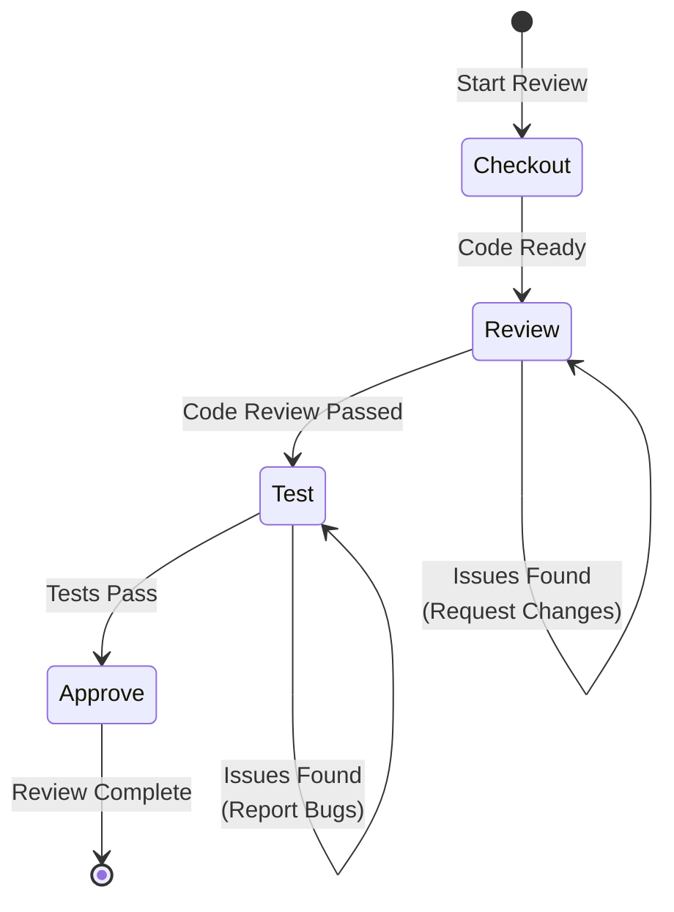

# Reviewer Flow

Standardized workflow for the Reviewer role, ensuring thorough code review and quality assurance.

## Workflow State Machine



## Execution Steps

### 1. Checkout (检出)

- **Goal**: Set up review environment
- **Checkpoints**:
  - [ ] Checkout the PR branch
  - [ ] Review Issue description and acceptance criteria
  - [ ] Check related files and context
  - [ ] Run `monoco issue lint` to verify compliance

### 2. Review (审查)

- **Goal**: Thorough code review
- **Checkpoints**:
  - [ ] Review code against acceptance criteria
  - [ ] Check code style and conventions
  - [ ] Verify error handling and edge cases
  - [ ] Review test coverage and quality
  - [ ] Check documentation updates

### 3. Test (测试)

- **Goal**: Adversarial testing and verification
- **Checkpoints**:
  - [ ] Run full test suite
  - [ ] Perform manual testing if needed
  - [ ] Test edge cases and error scenarios
  - [ ] Verify integration points

### 4. Approve (批准)

- **Goal**: Complete review with decision
- **Checkpoints**:
  - [ ] Summarize review findings
  - [ ] Provide constructive feedback
  - [ ] Update Issue status if needed
  - [ ] Record review comments in Issue

## Review Checklist

### Code Quality
- [ ] Code follows project conventions
- [ ] No obvious bugs or logic errors
- [ ] Proper error handling
- [ ] Adequate logging (where appropriate)

### Testing
- [ ] Unit tests cover new code
- [ ] Integration tests pass
- [ ] Edge cases are tested
- [ ] No flaky tests introduced

### Documentation
- [ ] Code comments are clear and helpful
- [ ] Public APIs are documented
- [ ] README/docs updated if needed

### Security
- [ ] No hardcoded secrets
- [ ] Input validation in place
- [ ] No SQL injection or XSS vulnerabilities

## Review Comments Format

```markdown
## Review Comments

### [File:Line] Issue Type: Brief Description

**Severity**: [blocking|major|minor|nit]

**Details**: Detailed explanation of the issue

**Suggestion**: How to fix or improve

---
```

## Best Practices

1. **Be Constructive**: Focus on the code, not the person
2. **Explain Why**: Always explain the reasoning behind suggestions
3. **Prioritize**: Distinguish between blocking issues and nits
4. **Respond Promptly**: Don't let reviews sit for too long
