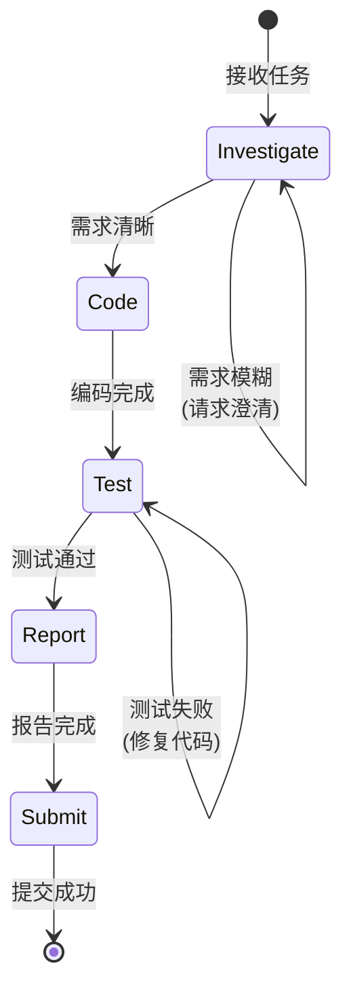

# Engineer Flow

Engineer 角色的标准化工作流，确保代码开发遵循 "Investigate → Code → Test → Report → Submit" 流程。

## 工作流状态机

## 执行步骤

### 1. Investigate (调研)

- **目标**: 充分理解需求，识别技术风险和依赖
- **输入**: Issue 描述、相关代码、依赖 Issue
- **输出**: 技术方案草稿、风险清单
- **检查点**:
  - [ ] 阅读并理解 Issue 描述
  - [ ] 识别相关代码文件
  - [ ] 检查依赖 Issue 状态
  - [ ] 评估技术可行性

### 2. Code (编码)

- **目标**: 实现功能或修复缺陷
- **前置条件**: 需求已清晰，分支已创建 (`monoco issue start <ID> --branch`)
- **检查点**:
  - [ ] 遵循项目代码规范
  - [ ] 编写/更新必要的文档
  - [ ] 处理边界情况

### 3. Test (测试)

- **目标**: 确保代码质量和功能正确性
- **策略**: 循环测试直到通过
- **检查点**:
  - [ ] 编写/更新单元测试
  - [ ] 运行测试套件 (`pytest`, `cargo test`, etc.)
  - [ ] 修复失败的测试
  - [ ] 检查测试覆盖率

### 4. Report (报告)

- **目标**: 记录变更内容，更新 Issue 状态
- **检查点**:
  - [ ] 更新 Issue 文件追踪 (`monoco issue sync-files`)
  - [ ] 编写变更摘要
  - [ ] 更新任务清单 (Checkboxes)

### 5. Submit (提交)

- **目标**: 完成代码提交，进入评审流程
- **检查点**:
  - [ ] 运行 `monoco issue lint` 检查合规性
  - [ ] 运行 `monoco issue submit <ID>`
  - [ ] 等待评审结果

## 决策分支

| 条件 | 动作 |
|------|------|
| 需求不清晰 | 返回 Investigate，请求澄清 |
| 测试失败 | 返回 Code，修复问题 |
| Lint 失败 | 修复合规性问题，重新 Submit |
| 评审拒绝 | 返回 Code，按反馈修改 |

## 合规要求

- **禁止**: 跳过测试直接提交
- **禁止**: 在 main/master 分支直接修改代码
- **必须**: 使用 `monoco issue start --branch` 创建功能分支
- **必须**: 所有单元测试通过后才能 Submit
