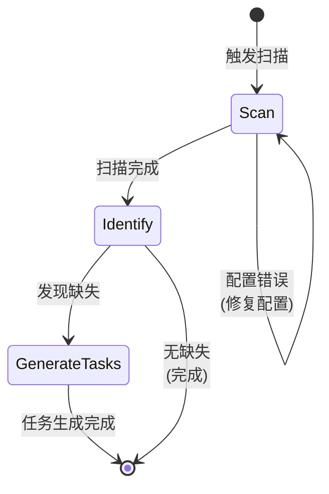

# I18n Scan Workflow

I18n 扫描的标准化工作流，确保 "Scan → Identify → Generate Tasks" 流程。

## 工作流状态机



## 执行步骤

### 1. Scan (扫描)

- **目标**: 扫描项目中所有文档，识别翻译覆盖情况
- **输入**: 项目文件、i18n 配置
- **输出**: 扫描报告
- **检查点**:
  - [ ] 检查 `.monoco/config.yaml` 中的 i18n 配置
  - [ ] 运行 `monoco i18n scan`
  - [ ] 确认源语言和目标语言设置正确
  - [ ] 验证排除规则（.gitignore、build 目录等）

### 2. Identify (识别缺失)

- **目标**: 分析扫描结果，识别具体缺失的翻译
- **策略**: 对比源文件和目标文件
- **检查点**:
  - [ ] 列出所有缺失翻译的源文件
  - [ ] 识别缺失的目标语言
  - [ ] 评估缺失翻译的影响范围
  - [ ] 按优先级排序（核心文档优先）

### 3. Generate Tasks (生成任务)

- **目标**: 为缺失的翻译创建追踪任务
- **策略**: 根据缺失情况创建 Issue 或备忘录
- **检查点**:
  - [ ] 为核心文档缺失创建 Feature Issue
  - [ ] 为次要文档缺失创建 Memo 提醒
  - [ ] 在 Issue 中标注需要翻译的文件路径
  - [ ] 设置合理的优先级和截止日期

## 决策分支

| 条件 | 动作 |
|------|------|
| 配置错误 | 修复 `.monoco/config.yaml`，重新扫描 |
| 无缺失翻译 | 流程完成，无需进一步操作 |
| 大量缺失 | 创建 Epic，拆分为多个 Feature |
| 关键文档缺失 | 高优先级，立即创建 Issue |

## 合规要求

- **必须**: 扫描前验证 i18n 配置正确
- **必须**: 所有核心文档必须有对应翻译
- **建议**: 定期运行扫描（如每周）
- **建议**: 将翻译任务与功能开发绑定

## 相关命令

```bash
# 扫描缺失翻译
monoco i18n scan

# 创建翻译任务
monoco issue create feature -t "翻译 {filename} 到 {lang}"

# 添加备忘录
monoco memo add "需要翻译: {filepath}"
```

## 输出示例

扫描完成后，应生成如下报告：

```
I18n Scan Report
================
Source Language: en
Target Languages: zh, ja

Missing Translations:
- docs/guide.md → zh/guide.md [MISSING]
- docs/api.md → ja/api.md [MISSING]

Coverage: 85%
```
