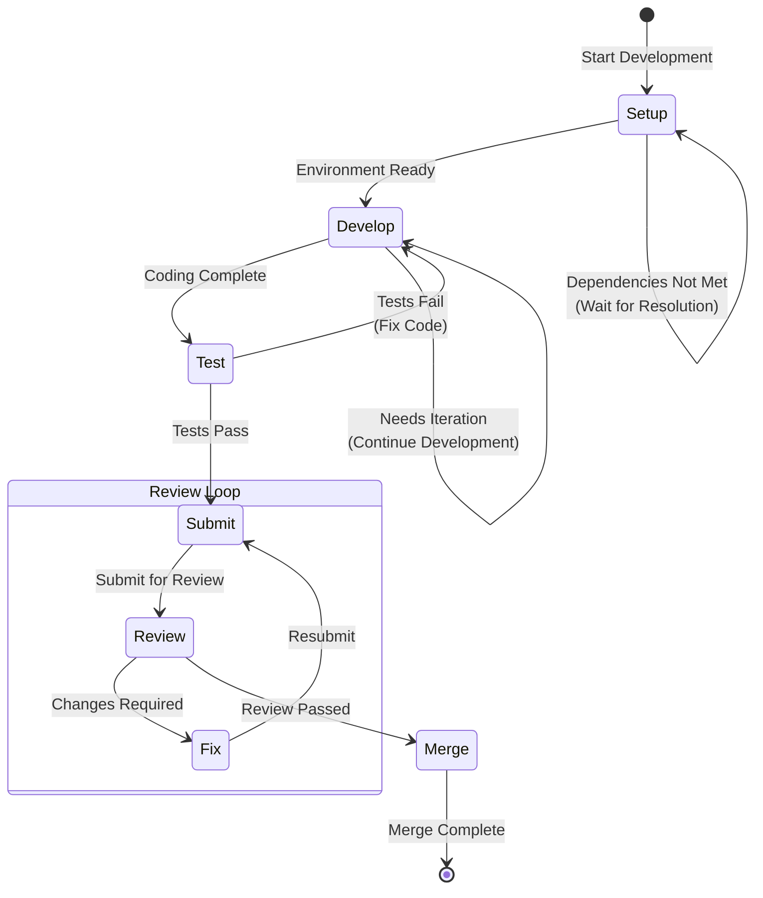

# Issue Develop Workflow

Complete standardized workflow for Issue development, testing, submission, review and merge.

**Applicable Scenario**: Copilot Mode (Human-led, AI-assisted)
**Target Users**: Developers responsible for implementing features or fixing bugs

## Workflow State Machine



## Execution Steps

### 1. Setup

- **Goal**: Prepare development environment, ensure ready to code
- **Checkpoints**:
  - [ ] Run `monoco issue start <ID> --branch` to create feature branch
  - [ ] Confirm branch is created and switched
  - [ ] Verify not currently on main/master branch
  - [ ] Check if dependency Issues are completed
  - [ ] Confirm Issue is refined (has technical task list)

**Environment Checklist**:
| Check Item | Command/Method |
|------------|----------------|
| Current Branch | `git branch --show-current` |
| Branch Status | `git status` |
| Dependency Issues | `monoco issue show <ID>` |
| Code Standards | Check project lint configuration |

### 2. Develop

- **Goal**: Implement feature or fix bug
- **Strategy**: Iterative development, small commits
- **Checkpoints**:
  - [ ] Follow project code standards
  - [ ] Write/update unit tests
  - [ ] Commit code regularly (small commits)
  - [ ] Update file tracking (`monoco issue sync-files`)
  - [ ] Maintain code reviewability (single commit < 400 lines)

**Development Principles**:
| Principle | Description |
|-----------|-------------|
| Small Commits | Each commit is a logical unit |
| Test First | Prioritize writing test cases |
| Continuous Sync | Update file tracking promptly |
| Stay Focused | Avoid unrelated changes |

### 3. Test

- **Goal**: Ensure code quality and functional correctness
- **Checkpoints**:
  - [ ] Run unit tests, ensure they pass
  - [ ] Run integration tests (if applicable)
  - [ ] Run code style checks (lint)
  - [ ] Manually verify functionality (if needed)
  - [ ] Check test coverage

**Test Levels**:
```
Unit Test → Integration Test → E2E Test → Manual Verification
   ↑          ↑            ↑            ↑
 Required   Recommended   As Needed    As Needed
```

### 4. Submit

- **Goal**: Prepare for code review
- **Checkpoints**:
  - [ ] Run `monoco issue lint` to check compliance
  - [ ] Fix all Lint errors
  - [ ] Update task list status (mark completed items)
  - [ ] Write clear commit message
  - [ ] Run `monoco issue submit <ID>`

**Commit Message Specification**:
```
<type>(<scope>): <subject>

<body>

Refs: <ISSUE-ID>
```

| Type | Purpose |
|------|---------|
| feat | New feature |
| fix | Bug fix |
| docs | Documentation update |
| style | Code formatting |
| refactor | Refactoring |
| test | Test related |
| chore | Build/tools |

### 5. Review

- **Goal**: Code quality and process compliance check
- **Checkpoints**:
  - [ ] Is functionality correctly implemented
  - [ ] Does code meet design specifications
  - [ ] Are tests sufficient
  - [ ] Is documentation updated
  - [ ] Does it follow project standards

**Review Dimensions**:
| Dimension | Check Content |
|-----------|---------------|
| Correctness | Does functionality work as expected |
| Design | Does it meet architecture design |
| Testing | Is test coverage sufficient |
| Standards | Does it follow code standards |
| Documentation | Is documentation updated |
| Performance | Are there obvious performance issues |
| Security | Are there security risks |

### 6. Merge

- **Goal**: Complete Issue, merge code
- **Checkpoints**:
  - [ ] Code has passed review
  - [ ] All CI checks pass
  - [ ] Code is merged to main branch
  - [ ] Run `monoco issue close <ID> --solution completed --prune`
  - [ ] Verify branch is cleaned up
  - [ ] Update Review Comments (record review feedback)

## Decision Branches

| Condition | Action |
|-----------|--------|
| Dependency Issues not completed | Return to Setup, wait for dependencies |
| Tests fail | Return to Develop, fix code |
| Lint fails | Fix compliance issues, resubmit |
| Review requires changes | Return to Fix, modify per feedback |
| Review passed | Enter Merge, merge and cleanup |

## Compliance Requirements

- **Prohibited**: Directly modify code on main/master branch
- **Required**: Use `monoco issue start --branch` to create feature branch
- **Required**: All unit tests must pass before Submit
- **Required**: Each Issue must have at least 2 Checkboxes
- **Required**: Review/Done phase must include Review Comments
- **Recommended**: Small commits, frequently sync file tracking

## Related Commands

```bash
# Start development
monoco issue start FEAT-0001 --branch

# Sync file tracking
monoco issue sync-files

# Check compliance
monoco issue lint

# Submit for review
monoco issue submit FEAT-0001

# Close Issue
monoco issue close FEAT-0001 --solution completed --prune
```

## Relationship with flow_engineer

The relationship between this workflow and `flow_engineer`:

```
issue-develop-workflow          flow_engineer
       │                              │
       ├── Setup ─────────────────────┤
       ├── Develop ←──────────────────┤ Investigate → Code → Test
       ├── Test ──────────────────────┤
       ├── Submit ────────────────────┤ Report → Submit
       ├── Review ────────────────────┤
       └── Merge ─────────────────────┤
```

- `issue-develop-workflow`: Focuses on Issue-level process management
- `flow_engineer`: Focuses on specific technical process for code implementation

During the Develop phase, developers should follow `flow_engineer`'s Investigate → Code → Test → Report → Submit process.

## Copilot Mode Tips

As an AI Copilot, you should:
1. **Assist coding**: Help implement features, fix bugs
2. **Code review**: Pre-review before submission to find potential issues
3. **Test assistance**: Help write test cases, ensure coverage
4. **Compliance check**: Remind developers to follow project standards
5. **Documentation sync**: Assist in updating related documentation
