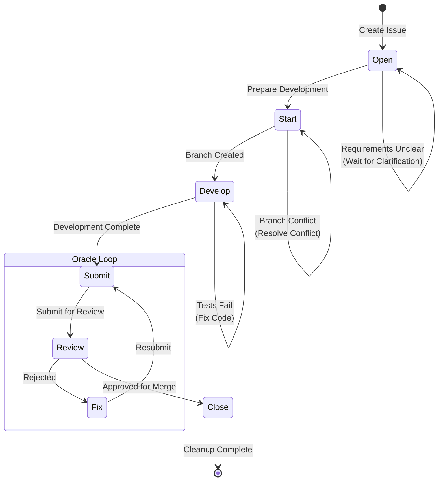

# Issue Lifecycle Workflow

Standardized workflow for Issue lifecycle, ensuring "Open → Start → Develop → Submit → Review → Close" process.

## Workflow State Machine



## Execution Steps

### 1. Open

- **Goal**: Create clear, actionable Issue
- **Input**: Requirement description, type, priority
- **Output**: Issue Ticket file
- **Checkpoints**:
  - [ ] Use `monoco issue create <type> -t "Title"`
  - [ ] Select appropriate type (epic/feature/chore/fix)
  - [ ] Write clear description and acceptance criteria
  - [ ] Set dependency relationships (if needed)
  - [ ] Ensure at least 2 Checkboxes

### 2. Start

- **Goal**: Prepare development environment, create feature branch
- **Checkpoints**:
  - [ ] Run `monoco issue start <ID> --branch`
  - [ ] Confirm branch is created and switched
  - [ ] Verify not currently on main/master branch
  - [ ] Check if dependency Issues are completed

### 3. Develop

- **Goal**: Implement feature or fix bug
- **Strategy**: Iterative development, continuous testing
- **Checkpoints**:
  - [ ] Follow project code standards
  - [ ] Write/update unit tests
  - [ ] Run test suite, ensure it passes
  - [ ] Commit code regularly (small commits)
  - [ ] Update file tracking (`monoco issue sync-files`)

### 4. Submit

- **Goal**: Prepare for code review
- **Checkpoints**:
  - [ ] Run `monoco issue lint` to check compliance
  - [ ] Fix all Lint errors
  - [ ] Update task list status
  - [ ] Run `monoco issue submit <ID>`
  - [ ] Write change summary

### 5. Review

- **Goal**: Code quality and process compliance check
- **Checkpoints**:
  - [ ] Is functionality correctly implemented
  - [ ] Does code meet design specifications
  - [ ] Are tests sufficient
  - [ ] Is documentation updated
  - [ ] Does it follow project standards

### 6. Close

- **Goal**: Complete Issue, cleanup environment
- **Checkpoints**:
  - [ ] Code is merged to main branch
  - [ ] Run `monoco issue close <ID> --solution completed --prune`
  - [ ] Verify branch is cleaned up
  - [ ] Update Review Comments (if needed)

## Decision Branches

| Condition | Action |
|-----------|--------|
| Requirements unclear | Return to Open, request clarification |
| Branch creation fails | Check Git status, resolve conflicts |
| Tests fail | Return to Develop, fix code |
| Lint fails | Fix compliance issues, resubmit |
| Review rejected | Return to Develop, modify per feedback |
| Review passed | Enter Close, merge and cleanup |

## Compliance Requirements

- **Prohibited**: Directly modify code on main/master branch
- **Required**: Use `monoco issue start --branch` to create feature branch
- **Required**: All unit tests must pass before Submit
- **Required**: Each Issue must have at least 2 Checkboxes
- **Required**: Review/Done phase must include Review Comments
- **Recommended**: Small commits, frequently sync file tracking

## Related Commands

```bash
# Create Issue
monoco issue create feature -t "Title"

# Start development
monoco issue start FEAT-0001 --branch

# Sync file tracking
monoco issue sync-files

# Check compliance
monoco issue lint

# Submit for review
monoco issue submit FEAT-0001

# Close Issue
monoco issue close FEAT-0001 --solution completed --prune
```

## Issue Type Guide

| Type | Purpose | Prefix | Mindset |
|------|---------|--------|---------|
| Epic | Grand goals, vision container | EPIC- | Architect |
| Feature | User value increment | FEAT- | Product Owner |
| Chore | Engineering tasks | CHORE- | Builder |
| Fix | Bug fixes | FIX- | Debugger |

## Relationship with flow_engineer

This workflow complements `flow_engineer`:
- `issue-lifecycle-workflow`: Focuses on Issue management process
- `flow_engineer`: Focuses on code implementation process

Engineers should follow `flow_engineer`'s Investigate → Code → Test → Report → Submit process during the Develop phase.
