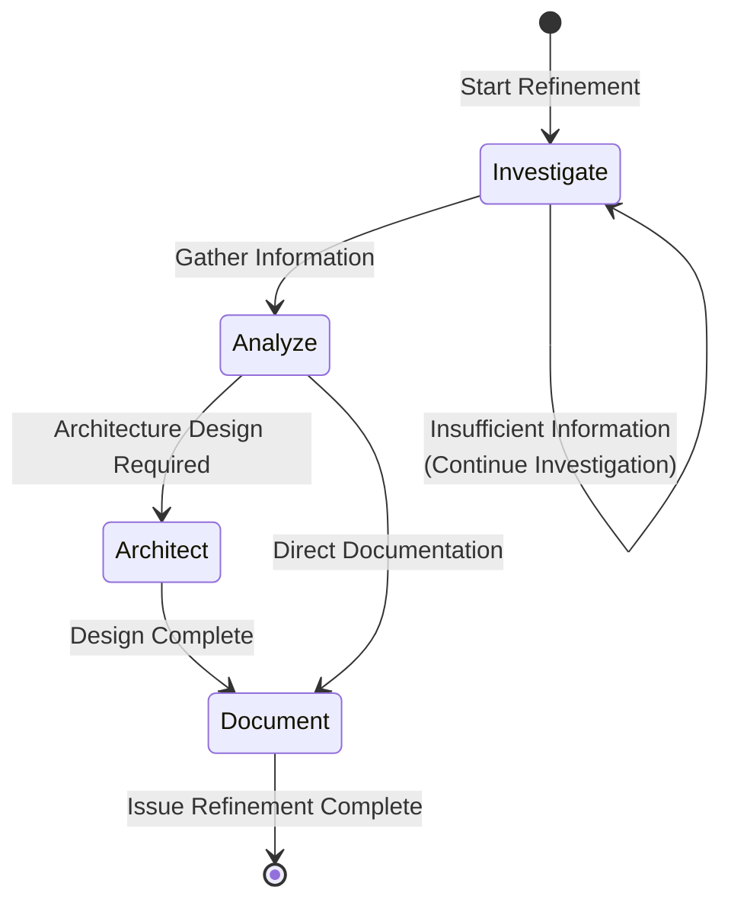

# Issue Refine Workflow

Standardized workflow for technical investigation, architecture analysis and solution design for newly created or pending refinement Issues.

**Applicable Scenario**: Copilot Mode (Human-led, AI-assisted)
**Target Users**: Developers who need to deeply understand problems and formulate implementation plans

## Workflow State Machine



## Execution Steps

### 1. Investigate

- **Goal**: Comprehensively gather information related to the Issue
- **Input**: Issue Ticket, related code, documentation
- **Output**: Information gathering report
- **Checkpoints**:
  - [ ] Read Issue description, understand core problem
  - [ ] Identify related code modules and files
  - [ ] Review related Issue/PR history
  - [ ] Check external dependencies and constraints
  - [ ] Collect similar implementation references (Spike)

**Investigation Dimensions**:
| Dimension | Investigation Content |
|-----------|----------------------|
| Code | Current implementation of related modules |
| History | Related Issues, PRs, design documents |
| Dependencies | External libraries, APIs, service dependencies |
| Constraints | Performance requirements, security requirements, compatibility |
| References | Best practices for similar features |

### 2. Analyze

- **Goal**: Analyze gathered information, identify key problems and solution options
- **Checkpoints**:
  - [ ] Analyze architecture inheritance (how to fit into existing architecture)
  - [ ] Assess security impact
  - [ ] Assess performance impact
  - [ ] Assess maintainability
  - [ ] Identify potential risks and mitigation measures

**Analysis Framework**:

#### Architecture Inheritance
- Are existing architecture patterns applicable?
- Is a new abstraction layer needed?
- Impact on coupling with existing modules?

#### Security Assessment
- Input validation requirements
- Access control requirements
- Data protection requirements
- Potential attack surface analysis

#### Performance Assessment
- Time complexity impact
- Space complexity impact
- Concurrency/parallelism requirements
- Resource usage estimation

#### Maintainability Assessment
- Code complexity changes
- Test coverage requirements
- Documentation update requirements
- Future extensibility

### 3. Architect (Optional)

- **Goal**: Architecture design for complex Issues
- **Applicable**: Issues involving architecture changes or large features
- **Checkpoints**:
  - [ ] Determine technical solution selection
  - [ ] Design interfaces and interaction protocols
  - [ ] Plan data model changes
  - [ ] Define implementation milestones

**Outputs**:
- Architecture Decision Record (ADR)
- Interface design document
- Data model changes
- Milestone plan

### 4. Document

- **Goal**: Update analysis results to Issue
- **Checkpoints**:
  - [ ] Update technical task list
  - [ ] Add architecture decision explanation
  - [ ] Supplement risks and mitigation measures
  - [ ] Update acceptance criteria (if needed)
  - [ ] Add reference links and dependency descriptions
  - [ ] Run `monoco issue lint` to verify compliance

**Refined Issue Structure**:

```markdown
## Objective
[Original Content]

## Acceptance Criteria
- [ ] Acceptance criterion 1
- [ ] Acceptance criterion 2

## Technical Analysis

### Current State Analysis
Describe current code state and related implementation.

### Solution Selection
| Solution | Pros | Cons | Decision |
|----------|------|------|----------|
| A | ... | ... | Adopted/Alternative |
| B | ... | ... | Alternative/Abandoned |

### Risk Assessment
| Risk | Impact | Mitigation |
|------|--------|------------|
| Risk1 | High/Medium/Low | Measure... |

## Technical Tasks
- [ ] Task 1
- [ ] Task 2

## References
- Related Issue: #XXX
- Reference Implementation: [Link]
- ADR: [Link]
```

## Decision Branches

| Condition | Action |
|-----------|--------|
| Insufficient information | Return to Investigate, continue gathering |
| Architecture design needed | Enter Architect phase |
| Solution is clear | Directly enter Document phase |
| Blocking dependency found | Create dependency Issue, mark current Issue |
| Problem too complex | Suggest splitting into multiple Issues |

## Refinement Level Guide

| Issue Type | Refinement Requirements |
|------------|------------------------|
| Epic | Must include architecture design, milestones, subtask decomposition |
| Feature | Must include technical solution, risk assessment, task decomposition |
| Chore | Must include implementation steps, impact scope |
| Fix | Must include root cause analysis, fix solution, test cases |

## Related Commands

```bash
# View Issue details
monoco issue show <ID>

# Check compliance
monoco issue lint

# Sync file tracking
monoco issue sync-files

# View related Spike
monoco spike list
```

## Relationship with flow_engineer

This workflow complements `flow_engineer`:
- `issue-refine-workflow`: Focuses on Issue refinement phase, completing technical investigation before development
- `flow_engineer`: Focuses on code implementation phase, executing Investigate → Code → Test → Report → Submit

Information gathered during refinement phase will provide important input for the Engineer phase's Investigate.

## Copilot Mode Tips

As an AI Copilot, you should:
1. **Explore proactively**: Help developers discover potential issues and edge cases
2. **Provide comparisons**: Give multiple technical solutions, analyze pros and cons
3. **Assist evaluation**: Help with security, performance impact assessment
4. **Remind omissions**: Check for missing key information or risk points
