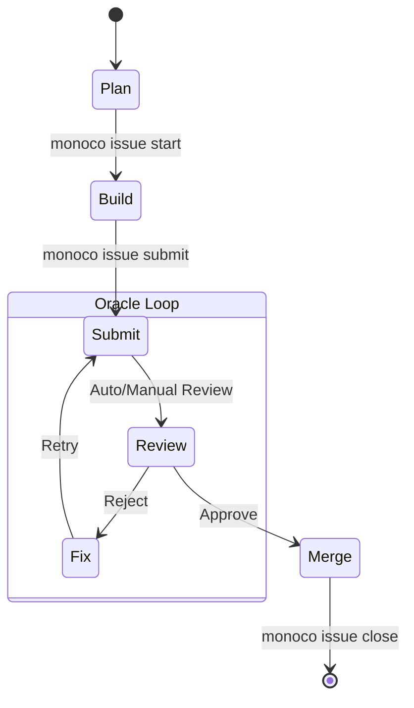

# Issue Management

Use this skill to create and manage **Issues** (Universal Atoms) in Monoco projects.

## Core Ontology

### 1. Strategy Layer

- **🏆 EPIC**: Grand goals, vision containers. Mindset: Architect.

### 2. Value Layer

- **✨ FEATURE**: Value increments from user perspective. Mindset: Product Owner.
- **Atomicity Principle**: Feature = Design + Dev + Test + Doc + i18n. They are one.

### 3. Execution Layer

- **🧹 CHORE**: Engineering maintenance, no direct user value. Mindset: Builder.
- **🐞 FIX**: Correcting deviations. Mindset: Debugger.

## Workflow Policies

### 1. Strict Git Workflow

Monoco enforces a **Feature Branch** model.

- **Start**: Agents **MUST** use `monoco issue start <ID> --branch` to start working.
  - This creates and switches to a standard `feat/<ID>-<slug>` branch.
  - **Do NOT** manually create branches using `git checkout -b`.
- **Protected Main**: **NO** direct modification on `main`, `master`, or `production` branches. Linter will block this.
- **Submit**: Run `monoco issue submit <ID>` when work is ready for review.
  - This moves the issue to `Review` stage and generates a Delivery Report.
  - **Note**: This does **not** merge the code. You (or the user) must handle the Merge/PR process.

## Standardized Workflow

### Workflow Diagram

### Action Steps

1.  **Plan Phase**:
    - Ensure Issue exists and is in `Open` status.
    - Verify requirements and tasks.

2.  **Build Phase**:
    - Run `monoco issue start <ID> --branch` (Verification: ensures branch is created).
    - Implement features/fixes.
    - Run `monoco issue sync-files` to track changes.

3.  **Submit Phase (Oracle Loop)**:
    - Run tests to ensure quality.
    - Run `monoco issue lint`.
    - Run `monoco issue submit <ID>`.
    - **IF** errors/feedback received:
      - Fix issues.
      - Re-run tests.
      - Re-submit.

4.  **Merge Phase**:
    - Once approved:
    - Run `monoco issue close <ID> --solution completed --prune`.

### 2. File Tracking

Agents must track modified files to maintain Self-Contained Context.

- **Mechanism**: Issue Ticket Front Matter contains a `files: []` field.
- **Automated (Recommended)**: Run `monoco issue sync-files` inside the Feature Branch. It diffs against the base branch.
- **Manual (Fallback)**: If working without branches, Agent MUST **actively** append modified paths to the `files` list.

## Guidelines

### Directory Structure & Naming

`Issues/{CapitalizedPluralType}/{lowercase_status}/`

- **Types**: `Epics`, `Features`, `Chores`, `Fixes`
- **Statuses**: `open`, `backlog`, `closed`

### Structural Integrity

Issues are validated via `monoco issue lint`. key constraints:

1. **Mandatory Heading**: `## {ID}: {Title}` must match front matter.
2. **Min Checkboxes**: At least 2 checkboxes (AC/Tasks).
3. **Review Protocol**: `## Review Comments` required for `review` or `done` stages.

### Path Transitions

Use `monoco issue`:

1. **Create**: `monoco issue create <type> --title "..."`
   - Params: `--parent <id>`, `--dependency <id>`, `--related <id>`, `--sprint <id>`, `--tags <tag>`

2. **Transition**: `monoco issue open/close/backlog <id>`

3. **View**: `monoco issue scope`

4. **Validation**: `monoco issue lint`

5. **Modification**: `monoco issue start/submit/delete <id>`

6. **Sync**: `monoco issue sync-files [id]` (Sync code changes to Issue file)

7. **Validation**: `monoco issue lint` (Enforces compliance)

## Validation Rules (FEAT-0082)

To ensure data integrity, all Issue tickets must follow these strict rules:

### 1. Structural Consistency

- Must contain a Level 2 Heading matching exactly: `## {ID}: {Title}`.
- Example: `## FEAT-0082: Issue Ticket Validator`

### 2. Content Completeness

- **Checkboxes**: Minimum of 2 checkboxes required (one for AC, one for Tasks).
- **Review Comments**: If `stage` is `review` or `done`, a `## Review Comments` section is mandatory and must not be empty.

### 3. Checkbox Syntax & Hierarchy

- Use only `- [ ]`, `- [x]`, `- [-]`, or `- [/]`.
- **Inheritance**: If nested checkboxes exist, the parent state must reflect child states (e.g., if any child is `[/]`, parent must be `[/]`; if all children are `[x]`, parent must be `[x]`).

### 4. State Matrix

The `status` (folder) and `stage` (front matter) must be compatible:

- **open**: Draft, Doing, Review, Done
- **backlog**: Draft, Doing, Review
- **closed**: Done

### 5. Environment Policy

Linter includes environment-aware guardrails:

- 🛑 **Dirty Main Protection**: Fails if uncommitted changes are detected on protected branches (`main`/`master`).

### 6. ID Format & Hierarchy

- **ID Specification**: Issue IDs must strictly follow the `TYPE-XXXX` format, where `XXXX` are 4 digits (e.g., `FEAT-0001`, `FIX-9999`).
- **No Suffixes**: IDs with suffixes like `FEAT-0001-1` are strictly prohibited.
- **Hierarchy Expression**: Sub-features or sub-tasks must be expressed using the `parent` field in the Front Matter. Do NOT use ID naming conventions (like hierarchical suffixes) to express relationships.
