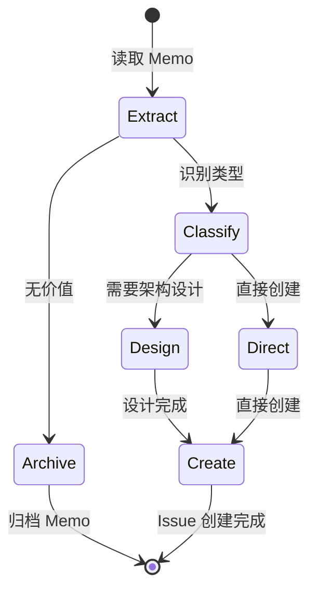

# Issue Create Workflow

从 Memo 中提取改进线索，分析并创建结构化 Issue Ticket 的标准化工作流。

**适用场景**: Copilot 模式（人类主导，AI 辅助）
**目标用户**: 需要快速将想法/笔记转化为可执行任务的开发者

## 工作流状态机



## 执行步骤

### 1. Extract (提取)

- **目标**: 从 Memo 中提取关键改进线索
- **输入**: Memo 文件或临时笔记
- **输出**: 结构化的改进线索列表
- **检查点**:
  - [ ] 运行 `monoco memo list` 查看待处理 Memo
  - [ ] 分析每个 Memo 的改进类型和影响范围
  - [ ] 识别可执行的改进点（非纯参考资料）
  - [ ] 记录改进的动机和预期效果

**分析维度**:
| 维度 | 问题 |
|------|------|
| 价值 | 这个改进解决什么问题？ |
| 范围 | 影响哪些模块/功能？ |
| 紧急 | 是现在做还是以后做？ |
| 可行 | 是否有足够信息开始？ |

### 2. Classify (分类)

- **目标**: 确定 Issue 类型和优先级
- **检查点**:
  - [ ] 判断是否为架构级改进（→ Epic）
  - [ ] 判断是否为用户价值增量（→ Feature）
  - [ ] 判断是否为工程债务（→ Chore）
  - [ ] 判断是否为缺陷修复（→ Fix）
  - [ ] 评估是否需要前置架构设计

**决策分支**:

| 条件 | 类型 | 下一步 |
|------|------|--------|
| 架构愿景级改进，需要分解为多个 Feature | Epic | → Design |
| 用户可交付价值，有明确验收标准 | Feature | → Direct |
| 工程维护任务，技术债务清理 | Chore | → Direct |
| 缺陷修复，有明确复现步骤 | Fix | → Direct |
| 纯参考资料，无直接改进价值 | - | → Archive |
| 需要架构设计才能估算工作量 | - | → Design |

### 3. Design (设计) - 可选

- **目标**: 对复杂改进进行初步架构设计
- **适用**: Epic 或大型 Feature
- **检查点**:
  - [ ] 分析现有架构继承性
  - [ ] 确定技术方案方向
  - [ ] 识别依赖关系和风险点
  - [ ] 估算工作量和里程碑

**输出物**:
- 架构决策记录 (ADR) 草稿
- 子任务分解建议
- 依赖 Issue 列表

### 4. Create (创建)

- **目标**: 创建符合规范的 Issue
- **检查点**:
  - [ ] 运行 `monoco issue create <type> -t "标题"`
  - [ ] 编写清晰的描述和背景
  - [ ] 定义可验证的验收标准（至少 2 个 Checkbox）
  - [ ] 设置依赖关系（如需要）
  - [ ] 关联相关 Memo（如适用）
  - [ ] 运行 `monoco issue lint` 验证合规性

**Issue 内容模板**:

```markdown
## Objective
清晰描述这个 Issue 的目标和预期结果。

## Acceptance Criteria
- [ ] 验收标准 1
- [ ] 验收标准 2

## Technical Tasks
- [ ] 技术任务 1
- [ ] 技术任务 2

## Related
- Parent: EPIC-XXXX (如适用)
- Related Memo: MEMO-XXXX (如适用)
```

### 5. Archive (归档) - 可选

- **目标**: 对无直接改进价值的 Memo 进行归档
- **检查点**:
  - [ ] 确认 Memo 内容为纯参考资料
  - [ ] 记录归档原因
  - [ ] 更新 Memo 状态（如系统支持）

## Issue 类型指南

| 类型 | 用途 | 前缀 | Mindset | 示例 |
|------|------|------|---------|------|
| Epic | 宏大目标、愿景容器 | EPIC- | Architect | 重构核心架构 |
| Feature | 用户价值增量 | FEAT- | Product Owner | 添加导出功能 |
| Chore | 工程性事务 | CHORE- | Builder | 升级依赖版本 |
| Fix | 缺陷修复 | FIX- | Debugger | 修复内存泄漏 |

## 相关命令

```bash
# 查看待处理 Memo
monoco memo list

# 创建 Issue
monoco issue create feature -t "标题"
monoco issue create chore -t "标题"
monoco issue create fix -t "标题"
monoco issue create epic -t "标题"

# 验证 Issue 合规性
monoco issue lint
```

## 与 flow_engineer 的关系

此工作流与 `flow_engineer` 互补：
- `issue-create-workflow`: 关注 Issue 创建阶段，将想法转化为可执行任务
- `flow_engineer`: 关注代码实现阶段，执行 Investigate → Code → Test → Report → Submit

## Copilot 模式提示

作为 AI Copilot，你应该：
1. **主动提问**: 当 Memo 内容不清晰时，询问人类开发者意图
2. **提供选项**: 给出多个分类建议，说明理由
3. **协助起草**: 帮助编写 Issue 描述和验收标准
4. **提醒合规**: 确保创建的 Issue 符合项目规范
