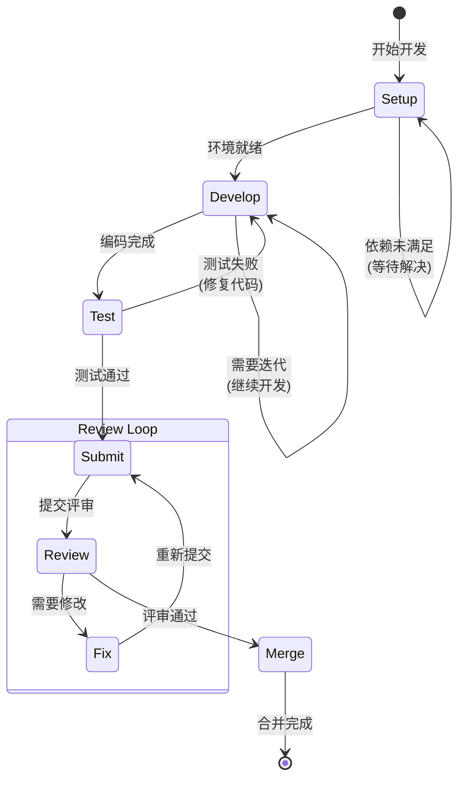

# Issue Develop Workflow

执行 Issue 开发、测试、提交、评审和合并的完整标准化工作流。

**适用场景**: Copilot 模式（人类主导，AI 辅助）
**目标用户**: 负责实现功能或修复缺陷的开发者

## 工作流状态机



## 执行步骤

### 1. Setup (准备)

- **目标**: 准备开发环境，确保可以开始编码
- **检查点**:
  - [ ] 运行 `monoco issue start <ID> --branch` 创建功能分支
  - [ ] 确认分支已创建并切换
  - [ ] 验证当前不在 main/master 分支
  - [ ] 检查依赖 Issue 是否已完成
  - [ ] 确认 Issue 已细化（有技术任务清单）

**环境检查清单**:
| 检查项 | 命令/方法 |
|--------|-----------|
| 当前分支 | `git branch --show-current` |
| 分支状态 | `git status` |
| 依赖 Issue | `monoco issue show <ID>` |
| 代码规范 | 检查项目 lint 配置 |

### 2. Develop (开发)

- **目标**: 实现功能或修复缺陷
- **策略**: 迭代开发，小步提交
- **检查点**:
  - [ ] 遵循项目代码规范
  - [ ] 编写/更新单元测试
  - [ ] 定期提交代码（小步提交）
  - [ ] 更新文件追踪（`monoco issue sync-files`）
  - [ ] 保持代码可审查性（单次提交 < 400 行）

**开发原则**:
| 原则 | 说明 |
|------|------|
| 小步提交 | 每次提交一个逻辑单元 |
| 测试先行 | 优先编写测试用例 |
| 持续同步 | 及时更新文件追踪 |
| 保持专注 | 避免无关修改 |

### 3. Test (测试)

- **目标**: 确保代码质量和功能正确性
- **检查点**:
  - [ ] 运行单元测试，确保通过
  - [ ] 运行集成测试（如适用）
  - [ ] 运行代码规范检查（lint）
  - [ ] 手动验证功能（如需要）
  - [ ] 检查测试覆盖率

**测试层次**:
```
单元测试 → 集成测试 → 端到端测试 → 手动验证
   ↑          ↑            ↑            ↑
 必须        推荐          按需         按需
```

### 4. Submit (提交)

- **目标**: 准备代码评审
- **检查点**:
  - [ ] 运行 `monoco issue lint` 检查合规性
  - [ ] 修复所有 Lint 错误
  - [ ] 更新任务清单状态（标记完成项）
  - [ ] 编写清晰的提交信息
  - [ ] 运行 `monoco issue submit <ID>`

**提交信息规范**:
```
<type>(<scope>): <subject>

<body>

Refs: <ISSUE-ID>
```

| 类型 | 用途 |
|------|------|
| feat | 新功能 |
| fix | 缺陷修复 |
| docs | 文档更新 |
| style | 代码格式 |
| refactor | 重构 |
| test | 测试相关 |
| chore | 构建/工具 |

### 5. Review (评审)

- **目标**: 代码质量和流程合规检查
- **检查点**:
  - [ ] 功能是否正确实现
  - [ ] 代码是否符合设计规范
  - [ ] 测试是否充分
  - [ ] 文档是否同步更新
  - [ ] 是否遵循项目规范

**评审维度**:
| 维度 | 检查内容 |
|------|----------|
| 正确性 | 功能是否按预期工作 |
| 设计 | 是否符合架构设计 |
| 测试 | 测试覆盖是否充分 |
| 规范 | 是否遵循代码规范 |
| 文档 | 文档是否同步更新 |
| 性能 | 是否有明显性能问题 |
| 安全 | 是否有安全隐患 |

### 6. Merge (合并)

- **目标**: 完成 Issue，合并代码
- **检查点**:
  - [ ] 代码已通过评审
  - [ ] 所有 CI 检查通过
  - [ ] 代码已合并到主分支
  - [ ] 运行 `monoco issue close <ID> --solution completed --prune`
  - [ ] 验证分支已清理
  - [ ] 更新 Review Comments（记录评审反馈）

## 决策分支

| 条件 | 动作 |
|------|------|
| 依赖 Issue 未完成 | 返回 Setup，等待依赖 |
| 测试失败 | 返回 Develop，修复代码 |
| Lint 失败 | 修复合规性问题，重新 Submit |
| 评审需要修改 | 返回 Fix，按反馈修改 |
| 评审通过 | 进入 Merge，合并并清理 |

## 合规要求

- **禁止**: 在 main/master 分支直接修改代码
- **必须**: 使用 `monoco issue start --branch` 创建功能分支
- **必须**: 所有单元测试通过后才能 Submit
- **必须**: 每个 Issue 至少 2 个 Checkbox
- **必须**: Review/Done 阶段必须包含 Review Comments
- **建议**: 小步提交，频繁同步文件追踪

## 相关命令

```bash
# 启动开发
monoco issue start FEAT-0001 --branch

# 同步文件追踪
monoco issue sync-files

# 检查合规性
monoco issue lint

# 提交评审
monoco issue submit FEAT-0001

# 关闭 Issue
monoco issue close FEAT-0001 --solution completed --prune
```

## 与 flow_engineer 的关系

此工作流与 `flow_engineer` 的关系：

```
issue-develop-workflow          flow_engineer
       │                              │
       ├── Setup ─────────────────────┤
       ├── Develop ←──────────────────┤ Investigate → Code → Test
       ├── Test ──────────────────────┤
       ├── Submit ────────────────────┤ Report → Submit
       ├── Review ────────────────────┤
       └── Merge ─────────────────────┤
```

- `issue-develop-workflow`: 关注 Issue 级别的流程管理
- `flow_engineer`: 关注代码实现的具体技术流程

在 Develop 阶段，开发者应遵循 `flow_engineer` 的 Investigate → Code → Test → Report → Submit 流程。

## Copilot 模式提示

作为 AI Copilot，你应该：
1. **协助编码**: 帮助实现功能、修复缺陷
2. **代码审查**: 在提交前进行预审查，发现潜在问题
3. **测试协助**: 帮助编写测试用例，确保覆盖
4. **合规检查**: 提醒开发者遵循项目规范
5. **文档同步**: 协助更新相关文档
