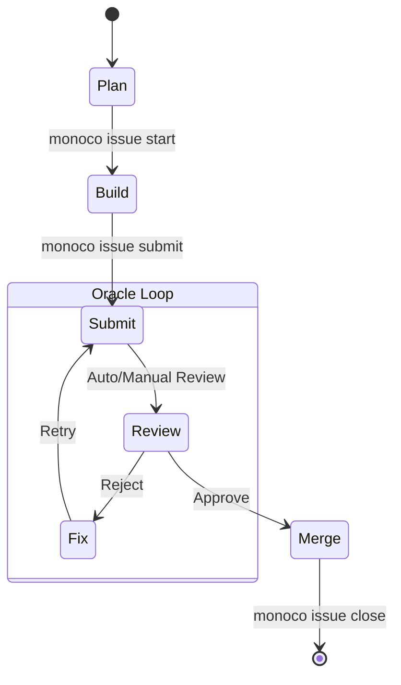

# 自我管理 (Monoco Issue System)

使用此技能在 Monoco 项目中创建和管理 **Issue** (通用原子)。该系统参考 Jira 表达体系，同时保持 "建设者 (Builder)" 和 "调试者 (Debugger)" 思维模式的隔离。

## 核心本体论 (Core Ontology)

Monoco 不仅仅复刻 Jira，而是基于 **"思维模式 (Mindset)"** 重新定义工作单元。

### 1. 战略层 (Strategy)

#### 🏆 EPIC (史诗)

- **Mindset**: _Architect_ (架构师)
- **定义**: 跨越多个周期的宏大目标。它不是单纯的"大任务"，而是"愿景的容器"。
- **产出**: 定义了系统的边界和核心价值。

### 2. 价值层 (Value)

#### ✨ FEATURE (特性)

- **Mindset**: _Product Owner_ (产品负责人)
- **定义**: 用户视角的价值增量。必须是可独立交付 (Shippable) 的垂直切片。
- **Focus**: "Why" & "What" (用户想要什么？)。
- **Prefix**: `FEAT-`

### 3. 执行层 (Execution)

#### 🧹 CHORE (杂务)

- **Mindset**: _Builder_ (建设者)
- **定义**: **不产生**直接用户价值的工程性事务。
- **场景**: 架构升级、写构建脚本、修复 CI/CD 流水线。
- **Focus**: "How" (为了支撑系统运转，必须做什么)。
- **Prefix**: `CHORE-`

> 注: 取代了传统的 Task 概念。

#### 🐞 FIX (修复)

- **Mindset**: _Debugger_ (调试者)
- **定义**: 预期与现实的偏差。它是负价值的修正。
- **Focus**: "Fix" (恢复原状)。
- **Prefix**: `FIX-`

> 注: 取代了传统的 Bug 概念。

---

**关系链**:

- **主要**: `EPIC` (愿景) -> `FEATURE` (价值交付单元)
- **次要**: `CHORE` (工程维护/支撑) - 通常独立存在。
- **原子性原则**: Feature = Design + Dev + Test + Doc + i18n。它们是一体的。

## 工作流策略 (Workflow Policies)

### 1. 严格 Git 工作流 (Strict Git Workflow)

Monoco 强制采用 **Feature Branch** 模式。

- **Start**: 必须使用 `monoco issue start <ID> --branch` 启动任务。这会自动创建 `feat/<ID>-<slug>` 分支。
- **禁止主干开发**: **严禁** 直接在 `main`, `master`, `production` 分支上修改代码。Linter 会拦截此类行为。
- **Submit**: 在提交 PR 前，运行 `monoco issue submit <ID>` 进行清理和预发布检查。

## 标准化工作流 (Standardized Workflow)

本指南引导 Agent 遵循 Monoco 标准 Issue 工作流。

### 工作流图示

### 执行步骤

1.  **Plan (计划阶段)**:
    - 确保 Issue 已创作且处于 `Open` 状态。
    - 验证需求描述与任务清单 (Acceptance Criteria)。

2.  **Build (构建阶段)**:
    - 运行 `monoco issue start <ID> --branch` (强制分支隔离)。
    - 实现功能或修复缺陷。
    - 运行 `monoco issue sync-files` 更新修改文件追踪。

3.  **Submit (提交阶段 - Oracle 循环)**:
    - 运行测试确保质量。
    - 运行 `monoco issue lint` 检查合规性。
    - 运行 `monoco issue submit <ID>` 触发评审。
    - **如果** 收到报错或反馈：
      - 修复问题。
      - 重新运行测试。
      - 重新运行提交。

4.  **Merge (合并/关闭阶段)**:
    - 一旦获得批准 (人工或自动)：
    - 运行 `monoco issue close <ID> --solution completed --prune` 清理环境并下线。

### 2. 文件追踪 (File Tracking)

为了保证上下文的自包含性 (Self-Contained Context)，Agent 必须记录修改过的文件。

- **机制**: Issue Ticket 的 Front Matter 包含 `files: []` 字段。
- **自动化 (推荐)**: 在 Feature Branch 中运行 `monoco issue sync-files`。它会自动对比当前分支与 Base 分支的差异并更新列表。
- **手动 (备选)**: 如果进行非分支开发，Agent 必须**主动**将修改的文件路径写入 `files` 列表。

## 准则 (Guidelines)

### 目录结构

`Issues/{CapitalizedPluralType}/{lowercase_status}/`

- `{TYPE}`: `Epics`, `Features`, `Chores`, `Fixes`
- `{STATUS}`: `open`, `backlog`, `closed`

### 路径流转

使用 `monoco issue`:

1. **Create**: `monoco issue create <type> --title "..."`
   - Params: `--parent <id>`, `--dependency <id>`, `--related <id>`, `--sprint <id>`, `--tags <tag>`

2. **Transition**: `monoco issue open/close/backlog <id>`

3. **View**: `monoco issue scope`

4. **Validation**: `monoco issue lint`

5. **Modification**: `monoco issue start/submit/delete <id>`

6. **Sync**: `monoco issue sync-files [id]` (同步代码变更到 Issue 文件)

7. **Validation**: `monoco issue lint` (强制执行合规性检查)

## 合规与结构校验 (Validation Rules)

为了确保数据严谨性，所有 Issue Ticket 必须遵循以下强制规则:

### 1. 结构一致性 (Structural Consistency)

- 必须包含一个二级标题 (`##`)，内容必须与 Front Matter 中的 ID 和 Title 严格匹配。
- 格式: `## {ID}: {Title}`
- 示例: `## FEAT-0082: Issue Ticket Validator`

### 2. 内容完整性 (Content Completeness)

- **Checkbox 数量**: 每个 Ticket 必须包含至少 2 个 Checkbox（通常代表 AC 和 Tasks）。
- **评审记录**: 当 `stage` 为 `review` 或 `done` 时，必须包含 `## Review Comments` 标题且内容不能为空。

### 3. Checkbox 语法与层级 (Checkbox Matrix)

- 仅限使用: `- [ ]`, `- [x]`, `- [-]`, `- [/]`。
- **层级继承**: 若存在嵌套 Checkbox，父项状态必须正确反映子项的聚合结果（例如: 任一子项为 `[/]` 则父项必为 `[/]`；子项全选则父项为 `[x]`）。

### 4. 状态矩阵 (State Matrix)

`status` (物理存放目录) 与 `stage` (Front Matter 字段) 必须兼容:

- **open**: Draft, Doing, Review, Done
- **backlog**: Draft, Doing, Review
- **closed**: Done

### 5. 环境策略 (Environment Policy)

Linter 包含环境感知防护：

- 🛑 **Dirty Main Protection**: 当检测到处于受保护分支 (`main`/`master`) 且存在未提交变更时，Lint 将失败并阻止操作。

### 6. ID 格式与层级 (ID Format & Hierarchy)

- **ID 规范**: Issue ID 必须严格遵循 `TYPE-XXXX` 格式，其中 `XXXX` 必须是 4 位数字（示例: `FEAT-0001`, `FIX-9999`）。
- **禁止后缀**: 禁止使用类似 `FEAT-0001-1` 这样带后缀的 ID。
- **层级表达**: 子功能或子任务应通过 `parent` 字段（在 Front Matter 中）来关联父级 Issue，严禁通过 ID 命名约定（如加分级后缀）来表达层级关系。
