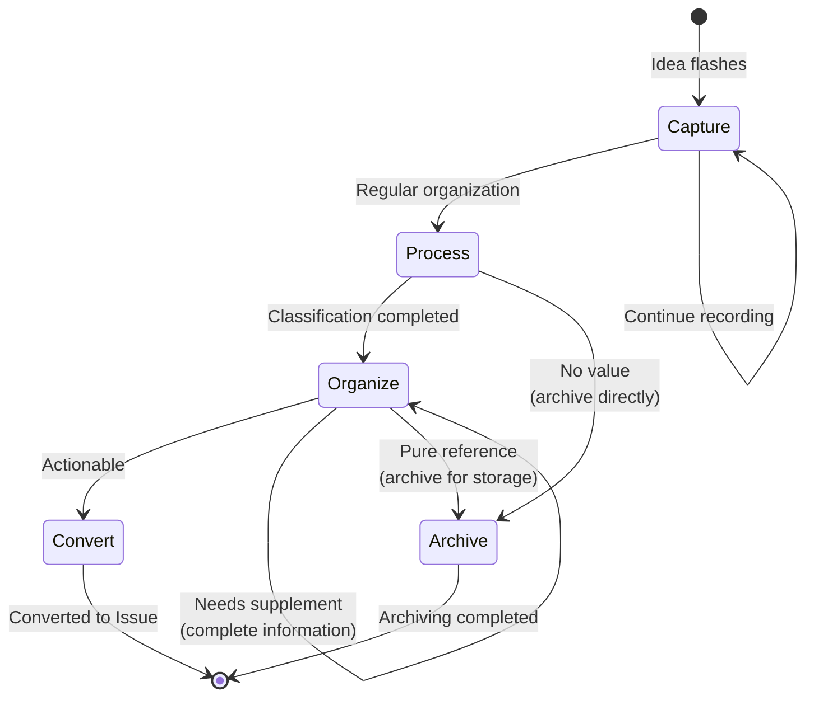

# Note Processing Workflow

Standardized workflow for Memo note processing, ensuring the "Capture → Process → Organize → Archive/Convert" process.

## Workflow State Machine



## Execution Steps

### 1. Capture (Capture)

- **Goal**: Quickly record fleeting ideas without interrupting current work
- **Input**: Ideas, inspirations, code snippets, links
- **Output**: Memo record
- **Checkpoints**:
  - [ ] Use `monoco memo add "content"`
  - [ ] Keep it concise, no detailed description needed
  - [ ] Add context (`-c file:line` if applicable)
  - [ ] Do not interrupt current task flow

### 2. Process (Processing)

- **Goal**: Regularly review and classify Memos
- **Strategy**: Regular organization (daily/weekly)
- **Checkpoints**:
  - [ ] Run `monoco memo list` to view all Memos
  - [ ] Evaluate value of each Memo
  - [ ] Classify: Actionable / Pure reference / No value
  - [ ] Supplement missing information

### 3. Organize (Organization)

- **Goal**: Structured organization of valuable Memos
- **Strategy**: Choose processing method based on type
- **Checkpoints**:
  - [ ] Add tags or categories to related Memos
  - [ ] Merge similar Memos
  - [ ] Complete vague records
  - [ ] Set priority (if applicable)

### 4. Archive/Convert (Archive or Convert)

- **Goal**: Archive processed Memos or convert to Issue
- **Checkpoints**:
  - [ ] **Convert**: Convert actionable ideas to Issue
    - Use `monoco issue create feature/chore/fix -t "title"`
    - Reference original Memo in the Issue
  - [ ] **Archive**: Archive pure reference content
    - Move to knowledge base or documentation
    - Remove from Memo list
  - [ ] **Delete**: Delete Memos with no value directly

## Decision Branches

| Condition | Action |
|-----------|--------|
| Idea is actionable | Convert, create Issue |
| Pure reference material | Archive, save to knowledge base |
| No value/outdated | Delete, remove directly |
| Information incomplete | Return to Organize, supplement information |

## Compliance Requirements

- **Required**: Memos are temporary, should not accumulate indefinitely
- **Required**: Actionable ideas must be converted to Issue for tracking
- **Recommended**: Process regularly (recommended weekly)
- **Recommended**: Keep Memos concise, avoid lengthy discussions

## Related Commands

```bash
# Add Memo
monoco memo add "Consider using Redis cache for user sessions"

# Memo with context
monoco memo add "Recursion may cause stack overflow" -c "src/utils.py:42"

# View all Memos
monoco memo list

# Edit Memo
monoco memo open

# Create Issue (convert Memo)
monoco issue create feature -t "Implement Redis cache"
```

## Usage Scenarios

| Scenario | Use Memo | Follow-up Processing |
|----------|----------|---------------------|
| Improvement suggestion during code review | `memo add "Refactoring suggestion: ..."` | Process → Convert to Issue |
| Temporary idea during meeting | `memo add "Idea: ..."` | Process → Organize → Convert |
| Useful code snippet | `memo add "Snippet: ..."` | Process → Archive to knowledge base |
| Technical article link | `memo add "Read: https://..."` | Process → Archive |
| Bug clue | `memo add "Possible Bug: ..."` | Process → Convert to Fix Issue |

## Difference from Issue

| Dimension | Memo | Issue |
|-----------|------|-------|
| Purpose | Record ideas | Track tasks |
| Lifecycle | Temporary, needs regular cleanup | Formal, complete lifecycle |
| Completion Criteria | Archived or converted | Acceptance criteria passed |
| Complexity | Simple, one sentence | Detailed, with AC and Tasks |
| Tracking | None | Complete tracking |

## Best Practices

1. **Record promptly**: Record immediately when ideas flash, avoid forgetting
2. **Organize regularly**: Process Memo list at least once a week
3. **Convert quickly**: Convert valuable ideas to Issue as soon as possible
4. **Delete decisively**: Delete outdated or valueless Memos decisively
5. **Keep concise**: Memos are quick notes, no detailed description needed
