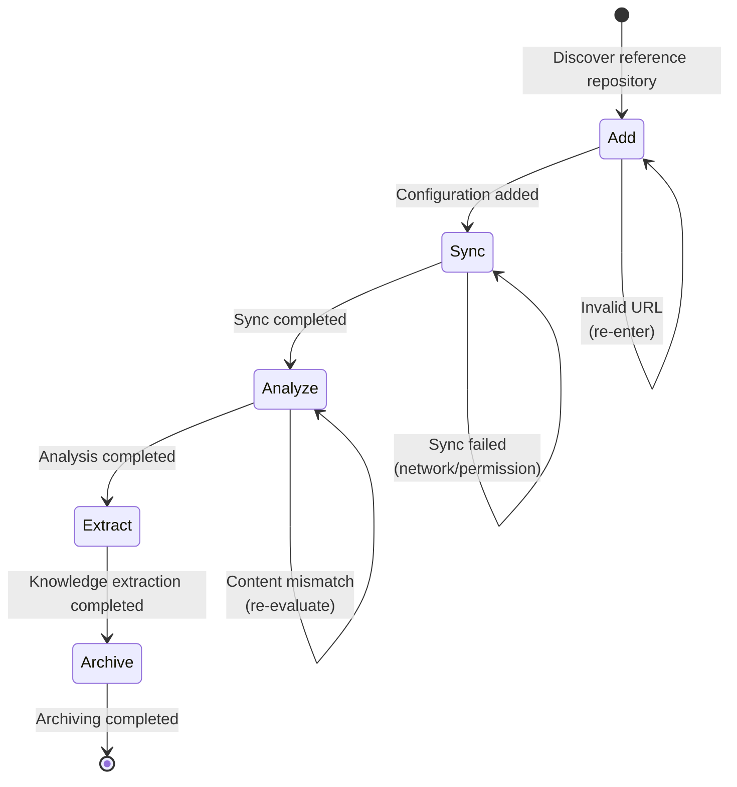

# Research Workflow

Standardized workflow for Spike research, ensuring the "Add → Sync → Analyze → Extract → Archive" process.

## Workflow State Machine



## Execution Steps

### 1. Add (Add Repository)

- **Goal**: Add external repository as reference
- **Input**: Repository URL, reference purpose
- **Output**: Configuration updated
- **Checkpoints**:
  - [ ] Verify repository URL is accessible
  - [ ] Confirm repository is relevant to current project
  - [ ] Run `monoco spike add <url>`
  - [ ] Check `.monoco/config.yaml` is updated

### 2. Sync (Synchronize)

- **Goal**: Download or update reference repository content
- **Checkpoints**:
  - [ ] Run `monoco spike sync`
  - [ ] Verify repository is cloned to `.references/<name>/`
  - [ ] Check sync logs for errors
  - [ ] Verify file permissions are correct (read-only)

### 3. Analyze (Analysis)

- **Goal**: Research the structure and content of reference repository
- **Strategy**: Systematic browsing and marking
- **Checkpoints**:
  - [ ] Browse overall repository structure
  - [ ] Identify modules relevant to current project
  - [ ] Mark valuable code patterns
  - [ ] Record architectural design highlights

### 4. Extract (Knowledge Extraction)

- **Goal**: Extract usable knowledge from reference repository
- **Strategy**: Document valuable findings
- **Checkpoints**:
  - [ ] Extract key code snippets (without modifying original files)
  - [ ] Record design patterns and best practices
  - [ ] Create learning notes (using Memo or Issue)
  - [ ] Annotate knowledge source (repository URL + Commit)

### 5. Archive (Archiving)

- **Goal**: Organize and archive research results
- **Checkpoints**:
  - [ ] Update project documentation, referencing the repository
  - [ ] Create knowledge index (if needed)
  - [ ] Run `monoco spike list` to verify status
  - [ ] Periodically clean up references no longer needed

## Decision Branches

| Condition | Action |
|-----------|--------|
| Invalid URL | Return to Add, check URL format |
| Sync failed | Check network, permissions, retry or skip |
| Content not relevant | Remove from configuration, reselect |
| Important pattern discovered | Create Issue, plan to introduce to project |

## Compliance Requirements

- **Prohibited**: Editing any files in `.references/`
- **Required**: All external knowledge must be annotated with source
- **Required**: Regular synchronization to get updates
- **Recommended**: Only add high-quality, relevant repositories

## Related Commands

```bash
# Add reference repository
monoco spike add <url>

# Sync all repositories
monoco spike sync

# List configured repositories
monoco spike list

# Record research findings
monoco memo add "Discovery: {insight}" -c "spike:{repo_name}"
```

## Best Practices

1. **Selective Choice**: Only add repositories highly relevant to the project
2. **Read-only Access**: Treat `.references/` as external knowledge base, never modify
3. **Regular Sync**: Run `monoco spike sync` monthly to get updates
4. **Knowledge Transformation**: Transform learned patterns into actual project improvements
