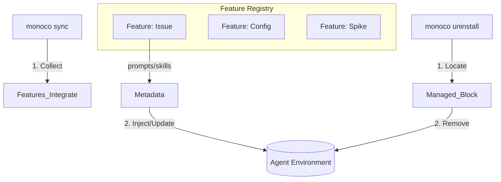

## EPIC-0014: Agent Environment Integration (Agent Native)

## 背景 (Context)

当前 Monoco 的 Agent 指引文档（如 `GEMINI.md`）和技能定义（`SKILL.md`）是静态的，依赖开发者手动复制维护。这导致:

1. **维护成本高**: CLI 更新后，文档未能及时同步。
2. **SSOT 缺失**: 多级目录下的文档版本不一致，误导 Agent。
3. **DX 割裂**: 用户需要手动配置 Cursor Rules 或 VS Code Settings 才能获得最佳 Agent 体验。

**核心理念**: 如果一个工具要给 AI 使用，它必须具备**自适应环境注入 (Adaptive Environment Injection)** 能力，即主动管理其在 Agent 上下文中的呈现。

## 目标 (Objective)

将 Monoco 升级为 **Agent Environment Manager (AEM)**，实现“零配置”的 Agent 环境集成:

1. **环境感知 (Discovery)**: 自动识别当前环境使用的 Agent 框架（Cursor, Trae, Antigravity, Claude Code, Gemini CLI, Qwen Code）。
2. **自动注入 (Auto-Injection)**: 将 Monoco 的核心规则（如 Issue 管理规范）自动注入到用户的 Prompt Context（如 `.cursorrules`）中。
3. **技能分发 (Skill Distribution)**: 自动安装和更新标准 Skill 到 Agent 可读取的路径。
4. **SSOT 托管**: 提供一个“自留地”（Managed Block），在此区域内 Monoco 拥有绝对的写入权，确保 AI 始终遵循最新的协议。

## 策略 (Strategy)

采用 **"可插拔特征架构 (Pluggable Feature Architecture)"** 与 **"反转控制 (IoC)"** 模式:

1. **特征协议 (Feature Protocol)**: 定义标准化的 `MonocoFeature` 接口，暴露 `integrate()` (获取 Prompts/Skills) 等钩子。
2. **核心总线 (Core Bus)**: 核心不再包含硬编码逻辑，而是遍历注册的 Feature 收集即时数据。
3. **全生命周期管理 (Lifecycle Management)**:
   - `sync`: 聚合调用所有 Feature 的 `integrate()`，收集元数据并**幂等注入**到 Agent 环境。
   - `uninstall`: 识别并**彻底清除** Monoco 注入的所有内容，恢复原状。

## 工作包 (Work Packages / Stories)

### 1. 核心与指令 (Core & CLI)

- [x] **Feature**: 实现 `monoco sync` 命令，支持检测环境并执行幂等写入（Idempotent Write）。
- [x] **Feature**: 实现 `monoco uninstall` 命令，支持识别标记并清理注入内容。
- [x] **Logic**: 抽象 `InjectionEngine`，作为底层负责处理文件 I/O、标记识别（Marker `## Monoco Managed`）和 Diff 逻辑。

### 2. 功能模块适配 (Feature Adaptation)

- [x] **Refactor**: 改造 `issue`, `spike`, `i18n` 模块，实现统一的 `MonocoFeature` 协议。
- [x] **Interface**: 各模块需暴露 `get_system_prompts()` 和 `get_skills()` 方法，返回标准化数据结构。

### 3. 配置系统 (Configuration System)

- [x] **Feature**: 在 `.monoco/config.yaml` 中新增 `agent` 配置段。
- [x] **Logic**: 支持用户自定义集成参数，例如:
  - [x] `target`: 指定注入目标文件（如 `.cursorrules` 或 `.windsurfrules`）。
  - [x] `framework`: 显式指定智能体框架类型。
  - [x] `includes`: 允许用户选择性启用特定的 Feature 注入。

### 4. 质量与测试 (QA & Validation)

- [x] **Test**: 编写集成测试，模拟反复运行 `sync`，验证内容不重复（幂等性）。
- [x] **Test**: 验证 `uninstall` 执行后，目标文件完全不残留 Monoco 标记。
- [x] **Lint**: 确保注入的 Markdown 内容格式规范（如列表缩进、空行控制），符合 LLM 阅读习惯。

## 验收标准 (Acceptance Criteria)

- [x] **核心改造 (Core)**: 支持 `sync` 接口（可写入项目或全局配置）与 `uninstall` 接口（删除对应配置）。
- [x] **功能适配 (Feature)**: 各功能模块（Issue, Spike, I18n）完成改造，对外提供 System Prompts 和 Skills 接口。
- [x] **配置增强 (Config)**: 配置文件添加“智能体集成”配置项，管理系统提示词路径与集成参数。_(注: 配置管理本身的 Agent 适配已从本 Epic 移除，由 EPIC-0013 作为纯 CLI 功能维护)_
- [x] **质量保证 (QA)**: 完善测试脚本，确保 `sync`（幂等的安装/更新）正常工作且不破坏用户数据，`uninstall` 清理彻底，且生成内容符合 Markdown Lint 规范。

## 总结 (Summary)

本 Epic 成功实现了 Monoco 与主流 Agent 环境（Cursor, Claude, Gemini 等）的深度集成。

**核心产出: **

1. **`monoco sync`**: 实现了 System Prompts 的全自动注入和 Skills 的跨框架分发。
2. **多端适配**: 原生支持 5 类 Agent 框架环境。
3. **SSOT**: 建立了基于 Feature 驱动的文档与技能分发体系。

**变更说明: **

- **配置管理集成 (De-scoped)**: 考虑到安全模型与 KISS 原则，决定不为 Agent 提供配置修改接口。配置管理相关功能收敛至 `EPIC-0013` 并在 CLI 侧完成实现。

## Review Comments

- [x] Self-Review
