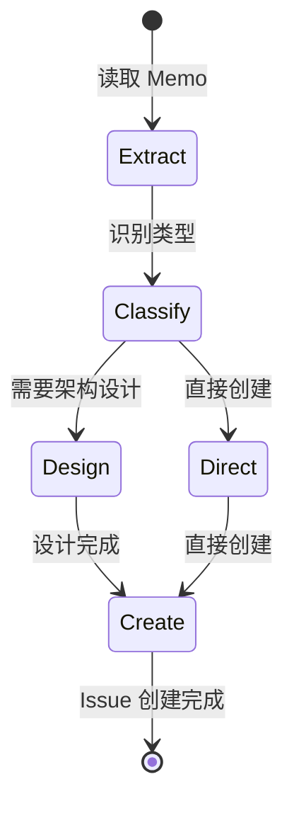

## FEAT-0128: 创建 Copilot 模式原子 Flow Skills

## Objective

为 **Copilot 模式**（人类主导，AI 辅助）创建 3 个原子 Flow Skills，替代臃肿的 `issue-lifecycle-workflow`。这些 Skill 将同步到 `.claude/skills/` 供人类开发者参考使用。

**目标位置**: `monoco/features/issue/resources/skills/`
**同步目标**: `.claude/skills/`

## Acceptance Criteria

- [x] `issue_create_workflow` Skill 创建完成
- [x] `issue_refine_workflow` Skill 创建完成
- [x] `issue_develop_workflow` Skill 创建完成
- [x] 所有 Skill 包含完整的 Mermaid 状态机
- [x] 所有 Skill 包含详细的检查点 (Checkpoints)
- [x] 支持多语言（en/zh）

## Technical Tasks

### 1. issue_create_workflow (Memo → Issue 转化)
- [x] 创建 `monoco/features/issue/resources/skills/issue_create_workflow/SKILL.md`
- [x] 定义状态机: Extract → Classify → (Design) → Create
- [x] 编写检查点：Memo 分析、类型判断、Issue 创建
- [x] 决策分支：Epic/Feature/Chore/Fix 分类逻辑

### 2. issue_refine_workflow (Issue 调查细化)
- [x] 创建 `monoco/features/issue/resources/skills/issue_refine_workflow/SKILL.md`
- [x] 定义状态机: Investigate → Analyze → (Architect) → Document
- [x] 编写检查点：代码阅读、架构分析、安全评估、性能评估
- [x] 细化维度：架构继承性、安全性、性能、可维护性

### 3. issue_develop_workflow (Issue 开发交付)
- [x] 创建 `monoco/features/issue/resources/skills/issue_develop_workflow/SKILL.md`
- [x] 定义状态机: Setup → Develop → Test → Submit → Review → Merge
- [x] 编写检查点：分支创建、编码、测试、提交、评审
- [x] 与 `flow_engineer` 的协作说明

### 4. 多语言支持
- [x] 确认 Skill 结构支持 `resources/{lang}/` 模式
- [x] 准备中文版本内容框架

## Skill 结构规范

```yaml
---
name: issue-create-workflow
description: 从 Memo 提取改进线索，分类并创建 Issue Ticket
type: flow
domain: issue
version: 1.0.0
---

# Issue Create Workflow

## 工作流状态机



## 执行步骤

### 1. Extract (提取)
- **目标**: 从 Memo 中提取关键改进线索
- **检查点**:
  - [ ] 运行 `monoco memo list` 查看待处理 Memo
  - [ ] 分析每个 Memo 的改进类型和影响范围

### 2. Classify (分类)
- **目标**: 确定 Issue 类型和优先级
- **检查点**:
  - [ ] 判断是否为架构级改进（→ Epic）
  - [ ] 判断是否为用户价值增量（→ Feature）
  - [ ] 判断是否为工程债务（→ Chore）
  - [ ] 判断是否为缺陷修复（→ Fix）

### 3. Create (创建)
- **目标**: 创建符合规范的 Issue
- **检查点**:
  - [ ] 运行 `monoco issue create <type> -t "标题"`
  - [ ] 编写清晰的描述和验收标准
  - [ ] 设置依赖关系（如需要）
  - [ ] 确保至少 2 个 Checkbox

## 决策分支

| 条件 | 动作 |
|------|------|
| 架构愿景级改进 | 创建 Epic |
| 用户可交付价值 | 创建 Feature |
| 工程维护任务 | 创建 Chore |
| 缺陷修复 | 创建 Fix |
| 纯参考资料 | Archive Memo |
```

## Related

- Parent: EPIC-0024
- Related: FEAT-0129 (Autopilot Planner), FEAT-0130 (重构)

## Review Comments

### 完成总结

已成功创建 3 个 Copilot 模式原子 Flow Skills：

1. **issue_create_workflow**: 从 Memo 提取改进线索，分类并创建 Issue Ticket
   - 状态机: Extract → Classify → (Design) → Create
   - 包含完整的检查点和决策分支

2. **issue_refine_workflow**: 调查并细化 Issue，补充技术细节和实现方案
   - 状态机: Investigate → Analyze → (Architect) → Document
   - 包含架构继承性、安全性、性能、可维护性评估框架

3. **issue_develop_workflow**: 执行 Issue 开发、测试、提交和评审的完整工作流
   - 状态机: Setup → Develop → Test → Submit → Review → Merge
   - 包含与 flow_engineer 的协作说明

所有 Skill 已同步到 `.claude/skills/` 目录供人类开发者参考使用。
