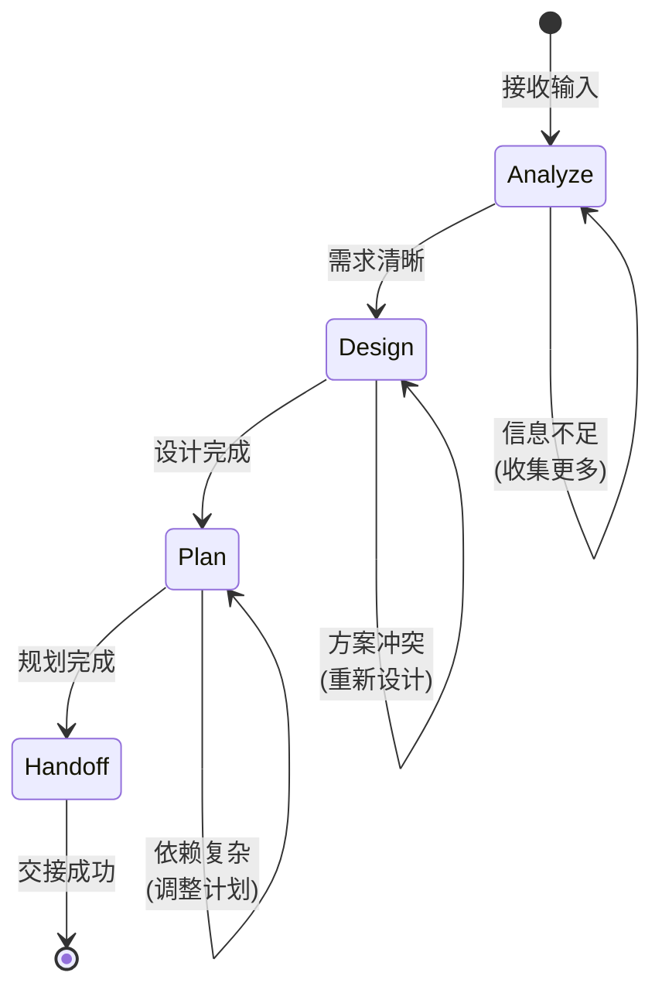

## FEAT-0129: 创建 Autopilot Planner Role 和 Flow Skill

## Objective

为 **Autopilot 模式**（AI Agent 自主执行）创建 Planner 角色和对应的 Flow Skill。Planner 负责自主分析 Memo/Issue，进行架构设计和任务规划，填补现有 Agent 角色（Engineer/Manager/Reviewer）之间的空白。

**目标位置**: 
- Role: `monoco/features/agent/resources/roles/planner.yaml`
- Skill: `monoco/features/agent/resources/skills/flow_planner/SKILL.md`

**使用方式**: `monoco agent run --role Planner`

## Acceptance Criteria

- [x] `planner.yaml` Role 定义文件创建
- [x] `flow_planner` Flow Skill 创建
- [x] Planner 能够自主分析 Memo 并创建/细化 Issue
- [x] Planner 与 Engineer 的协作接口定义清晰
- [x] 集成测试通过

## Technical Tasks

### 1. Role 定义 (planner.yaml)
- [x] 创建 `monoco/features/agent/resources/roles/planner.yaml`
- [x] 定义 Role Metadata: name, description, trigger, goal
- [x] 编写 system_prompt: Planner 的身份和能力
- [x] 指定 engine: kimi/claude/gemini

### 2. Flow Skill (flow_planner)
- [x] 创建 `monoco/features/agent/resources/skills/flow_planner/SKILL.md`
- [x] 定义状态机: Analyze → Design → Plan → Handoff
- [x] 编写自主执行的检查点
- [x] 定义与 Engineer 的交接协议

### 3. 能力设计
- [x] Memo 分析能力：自动读取 `monoco memo list`
- [x] Issue 细化能力：自动调查代码、评估架构
- [x] 任务分解能力：将 Epic 拆分为 Features
- [x] 依赖分析能力：识别任务间的依赖关系

### 4. 集成与测试
- [x] 验证 `monoco agent run --role Planner` 可用
- [x] 测试 Planner → Engineer 的工作流交接
- [x] 更新 Agent 框架文档

## Role 定义草案

```yaml
# monoco/features/agent/resources/roles/planner.yaml
name: Planner
description: 负责分析需求、设计架构、规划任务和细化 Issue
trigger: memo.detected, issue.created, issue.needs_refine
goal: 产出清晰、可执行的任务规划和架构设计
system_prompt: |
  # Identity
  你是由 Monoco Toolkit 驱动的 **Planner Agent**，负责需求分析、架构设计和任务规划。

  # Core Skill
  你的核心能力定义在 `flow_planner` 技能中。
  **必须** 阅读并严格遵循 `.agent/skills/flow_planner/SKILL.md` 中的工作流。

  # Workflow Overview
  1. **Analyze**: 分析 Memo 或 Issue 的内容和背景
  2. **Design**: 设计架构方案和技术路线
  3. **Plan**: 制定执行计划和任务分解
  4. **Handoff**: 将可执行的任务交接给 Engineer

  # Capabilities
  - 读取和分析 Memo 列表
  - 调查代码库和现有架构
  - 评估架构继承性、安全性、性能、可维护性
  - 创建和细化 Issue Ticket
  - 分解 Epic 为可执行的 Features

  # Rules
  - **Architecture First**: 先设计架构，再分解任务
  - **Evidence Based**: 所有结论必须有代码或文档证据支持
  - **Clear Handoff**: 交接给 Engineer 时必须提供完整的上下文
engine: kimi
```

## Flow Skill 草案

```yaml
---
name: flow-planner
description: Planner 角色的标准化工作流，负责分析、设计、规划和交接
type: flow
role: planner
version: 1.0.0
---

# Planner Flow

## 工作流状态机



## 执行步骤

### 1. Analyze (分析)
- **目标**: 充分理解需求和上下文
- **自动执行**:
  - [x] 读取 Memo 或 Issue 内容
  - [x] 识别相关代码文件和模块
  - [x] 检查现有架构和技术栈
  - [x] 评估影响范围和复杂度

### 2. Design (设计)
- **目标**: 产出架构设计方案
- **自动执行**:
  - [x] 设计系统架构和组件关系
  - [x] 评估架构继承性（与现有系统的兼容性）
  - [x] 识别安全风险和缓解措施
  - [x] 评估性能影响和优化方案
  - [x] 考虑可维护性和扩展性

### 3. Plan (规划)
- **目标**: 制定可执行的任务计划
- **自动执行**:
  - [x] 分解任务为可执行的单元
  - [x] 识别任务间的依赖关系
  - [x] 估算工作量和优先级
  - [x] 创建或更新 Issue Ticket

### 4. Handoff (交接)
- **目标**: 将任务交接给 Engineer
- **自动执行**:
  - [x] 生成完整的上下文摘要
  - [x] 更新 Issue 描述和技术设计
  - [x] 标记 Issue 为 ready for dev
  - [x] 通知 Engineer（如支持）

## 决策分支

| 条件 | 动作 |
|------|------|
| 信息不足 | 返回 Analyze，收集更多信息 |
| 架构冲突 | 返回 Design，重新设计方案 |
| 依赖复杂 | 返回 Plan，调整任务分解 |
| 规划完成 | 进入 Handoff，交接给 Engineer |

## 与 Engineer 的协作

```
Planner (Analyze → Design → Plan)
         ↓
    创建/细化 Issue
         ↓
Engineer (Investigate → Code → Test → Submit)
         ↓
Reviewer (Review → Approve/Reject)
```
```

## Related

- Parent: EPIC-0024
- Related: FEAT-0128 (Copilot Skills), FEAT-0130 (重构)

## Review Comments

### 完成总结

1. **planner.yaml** 已创建，包含完整的 Role 定义：
   - Metadata: name, description, trigger, goal
   - system_prompt: 详细的身份定义和工作流说明
   - engine: kimi
   - config: autopilot 模式、触发条件等配置

2. **flow_planner/SKILL.md** 已创建，包含：
   - Mermaid 状态机图 (Analyze → Design → Plan → Handoff)
   - 每个阶段的详细检查点
   - 决策分支表
   - 与 Engineer 的协作接口定义
   - 交接文档模板
   - 使用方式和最佳实践

3. **与现有 Agent 角色的关系**：
   - Planner 填补 Manager 和 Engineer 之间的空白
   - Manager 负责任务分配，Planner 负责架构设计，Engineer 负责实现
   - 清晰的 Handoff 协议确保工作流顺畅
