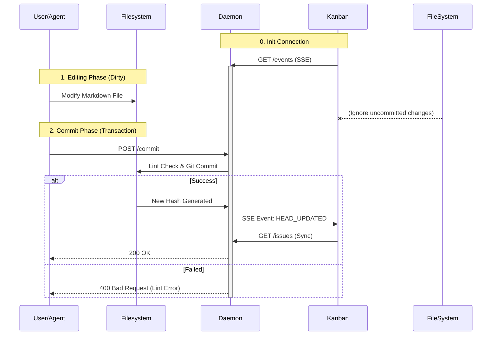

# Technical Architecture

To satisfy both "extreme desktop experience" and "broad mobile/web coverage," Kanban adopts a **Core + Shells** layered Monorepo architecture.

## 1. Architecture Overview

```mermaid
graph TD
    subgraph "Core (Shared Logic)"
        Store[State Store (Zustand)]
        Query[Data Sync (TanStack Query)]
        Parser[Markdown/Typedown Parser]
        IFS[IFileSystem Interface]
    end

    subgraph "Adapters (Bridge)"
        DesktopAdapter[Desktop FS Adapter]
        WebAdapter[API/IndexedDB Adapter]
        VSCodeAdapter[VS Code FS Adapter]
    end

    subgraph "Shells (UI Presentation)"
        DesktopApp[Desktop App (Tauri + React)]
        WebApp[Web App (Next.js)]
        MobileApp[Mini Program (Taro)]
    end

    Store --> Query
    Query --> Parser
    Parser --> IFS

    DesktopAdapter -- implements --> IFS
    WebAdapter -- implements --> IFS
    VSCodeAdapter -- implements --> IFS

    DesktopApp --> DesktopAdapter
    DesktopApp --> Store

    WebApp --> WebAdapter
    WebApp --> Store

    MobileApp --> WebAdapter
    MobileApp --> Store
```

## 2. Core Layer

This is the shared brain for all platforms, responsible for business logic and data models.

- **Tech Stack**: TypeScript, Zustand, TanStack Query, Pydantic (via Pyodide/WASM if needed).
- **Responsibilities**:
  - **Task Model**: Define data structures for Epic/Story/Task.
  - **Git Operations**: Encapsulate logic abstraction for add/commit/push/pull.
  - **Parser**: Parse Front Matter and Typedown syntax blocks.

## 3. Adapters Layer

Shields underlying storage implementation differences through Dependency Injection.

- **IFileSystem**: Defines standard interfaces `readDir(path)`, `readFile(path)`, `writeFile(path, content)`.
- **Desktop Implementation**: Directly operates OS file system using Tauri Rust backend.
- **Web Implementation**: Communicates with Chassis via HTTP API, or operates Browser OPFS (Origin Private File System).

## 4. Shells Layer (Presentation)

### 4.1 Desktop (Flagship)

- **Tech Stack**: **Tauri + React (Vite)**
- **Positioning**: Flagship experience. Main production tool for PMs and developers.
- **Advantages**:
  - Extremely small installer (<10MB).
  - Fast startup.
  - Rust backend handles Git operations with excellent performance and security.
  - Supports multi-window, system notifications, global shortcuts.

### 4.2 Web (SaaS)

- **Tech Stack**: **Next.js**
- **Positioning**: Public project display, lightweight collaboration.
- **Advantages**: SEO friendly, no installation required, link is shareable.

### 4.3 Mobile / Mini Program

- **Tech Stack**: **Taro**
- **Positioning**: Companion tool. Used for receiving notifications, approvals, simple replies.
- **Strategy**:
  - UI designed separately to adapt to mobile interactions (no drag-and-drop, heavy on clicks).
  - Reuses business logic from Core layer.

## 6. Synchronization & Interaction

Kanban adopts a **"Commit-Based Synchronization"** strategy, aiming to ensure absolute data consistency and robustness.

### 6.1 Core Principles

1. **Repo as Database**: Git repository is the only database.
2. **Commit as Transaction**: Only committed data is "effective" data. Kanban **only renders Git HEAD** state and does not read dirty data from Working Directory.
3. **Lint as Gatekeeper**: `monoco issue lint` is the only gatekeeper for writing. Any change failing validation cannot be committed and thus cannot enter Kanban view.

### 6.2 Communication Architecture: The Sidecar Daemon

To solve the collaboration problem between GUI and CLI, Kanban relies on the daemon process (`monoco serve`) provided by Toolkit:

- **Role**: Runs as a Sidecar process, providing HTTP REST API and SSE (Server-Sent Events) services.
- **Responsibilities**:
  - **Hot Runtime**: Keeps Pydantic Models in memory to avoid CLI cold start overhead.
  - **Transaction Proxy (REST)**: Receives write requests (POST) from Kanban and executes atomic operations of `Write -> Lint -> Commit`.
  - **Event Broadcast (SSE)**: Unidirectionally pushes `HEAD_UPDATED` signal via SSE channel when Repository Commit occurs.

### 6.3 Collaboration Workflow



### 6.4 Concurrency Control

Adopts **"Human First"** optimistic concurrency strategy instead of file locks.

- **Agent Rule**: Before performing write operations, Agent must check if `Issues/` directory is Clean. If there are uncommitted changes by humans, Agent **must terminate operation** to prevent overwriting human work.
- **Human Rule**: Humans have final interpretation rights but are responsible for resolving Git conflicts themselves.

## 7. Why not Electron?

For Monoco Kanban, **lightweight** and **security** are core considerations.

- **Tauri** isolates Webview from system bottom layer by default, exposing capabilities explicitly through Rust Commands, which aligns better with Monoco's security philosophy.
- **Size Advantage** significantly lowers user's psychological barrier to try.
