# Monoco Issue Lifecycle

Monoco follows the **"Task as Code"** philosophy. To balance file system physical attributes (Git friendliness, cleanliness) with agile development dynamic needs (refined status management), we adopt a **"Physical Trinity, Logical Quinary"** hybrid model.

## 1. The Space-Time Model

### Physical View - Storage Layer

The file system retains only three core directories to reflect data **persistence attributes** and **temperature**. Keeping physical structure simple is crucial to ensure linear and clear Git history, avoiding frequent file moves (Renames) and merge conflicts caused by micro-state changes.

| Directory (Status) | Meaning | Temperature |
| :--- | :--- | :--- |
| `backlog/` | **Backlog**. Ideas not yet scheduled. | ❄️ Cold |
| `open/` | **Open**. Active tasks in current iteration. | 🔥 Hot |
| `closed/` | **Closed**. Historical archive. | 🧊 Frozen |

### Logical View - Interaction Layer

In Kanban and toolchains, we further subdivide physical states into five logical stages, expressed via `stage` field in Metadata. This supports refined R&D flow without breaking physical layer simplicity.

| Logical Stage | Physical Location | Criteria (Metadata & Logic) | Meaning |
| :--- | :--- | :--- | :--- |
| **Backlog** | `backlog/` | `status: backlog` | Idea pool, waiting to enter Sprint. |
| **To Do** | `open/` | `status: open` + `stage: draft` | Scheduled, waiting to be claimed. |
| **In Progress** | `open/` | `status: open` + `stage: doing` | Coding/Design in progress. |
| **In Review** | `open/` | `status: open` + `stage: review` | Code review or acceptance testing. |
| **Done** | `closed/` | `status: closed` | Completed and merged. |

> **Archived**: This is a **computed attribute**, not an independent state.
>
> `is_archived = (status == closed) && (now - updated_at > 7 days)`
>
> Default view hides Archived items, but allows viewing via "Show Archived" filter.

## 2. Time Attributes

Issue has four key time anchors, fully recording its life history. These fields are automatically maintained by Toolkit.

- **`created_at` (Birth)**: Time when Issue file was initially created.
- **`opened_at` (Activation)**: Time when Issue moved from Backlog to Open (or created directly in Open). Marks start of Lead Time.
- **`updated_at` (Heartbeat)**: Last time metadata or content changed. This is **core basis for calculating `is_archived`**.
- **`closed_at` (End)**: Time when Issue moved to Closed. Marks end of lifecycle.

## 3. State Machine

Toolkit daemon is responsible for maintaining state transition rules and automation. State machine is not to restrict users, but to **offload user memory burden**.

### Transitions

0. **Create (Hot Start)**

   - _Default Action_: `monoco issue create`
   - _Physical_: Directly into `open/`
   - _Logical_: `stage` -> `todo`
   - _Optional_: `monoco issue create --backlog` -> Enter `backlog/`

1. **Start**

   - _Action_: `monoco issue start <id>`
   - _Physical_: `backlog/` -> `open/` (If still in Backlog)
   - _Logical_: `stage` -> `doing`
   - _Side Effect_: Automatically checkout/create git branch.

2. **Review**

   - _Action_: `monoco issue review <id>`
   - _Physical_: Unchanged (`open/`)
   - _Logical_: `stage` -> `review`
   - _Side Effect_: Check Git state, try to initiate PR.

3. **Close**
   - _Action_: `monoco issue close <id>`
   - _Physical_: `open/` -> `closed/`
   - _Logical_: `stage` -> `done` (Implicit)

### Guard Conditions

State machine includes Soft Guards to assist developers in maintaining best practices:

- **WIP Guard**: Limit parallel number of `In Progress` (though soft limit).
- **Dirty Guard**: Warns when trying to move from `Doing` to `Review` if uncommitted code (Dirty Worktree) is detected: "Did you forget to commit?"

## 4. Visualization

The following diagram shows mapping between physical and logical views, and time-based transition logic.

```mermaid
sequenceDiagram
    autonumber
    actor User as 👩‍💻 Developer
    participant Sys as 🤖 Toolkit System
    participant File as 📂 File System (Physical)
    participant Meta as 📝 Metadata (Logical)

    note over User, Meta: Phase 1: Inception (Default: Hot Start)
    User->>Sys: monoco issue create

    rect rgb(30, 35, 40)
    note right of User: Default Path
    Sys->>File: Create file in "open/"
    Sys->>Meta: status="open", stage="todo"
    Meta-->>Sys: opened_at = Now
    end

    opt Cold Start (-b / --backlog)
        Sys->>File: Create file in "backlog/"
        Sys->>Meta: status="backlog"
    end

    note over User, Meta: Phase 2: Execution
    User->>Sys: monoco issue start

    opt If in Backlog
        Sys->>File: MV "backlog/" → "open/"
        Meta-->>Sys: opened_at = Now
    end

    Sys->>Meta: stage="doing"

    loop Development
        User->>Sys: git commit / update
        Sys->>Meta: updated_at = Now
    end

    User->>Sys: monoco issue review
    Sys->>Meta: stage="review"

    note over User, Meta: Phase 3: Completion (Frozen)
    User->>Sys: monoco issue close
    Sys->>File: MV "open/" → "closed/"
    Sys->>Meta: status="closed", stage="done"
    Meta-->>Sys: closed_at = Now

    note over User, Meta: Phase 4: Archival (Virtual)
    opt After 7 days of silence
        Note right of Meta: (Now - updated_at) > 7d
        Note right of Meta: is_archived = True
    end
```

