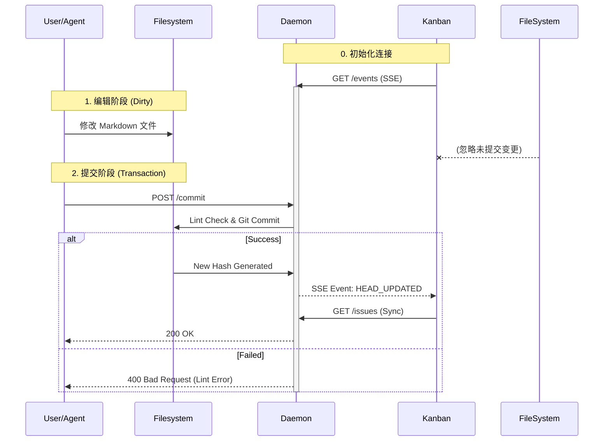

# 技术架构 (Technical Architecture)

为了同时满足“桌面端的极致体验”和“移动端/Web 的广泛覆盖”，Kanban 采用 **Core + Shells** 的分层 Monorepo 架构。

## 1. 架构概览

```mermaid
graph TD
    subgraph "Core (Shared Logic)"
        Store[State Store (Zustand)]
        Query[Data Sync (TanStack Query)]
        Parser[Markdown/Typedown Parser]
        IFS[IFileSystem Interface]
    end

    subgraph "Adapters (Bridge)"
        DesktopAdapter[Desktop FS Adapter]
        WebAdapter[API/IndexedDB Adapter]
        VSCodeAdapter[VS Code FS Adapter]
    end

    subgraph "Shells (UI Presentation)"
        DesktopApp[Desktop App (Tauri + React)]
        WebApp[Web App (Next.js)]
        MobileApp[Mini Program (Taro)]
    end

    Store --> Query
    Query --> Parser
    Parser --> IFS

    DesktopAdapter -- implements --> IFS
    WebAdapter -- implements --> IFS
    VSCodeAdapter -- implements --> IFS

    DesktopApp --> DesktopAdapter
    DesktopApp --> Store

    WebApp --> WebAdapter
    WebApp --> Store

    MobileApp --> WebAdapter
    MobileApp --> Store
```

## 2. 核心层 (Core)

这是所有平台的公用大脑，负责业务逻辑与数据模型。

- **技术栈**: TypeScript, Zustand, TanStack Query, Pydantic (via Pyodide/WASM if needed).
- **职责**:
  - **Task Model**: 定义 Epic/Story/Task 的数据结构。
  - **Git Operations**: 封装 add/commit/push/pull 的逻辑抽象。
  - **Parser**: 解析 Front Matter 和 Typedown 语法块。

## 3. 适配层 (Adapters)

通过依赖注入（Dependency Injection）模式，屏蔽底层存储实现的差异。

- **IFileSystem**: 定义标准接口 `readDir(path)`, `readFile(path)`, `writeFile(path, content)`.
- **Desktop Implementation**: 使用 Tauri Rust 后端直接操作 OS 文件系统。
- **Web Implementation**: 使用 HTTP API 与 Chassis 通信，或操作浏览器 OPFS (Origin Private File System)。

## 4. 展现层 (Shells)

### 4.1 桌面端 (Desktop - Flagship)

- **技术选型**: **Tauri + React (Vite)**
- **定位**: 旗舰体验。面向 PM 和开发者的主力生产工具。
- **优势**:
  - 安装包极小 (<10MB)。
  - 启动速度快。
  - Rust 后端处理 Git 操作，性能与安全性极佳。
  - 支持多窗口、系统通知、全局快捷键。

### 4.2 Web 端 (SaaS)

- **技术选型**: **Next.js**
- **定位**: 公开项目展示、轻量级协作。
- **优势**: 利于 SEO，无需安装，链接即分享。

### 4.3 移动/小程序 (Mobile)

- **技术选型**: **Taro**
- **定位**: 伴随工具。用于接收通知、审批、简单回复。
- **策略**:
  - UI 单独设计，适应移动端交互（无拖拽，重点击）。
  - 复用 Core 层的业务逻辑。

## 6. 同步与交互机制 (Synchronization & Interaction)

Kanban 采用 **"基于提交的同步 (Commit-Based Synchronization)"** 策略，旨在确保数据的绝对一致性与鲁棒性。

### 6.1 核心原则

1. **Repo as Database**: Git 仓库是唯一的数据库。
2. **Commit as Transaction**: 只有被 Commit 的数据才是“生效”的数据。Kanban **只渲染 Git HEAD** 的状态，不读取工作区（Working Directory）的脏数据。
3. **Lint as Gatekeeper**: `monoco issue lint` 是写入的唯一闸口。任何未能通过校验的变更都无法提交，也就无法进入 Kanban 视野。

### 6.2 通信架构: The Sidecar Daemon

为了解决 GUI 与 CLI 的协同问题，Kanban 依赖 Toolkit 提供的守护进程 (`monoco serve`):

- **角色**: 作为一个 Sidecar 进程运行，提供 HTTP REST API 和 SSE (Server-Sent Events) 服务。
- **职责**:
  - **热运行时**: 保持 Pydantic Models 在内存中，避免 CLI 冷启动开销。
  - **事务代理 (REST)**: 接收 Kanban 的写请求 (POST)，执行 `Write -> Lint -> Commit` 的原子操作。
  - **事件广播 (SSE)**: 当 Repository 发生 Commit 时，通过 SSE 通道单向推送 `HEAD_UPDATED` 信号。

### 6.3 协同工作流



### 6.4 并发控制 (Concurrency)

采用 **"人本优先 (Human First)"** 的乐观并发策略，而非文件锁。

- **Agent 守则**: Agent 在执行写操作前，必须检查 `Issues/` 目录是否干净（Clean）。如果存在人类未提交的变更，Agent **必须终止操作**，防止覆盖人类工作。
- **人类守则**: 人类拥有最终解释权，但需自行负责解决 Git 冲突。

## 7. 为什么不使用 Electron?

对于 Monoco Kanban 而言，**轻量化**和**安全性**是核心考量。

- **Tauri** 默认隔离 Webview 与系统底层，需通过 Rust Command 显式暴露能力，更符合 Monoco 的安全哲学。
- **体积优势** 能显著降低用户的心理尝试门槛。
