# Monoco 任务生命周期 (Issue Lifecycle)

Monoco 遵循 **"Task as Code"** 哲学。为了平衡文件系统的物理属性（Git 友好性、整洁度）与敏捷开发的动态需求（精细化状态管理），我们采用了 **"物理三态，逻辑五态" (Physical Trinity, Logical Quinary)** 的混合模型。

## 1. 时空模型 (The Space-Time Model)

### 物理视图 (Physical View) - 存储层

文件系统仅保留三个核心目录，以反映数据的**持久化属性**和**冷热程度**。保持物理结构的简单性至关重要，这能确保 Git 历史的线性与清晰，避免因微观状态变化导致频繁的文件移动 (Renames) 和合并冲突。

| 目录 (Status) | 含义                             | 冷热度    |
| :------------ | :------------------------------- | :-------- |
| `backlog/`    | **待办**。尚未排期的构想。       | ❄️ Cold   |
| `open/`       | **进行中**。当前迭代的活跃任务。 | 🔥 Hot    |
| `closed/`     | **已完成**。历史归档。           | 🧊 Frozen |

### 逻辑视图 (Logical View) - 交互层

在看板 (Kanban) 与工具链中，我们将物理状态进一步细分为五个逻辑阶段，通过 Metadata 中的 `stage` 字段来表达。这支撑了精细化的研发流，同时不破坏物理层的简洁性。

| 逻辑阶段 (Stage) | 物理位置   | 判定条件 (Metadata & Logic)      | 含义                      |
| :--------------- | :--------- | :------------------------------- | :------------------------ |
| **Backlog**      | `backlog/` | `status: backlog`                | 构想池，等待进入 Sprint。 |
| **To Do**        | `open/`    | `status: open` + `stage: draft`  | 已排期，等待认领。        |
| **In Progress**  | `open/`    | `status: open` + `stage: doing`  | 正在开发/设计中。         |
| **In Review**    | `open/`    | `status: open` + `stage: review` | 代码审查或验收测试中。    |
| **Done**         | `closed/`  | `status: closed`                 | 完成并合并。              |

> **Archived (归档)**: 这是一个**计算属性**，而非独立状态。
>
> `is_archived = (status == closed) && (now - updated_at > 7 days)`
>
> 默认视图会隐藏 Archived 项目，但允许通过 "Show Archived" 过滤器查看。

## 2. 时间属性 (Time Attributes)

Issue 拥有四个关键的时间锚点，完整记录其生命历程。这些字段由 Toolkit 自动维护。

- **`created_at` (诞生)**: Issue 文件最初创建的时间。
- **`opened_at` (激活)**: Issue 从 Backlog 移动到 Open (或直接创建在 Open) 的时间。标志着 Lead Time 的开始。
- **`updated_at` (心跳)**: 元数据或内容发生变更的最后时间。这是 **计算 `is_archived` 的核心依据**。
- **`closed_at` (终结)**: Issue 移动到 Closed 的时间。标志着生命周期的结束。

## 3. 状态机与流转 (State Machine)

Toolkit 守护进程负责维护状态流转的规则与自动化。状态机不是为了限制用户，而是为了**卸载用户的记忆负担**。

### 核心流转 (Transitions)

0.  **Create (创建 - 思考热启动)**
    - _Default Action_: `monoco issue create`
    - _Physical_: 直接进入 `open/`
    - _Logical_: `stage` -> `todo`
    - _Optional_: `monoco issue create --backlog` -> 进入 `backlog/`

1.  **Start (开始)**
    - _Action_: `monoco issue start <id>`
    - _Physical_: `backlog/` -> `open/` (如果还在 Backlog)
    - _Logical_: `stage` -> `doing`
    - _Side Effect_: 自动切出/创建 git 分支。

2.  **Review (提测)**
    - _Action_: `monoco issue review <id>`
    - _Physical_: 不变 (`open/`)
    - _Logical_: `stage` -> `review`
    - _Side Effect_: 检查 Git 状态，尝试发起 PR。

3.  **Close (关闭)**
    - _Action_: `monoco issue close <id>`
    - _Physical_: `open/` -> `closed/`
    - _Logical_: `stage` -> `done` (隐式)

### 守卫条件 (Guard Conditions)

状态机包含软性守卫 (Soft Guards)，用于辅助开发者保持最佳实践:

- **WIP Guard**: 限制 `In Progress` 的并行数量 (尽管是软限制)。
- **Dirty Guard**: 尝试从 `Doing` 转入 `Review` 时，若检测到未提交的代码 (Dirty Worktree)，发出警告: "Did you forget to commit?"

## 4. 可视化 (Visualization)

以下图表展示了物理视图与逻辑视图的映射关系，以及基于时间的流转逻辑。

```mermaid
sequenceDiagram
    autonumber
    actor User as 👩‍💻 Developer
    participant Sys as 🤖 Toolkit System
    participant File as 📂 File System (Physical)
    participant Meta as 📝 Metadata (Logical)

    note over User, Meta: Phase 1: Inception (Default: Hot Start)
    User->>Sys: monoco issue create

    rect rgb(30, 35, 40)
    note right of User: Default Path
    Sys->>File: Create file in "open/"
    Sys->>Meta: status="open", stage="todo"
    Meta-->>Sys: opened_at = Now
    end

    opt Cold Start (-b / --backlog)
        Sys->>File: Create file in "backlog/"
        Sys->>Meta: status="backlog"
    end

    note over User, Meta: Phase 2: Execution
    User->>Sys: monoco issue start

    opt If in Backlog
        Sys->>File: MV "backlog/" → "open/"
        Meta-->>Sys: opened_at = Now
    end

    Sys->>Meta: stage="doing"

    loop Development
        User->>Sys: git commit / update
        Sys->>Meta: updated_at = Now
    end

    User->>Sys: monoco issue review
    Sys->>Meta: stage="review"

    note over User, Meta: Phase 3: Completion (Frozen)
    User->>Sys: monoco issue close
    Sys->>File: MV "open/" → "closed/"
    Sys->>Meta: status="closed", stage="done"
    Meta-->>Sys: closed_at = Now

    note over User, Meta: Phase 4: Archival (Virtual)
    opt After 7 days of silence
        Note right of Meta: (Now - updated_at) > 7d
        Note right of Meta: is_archived = True
    end
```

