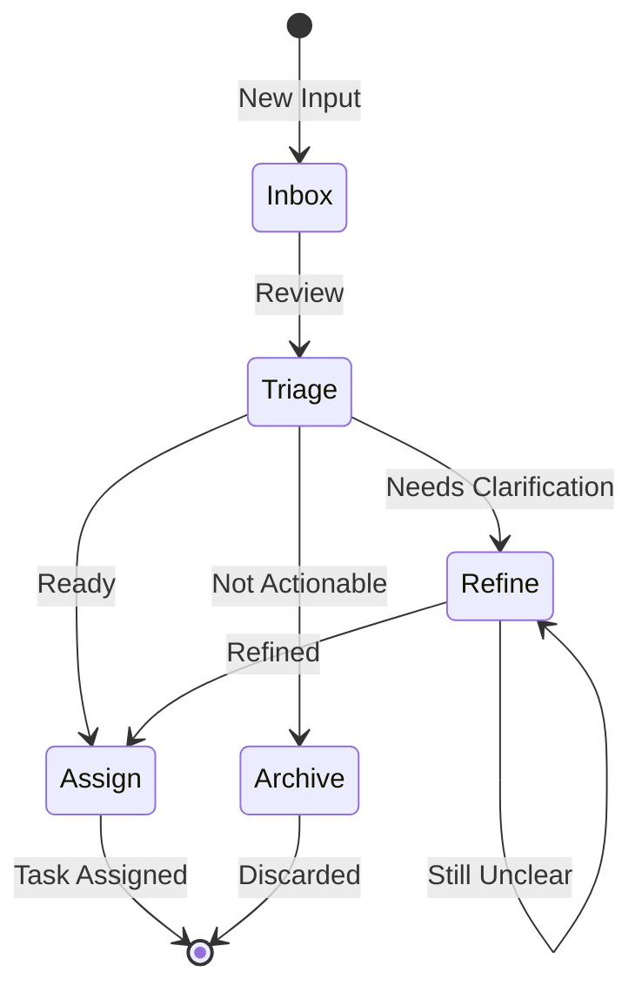

# Manager Flow

Standardized workflow for the Manager role, focusing on inbox organization, requirement refinement, and task assignment.

## Workflow State Machine

## Execution Steps

### 1. Inbox (收件箱)

- **Goal**: Collect all new inputs (Memos, external requests, ideas)
- **Input**: Raw notes, meeting minutes, user feedback
- **Checkpoints**:
  - [ ] Run `monoco memo list` to check pending memos
  - [ ] Review external issue trackers (if any)
  - [ ] Collect stakeholder requests

### 2. Triage (分类)

- **Goal**: Quick classification of inbox items
- **Checkpoints**:
  - [ ] Is this actionable?
  - [ ] Is this a bug, feature, chore, or epic?
  - [ ] Does it need immediate attention?
  - [ ] Is there enough context to proceed?

### 3. Refine (细化)

- **Goal**: Transform vague ideas into actionable requirements
- **Checkpoints**:
  - [ ] Clarify the "Why" (business value)
  - [ ] Define the "What" (acceptance criteria)
  - [ ] Identify dependencies and blockers
  - [ ] Estimate effort (rough sizing)

### 4. Assign (指派)

- **Goal**: Create proper Issues and assign to team members
- **Checkpoints**:
  - [ ] Create Issue using `monoco issue create <type> -t "Title"`
  - [ ] Link related Memos or Issues
  - [ ] Set appropriate priority and labels
  - [ ] Assign to team member (or leave unassigned for pickup)

### 5. Archive (归档)

- **Goal**: Clean up non-actionable items
- **Checkpoints**:
  - [ ] Document why it's not actionable
  - [ ] Move to appropriate archive location
  - [ ] Update stakeholders if needed

## Decision Matrix

| Input Type | Action | Next Step |
|------------|--------|-----------|
| Clear bug report | Create Fix Issue | Assign |
| Vague feature idea | Needs refinement | Refine |
| Technical debt | Create Chore Issue | Assign |
| Strategic initiative | Create Epic | Refine |
| Pure reference material | Archive | Archive |

## Best Practices

1. **Inbox Zero**: Process inbox regularly, don't let items accumulate
2. **Clear Acceptance Criteria**: Every Issue must have verifiable acceptance criteria
3. **Right Sizing**: Break down large tasks into manageable Issues
4. **Context Preservation**: Always link back to original memos or requests
