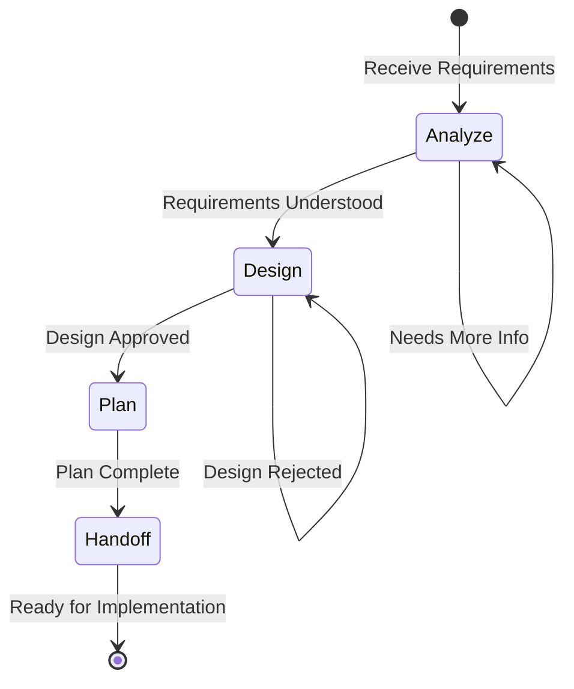

# Planner Flow

Standardized workflow for the Planner role, focusing on technical analysis, architecture design, and implementation planning.

## Workflow State Machine

## Execution Steps

### 1. Analyze (分析)

- **Goal**: Deep understanding of requirements and constraints
- **Input**: Feature/Chore Issue, stakeholder requirements
- **Output**: Analysis document, technical constraints list
- **Checkpoints**:
  - [ ] Read and understand requirements thoroughly
  - [ ] Identify technical constraints (performance, security, compatibility)
  - [ ] Research existing solutions and patterns
  - [ ] Document assumptions and risks

### 2. Design (设计)

- **Goal**: Create technical design and architecture
- **Checkpoints**:
  - [ ] Define system architecture and components
  - [ ] Design data models and interfaces
  - [ ] Consider scalability and maintainability
  - [ ] Document design decisions (ADR)

### 3. Plan (规划)

- **Goal**: Break down design into implementable tasks
- **Checkpoints**:
  - [ ] Create sub-tasks or child Issues
  - [ ] Define dependencies between tasks
  - [ ] Estimate effort for each task
  - [ ] Identify required skills and resources

### 4. Handoff (交接)

- **Goal**: Prepare comprehensive handoff to Engineering
- **Checkpoints**:
  - [ ] Document implementation guidelines
  - [ ] Create technical specification (if needed)
  - [ ] Update parent Issue with plan summary
  - [ ] Link all child Issues to parent

## Output Artifacts

| Artifact | Purpose | Location |
|----------|---------|----------|
| Analysis Notes | Document findings and constraints | Issue comments or linked doc |
| Architecture Diagram | Visual representation of design | `docs/architecture/` or Issue |
| ADR | Record design decisions | `docs/adr/` |
| Task Breakdown | List of implementable sub-tasks | Child Issues |
| Technical Spec | Detailed implementation guide | Issue description or linked doc |

## Best Practices

1. **Design for Change**: Anticipate future changes in your design
2. **Prototype When Uncertain**: Build quick prototypes to validate approaches
3. **Review Early**: Get feedback on designs before full planning
4. **Document Trade-offs**: Always document why certain decisions were made
