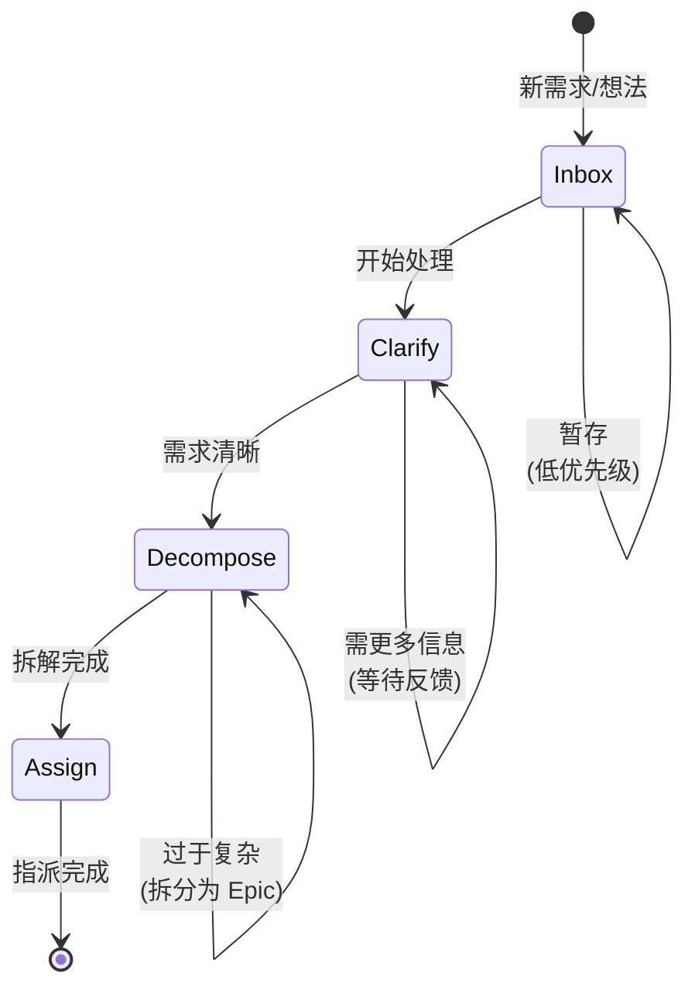

# Manager Flow

Manager 角色的标准化工作流，确保 "Inbox → Clarify → Decompose → Assign" 流程。

## 工作流状态机

## 执行步骤

### 1. Inbox (收件箱)

- **目标**: 收集和暂存所有 incoming 需求、想法和任务
- **输入**: Memo、用户反馈、系统告警、技术债务
- **检查点**:
  - [ ] 记录需求来源和背景
  - [ ] 初步分类 (Feature/Chore/Fix)
  - [ ] 评估紧急程度

### 2. Clarify (需求澄清)

- **目标**: 将模糊的需求转化为清晰的描述
- **策略**: 5W2H 分析法
- **检查点**:
  - [ ] **What**: 要解决什么问题？
  - [ ] **Why**: 为什么重要？
  - [ ] **Who**: 谁是利益相关者？
  - [ ] **When**: 期望的完成时间？
  - [ ] **Where**: 影响范围？
  - [ ] **How**: 建议的实现方式？
  - [ ] **How Much**: 工作量预估？

### 3. Decompose (任务拆解)

- **目标**: 将大任务拆分为可独立交付的子任务
- **策略**: 垂直切片 (Vertical Slicing)
- **检查点**:
  - [ ] 识别核心价值和依赖关系
  - [ ] 拆分为可独立交付的 Feature/Chore/Fix
  - [ ] 设置合理的优先级
  - [ ] 为复杂任务创建 Epic

### 4. Assign (任务指派)

- **目标**: 将任务分配给合适的执行者
- **检查点**:
  - [ ] 评估团队能力和负载
  - [ ] 明确验收标准 (Acceptance Criteria)
  - [ ] 设置合理的截止日期
  - [ ] 通知相关成员

## 决策分支

| 条件 | 动作 |
|------|------|
| 需求过于模糊 | 返回 Inbox，等待更多信息 |
| 任务过于复杂 | 创建 Epic，拆分为多个 Feature |
| 依赖其他任务 | 设置依赖关系，调整优先级 |
| 资源不足 | 调整范围或延期 |

## 合规要求

- **必须**: 每个任务都有清晰的验收标准
- **必须**: 复杂任务必须拆分为 Epic + Features
- **禁止**: 指派没有澄清需求给 Engineer
- **建议**: 使用 `monoco memo` 管理临时想法
