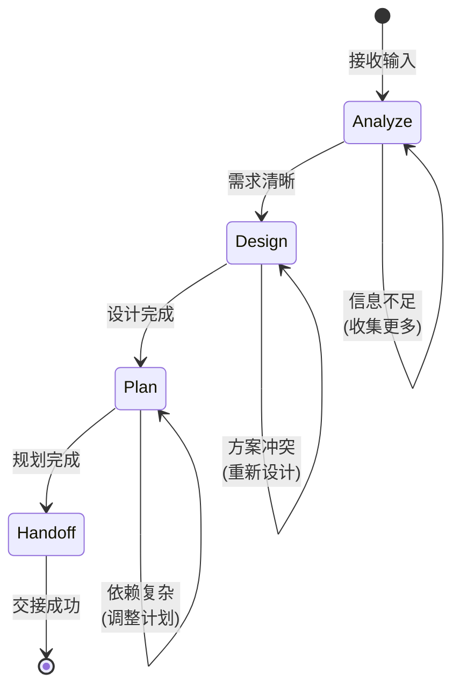

# flow_planner

Planner 角色的标准化工作流 (Flow Skill)，负责分析、设计、规划和交接。

## 工作流状态机



---

## 执行步骤

### 1. Analyze (分析)

**目标**: 充分理解需求和上下文

**入口条件**:
- 接收到 Memo 或 Issue 输入
- 或检测到需要细化的任务

**自动执行检查点**:

- [ ] **读取输入**: 读取 Memo 或 Issue 的完整内容
- [ ] **识别上下文**: 识别相关代码文件、模块和依赖
- [ ] **检查架构**: 检查现有架构和技术栈
- [ ] **评估范围**: 评估影响范围和复杂度
- [ ] **记录发现**: 将分析结果记录到 Issue 或创建新的研究 Issue

**退出条件**:
- 需求清晰明确 → 进入 Design
- 信息不足 → 返回 Analyze，收集更多信息

**命令参考**:
```bash
# 读取 Memo
monoco memo list
monoco memo open <id>

# 读取 Issue
cat Issues/<type>/<status>/<issue-file>.md

# 检查相关代码
grep -r "pattern" monoco/
```

---

### 2. Design (设计)

**目标**: 产出架构设计方案

**入口条件**:
- Analyze 阶段完成，需求清晰

**自动执行检查点**:

- [ ] **系统架构**: 设计系统架构和组件关系
- [ ] **继承性评估**: 评估与现有系统的兼容性
- [ ] **安全评估**: 识别安全风险和缓解措施
- [ ] **性能评估**: 评估性能影响和优化方案
- [ ] **可维护性**: 考虑可维护性和扩展性
- [ ] **设计文档**: 编写架构设计文档 (Architecture Decision Record)

**退出条件**:
- 设计完成且通过自评 → 进入 Plan
- 架构冲突 → 返回 Design，重新设计方案

**设计输出模板**:
```markdown
## Architecture Design

### 1. 系统架构
[架构图或描述]

### 2. 组件关系
- Component A → Component B
- 接口定义: ...

### 3. 技术选型
- 语言/框架: ...
- 依赖库: ...

### 4. 风险评估
| 风险 | 影响 | 缓解措施 |
|------|------|----------|
| ...  | ...  | ...      |
```

---

### 3. Plan (规划)

**目标**: 制定可执行的任务计划

**入口条件**:
- Design 阶段完成，架构方案确定

**自动执行检查点**:

- [ ] **任务分解**: 将工作分解为可执行的单元 (Issue/Feature)
- [ ] **依赖分析**: 识别任务间的依赖关系
- [ ] **工作量估算**: 估算每个任务的工作量和优先级
- [ ] **创建 Issue**: 使用 `monoco issue create` 创建子任务
- [ ] **更新父 Issue**: 更新原始 Issue 的任务列表和依赖

**退出条件**:
- 规划完成 → 进入 Handoff
- 依赖复杂 → 返回 Plan，调整任务分解

**命令参考**:
```bash
# 创建子任务
monoco issue create feature -t "子任务标题" --parent <parent-id>

# 更新 Issue
monoco issue edit <id> --add-task "任务描述"
```

---

### 4. Handoff (交接)

**目标**: 将任务交接给 Engineer

**入口条件**:
- Plan 阶段完成，任务已分解为可执行单元

**自动执行检查点**:

- [ ] **上下文摘要**: 生成完整的上下文摘要 (Context Summary)
- [ ] **更新 Issue**: 更新 Issue 描述，包含技术设计和执行步骤
- [ ] **标记状态**: 标记 Issue 为 `ready_for_dev`
- [ ] **通知 Engineer**: 如系统支持，通知 Engineer 有新任务

**交接文档模板**:
```markdown
## Handoff Document

### Context
[任务背景和目标的简要描述]

### Architecture
[架构设计的关键点]

### Implementation Guide
[实现步骤和注意事项]

### Acceptance Criteria
- [ ] 验收标准 1
- [ ] 验收标准 2

### Related Files
- `path/to/file1.py`
- `path/to/file2.py`

### Dependencies
- 依赖 Issue: #XXX
- 阻塞 Issue: #YYY
```

**退出条件**:
- 交接成功 → 工作流结束

---

## 决策分支

| 条件 | 动作 | 说明 |
|------|------|------|
| 信息不足 | 返回 Analyze | 收集更多信息，可能创建 Spike Issue |
| 架构冲突 | 返回 Design | 重新设计方案，记录决策理由 |
| 依赖复杂 | 返回 Plan | 调整任务分解，简化依赖关系 |
| 规划完成 | 进入 Handoff | 交接给 Engineer |

---

## 与 Engineer 的协作

```
Planner (Analyze → Design → Plan)
         ↓
    创建/细化 Issue
         ↓
Engineer (Investigate → Code → Test → Submit)
         ↓
Reviewer (Review → Approve/Reject)
         ↓
    [如需要] → 返回 Planner 重新规划
```

### 协作接口

**Planner → Engineer**:
- 输出: 细化的 Issue + 架构设计文档
- 格式: Issue 描述中包含 "## Implementation Guide" 章节
- 标记: Issue 标记为 `ready_for_dev`

**Engineer → Planner**:
- 触发: Engineer 发现需求不清或架构问题
- 动作: 标记 Issue 为 `needs_refine`，Planner 重新介入

---

## 使用方式

### 手动触发

```bash
# 以 Planner 角色运行
monoco agent run --role Planner --input Issues/Features/open/FEAT-XXXX.md
```

### 自动触发

当满足以下条件时自动触发:
1. 新 Memo 创建且包含 `#plan` 标签
2. Issue 被标记为 `needs_refine`
3. Epic 创建后需要分解为 Features

---

## 最佳实践

1. **Evidence Based**: 所有架构决策必须有代码或文档证据支持
2. **Incremental Design**: 优先采用增量式设计，避免过度设计
3. **Clear Boundaries**: 明确模块边界和接口契约
4. **Document First**: 先写设计文档，再创建实现任务
5. **Review Loop**: 复杂设计应经过 Review 后再交接

---

## 相关资源

- Role 定义: `monoco/features/agent/resources/roles/planner.yaml`
- Engineer Flow: `.agent/skills/flow_engineer/SKILL.md`
- Reviewer Flow: `.agent/skills/flow_reviewer/SKILL.md`
